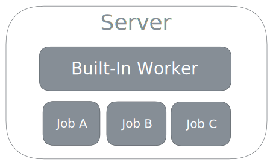
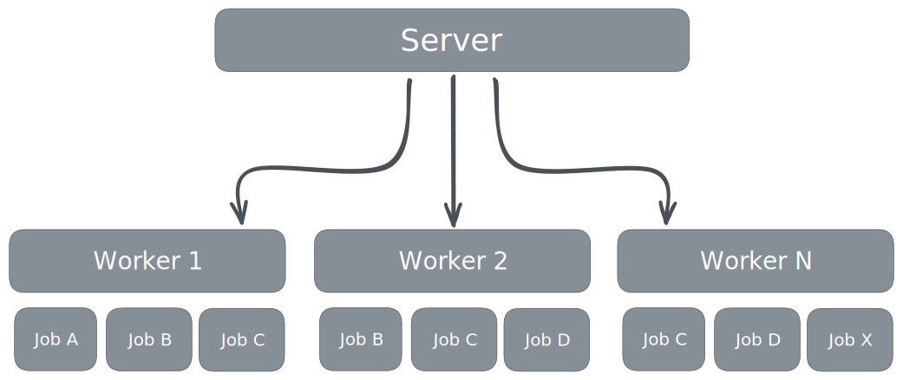

import { Steps } from "@astrojs/starlight/components";

This section covers the installation of Edge_iq. This generally involves the following steps:

<Steps>

1. Obtain a [license](/start/licensing/)
2. Download a [binary](/start/downloads/)
3. Configure and run the Server
4. Optionally, add additional Workers

</Steps>

## Minimal deployments.

A minimal Edge_iq installation consists of a single server process. The server provides a built-in worker, which is used for testing jobs, but it can also run as many jobs as the server's host resources can accomodate.

## Multi-worker deployments

Edge_iq scales by deploying additional workers, and connecting them to a server. For multi-worker deployments, all jobs are managed through the server.

Workers typically run on separate hosts, but they can be also run on the same host as the server, provided default worker ports are appropriately configured to avoid conflicts.

:::note
Servers and Workers can be deployed from the same binary.
:::
