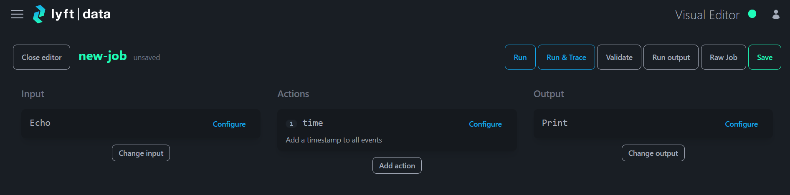
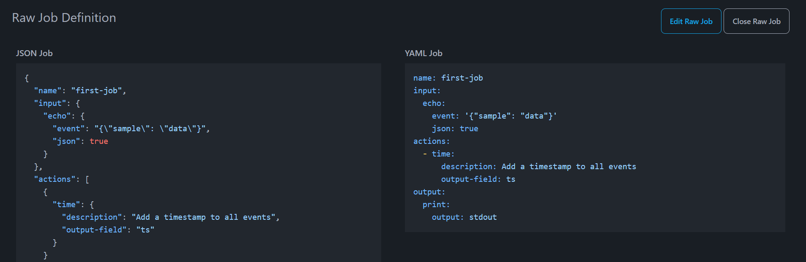
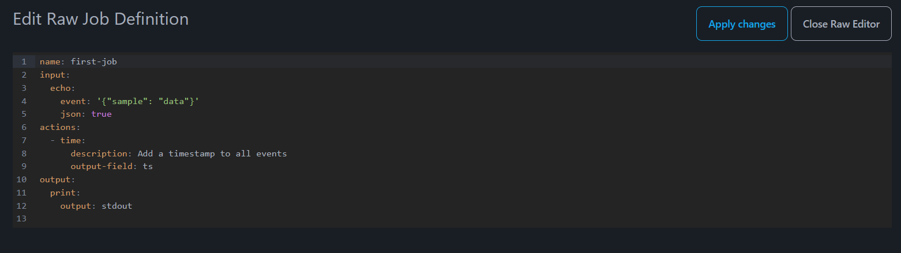

Jobs are configured and tested via the UI's visual editor.

From here you can [test jobs](../start/23-running.md) before deploying jobs to workers.

On the left is the [input](10-inputs.md), in the middle the [actions](14-actions.md),
and on the right is the [output](12-outputs.md).

There is also a way to view and edit the job in YAML. Click the `Raw Job` button
and you are presented with the job in JSON and YAML format. Internally, jobs are represented as JSON documents.

It is then possible to `Edit Raw Job`

With very large jobs, using the raw job editor can be helpful to quickly make small edits to job definitions.