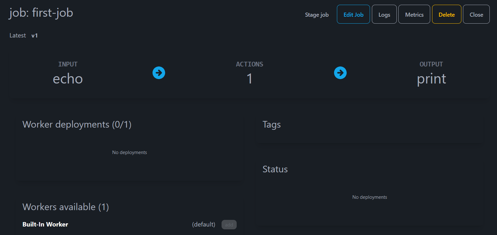
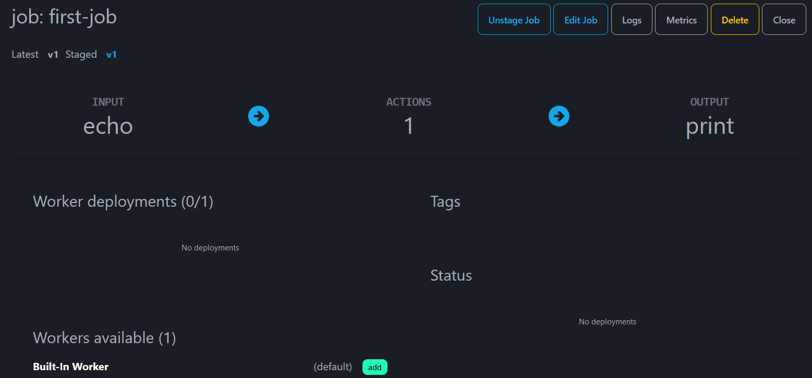
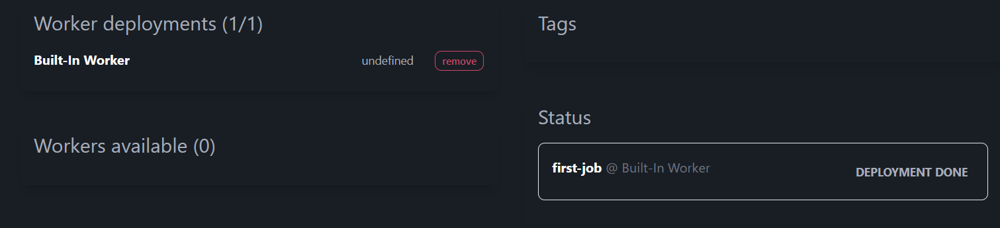
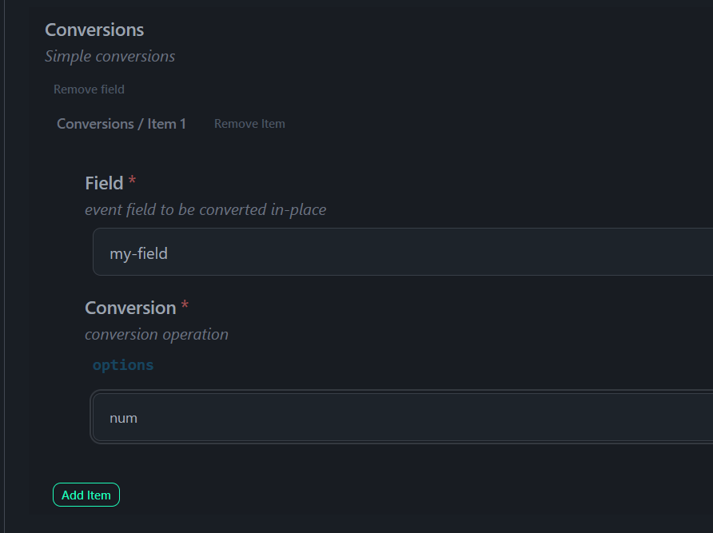
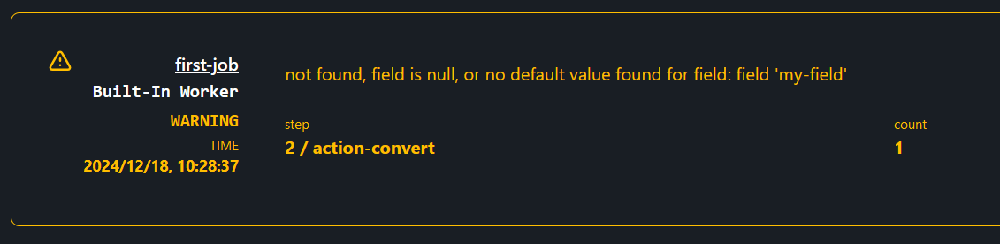

[Jobs](00-overview.md) are saved on the server after `Save` is pressed
in the editor. The visual editor's `Close Editor` button will prompt You when trying to close a job with unsaved changes. Closing the visual editor shows the job view:



The job needs to be _staged_ before it can be added to workers `Stage job`



The **Built-in Worker** is now ready and the `add` button goes green.

Pressing `add` and the job is run, final state is 'Deployment Done'



Clicking on `Logs` in the top right row, shows you that the job started.

Return to the job view (browser back arrow, Alt-back arrow); click on the red button `remove`

This is not a particularly interesting job yet - it runs once, and the output
goes to the standard output of the server.

```
2024-12-17T12:29:19.422Z INFO  edgeiq_worker::scheduler > Worker [Built-In Worker], starting job: [first-job]
{"sample":"data","ts":"2024-12-17T12:29:20.973Z"}
```

So let's introduce a problem. Go back to the visual editor, and add a `Convert` action. This will take existing fields (usually text) and convert them into numbers and so forth. But what if the field does not exist?



Now (and this is important) cick on the green `Add item` button to actually add the conversion.

So `Close Action`, `Save`, `Close Editor` and then `Restage Job`

Notice that the `Issues` icon on the top right has gone red. Click on that:



This will also appear in the job logs.
