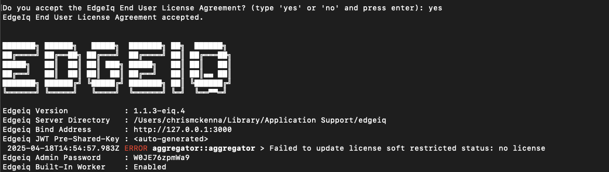
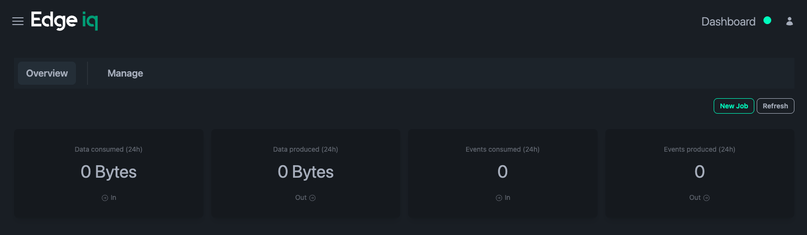
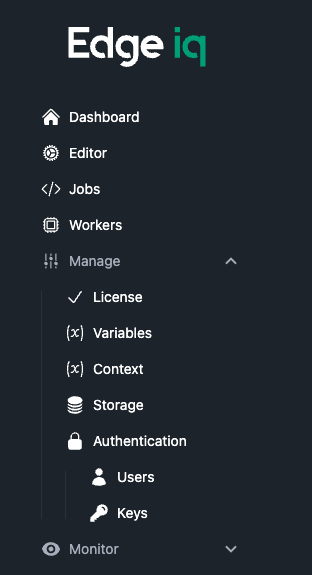

Once you have downloaded & extracted the `edgeiq` binary, you can run it directly.

In a terminal, run:

```
$ ./edgeiq run server
```

After a moment, you should see something like this in your terminal:



Look for `Edge IQ Admin Password` and copy this from the terminal. It will not be shown on the next run!

Next, visit http://localhost:3000/ in your web browser to bring up the UI.

Use the admin username and copied password to log in.

:::note
You may be prompted to add a license. Follow the [`Licensing`](/start/licensing/) instructions to get setup with a license.
:::

You will see a Dashboard like this:



From here, you can create Jobs, add other Workers, manage Channels and more.


