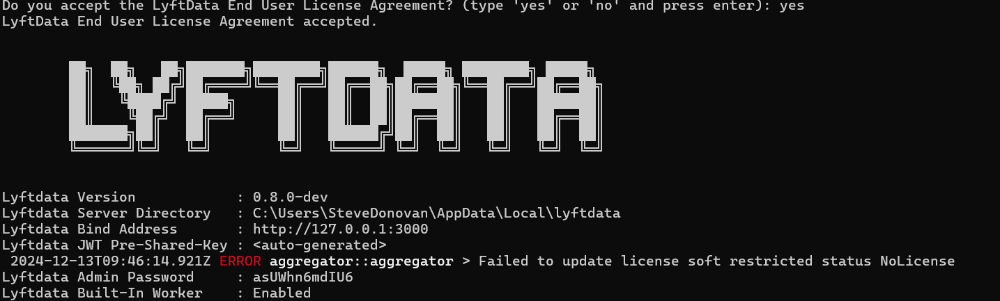

Once you have downloaded & extracted the `lyftdata` binary, you can run it directly.

```sh
$ ./lyftdata run server
```

The first time you do this, you will be asked to read and accept the EULA, and you will be given an admin password.



Look for `Lyftdata Admin Password` and copy this from the terminal.  It will not be shown on the next run!

Note that the server is listening by default on port 3000.

We do not have a license yet. Go to the browser and visit `localhost:3000` - you may sign in as 'admin' with the given password.

You will see an empty dashboard.


To set the license, go to the menu on the top-left corner, and find 'License' under 'Manage':


On the License page, click on `Change License` and paste your license key into the provided text box

