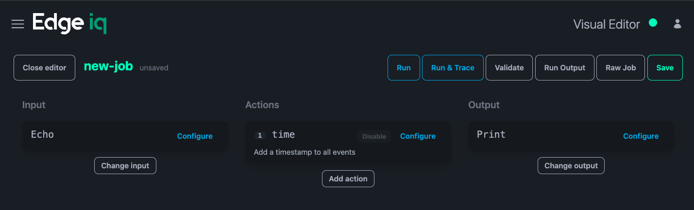
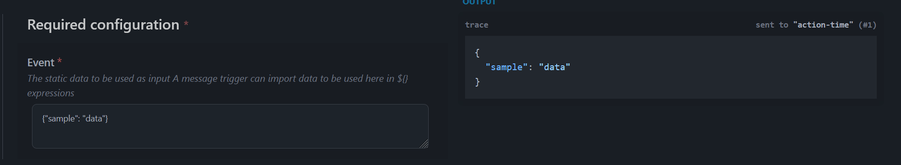
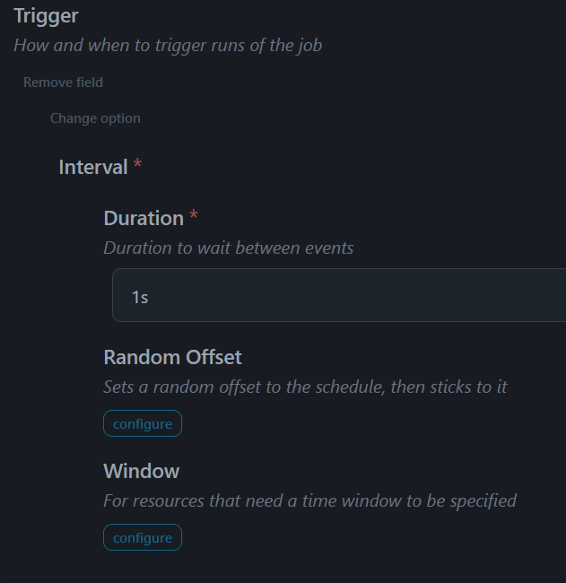

Go to `Jobs` using the top-left corner menu.

There is a top-left hand side menu `New Job`, which will lead you into _Quick Setup_.

Click `Skip quick setup` to get the default job configuration:

- events are provided directly using `input echo`
- events receive a timestamp from `action time`
- and finally are printed out using `output print`

You will end up in the _visual editor_:



It is important to notice that the job has been given a temporary name "new-job" with "unsaved" next to this. At this point, you edit the job name in place, hit `Ok` and press `Save` on the top-right.


After this, you _cannot rename_ the job.

Jobs may be directly run at this point. Click on `Run` and you will be taken to the `Run Output` page.

```json
{
  "sample": "data",
  "ts": "2024-12-13T11:07:25.554Z"
}
```

There are two important limits on these temporary, or _transient_ jobs. The maximum amount of seconds to run, and the maximum number of events to process. This guarantees that they will shutdown at some point.

Get back to the editor by closing this page (`Close Output` on the right). We want to change the input, so click on `Configure` inside the `Echo` box.

`Echo` is a very simple input, but there are three important things in common with other inputs:

- `Trigger` normally this job will just run once; this is how you schedule the job to run regularly
- `Json` by default, we assume that the data is arbitrary text; set this if the data is already JSON
- `Ignore Linebreaks` by default, each line of input becomes an event - set this if you need to treat the whole input as an event

After the first `Run`, there will be a `Rerun and Trace` button - the difference with regular `Run` is that you get the intermediate steps:

- the data entering the job from the input
- the data entering `time` action, the data changed after the action
- finally, the data flowing into the output

When you click on `Rerun and Trace` you will get the incoming data inline with the editor:



After turning off `JSON`, the data will look like this:

```json
{
  "_raw": "{\"sample\": \"data\"}"
}
```

The data is some arbitrary text, so it has to be _quoted_. The convention is that the event becomes a simple JSON object where `_raw` is the key of the raw data.

Atfter entering the lines "hello" and "there" in `Event`, the result is:

```json
{"_raw":"hello"}
{"_raw":"there"}
```

There is a separate event for each line, by default. Set `Ignore Linebreaks` and the lines are combined as one event:

```json
{
  "_raw": "hello\nthere"
}
```

## Running the Input more than Once:



It is easiest to start with `Interval` since this is simply the number of seconds, minutes or hours (like "5s","2h" and so forth)

If you hit `Run` you will only get 10 events, which is the event limit. If you were to hit `Run and trace` you would actually get 50 output documents, 45 of which are traces.

When the job is running a button `Cancel Run` appears which allows you to bail out of the job before the time limit.
