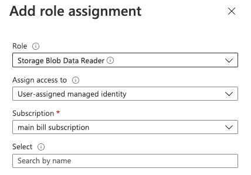

The purpose of this document is to provide some general knowledge about Managed Identities, information about where and how they can be used in Scuba, and what a Scuba customer should set up to allow us to connect through Managed Identities authentication.

# General background 

Managed Identities is a way to authenticate access to the Azure Cloud without using passwords and vaults.

Let’s say you need access from a Machine to a Storage Account or Blob/Container. In that case, you’ll create a Managed Identity and provide it to both parties. Our Storage will be the contributor, while the Machine will know it as an assigned identity.

The identity creation and assignment are done through the Azure portal.

For more information see official Microsoft documentation: [https://docs.microsoft.com/en-us/azure/active-directory/managed-identities-azure-resources/qs-configure-cli-windows-vm](https://docs.microsoft.com/en-us/azure/active-directory/managed-identities-azure-resources/qs-configure-cli-windows-vm)

# Managed Identities in Scuba

Managed Identities authentication can currently be used in two scenarios:

1. Import - reading/downloading data from Azure
2. GDPR purge request & receipts - writing/uploading data to Azure

In our system, there are several machines that require the Identity to be assigned to them:

- config
- data (all machines)
- import (all machines)
- string (all machines)

# Setup

## Creating the Managed Identity

1. Go to `Azure portal \ Managed Identities`.
2. Press `+ Create` in the toolbar.
3. Fill in the form and press `Review + create`.
4. Press `create` at the bottom of the new form.
5. Go to `Home \ Managed Identities \ <the identity you've created>`.
6. Copy the `Client ID` and send it to your Scuba representative.

## Set role assignments to your resource

1. Go to the relevant resource in the Azure Portal, such as `Storage account` (for import).
2. On the left panel go to `Access Control (IAM)`.
3. Press the `+ Add` button, and select `Add role assignment`.
4. Fill in the form as follow. you’ll need to do it twice for 2 different roles:
1.   Storage Blob Data Contributor
2.   Storage Blob Data Reader
5. Press `Save`.

## Assign the Identity to the accessing machines

1. Go to the relevant machine in the `Azure portal`.
2. On the left panel go to `Identity`.
3. Go to the `User assigned` tab.
4. Press the `+ Add` button.
5. Fill out the form on the right and select the identity you’ve created.
6. Press the `Add` button at the bottom.

That’s it! Don’t forget to send us the Managed Identity Client ID.