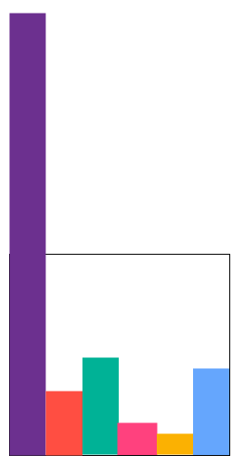
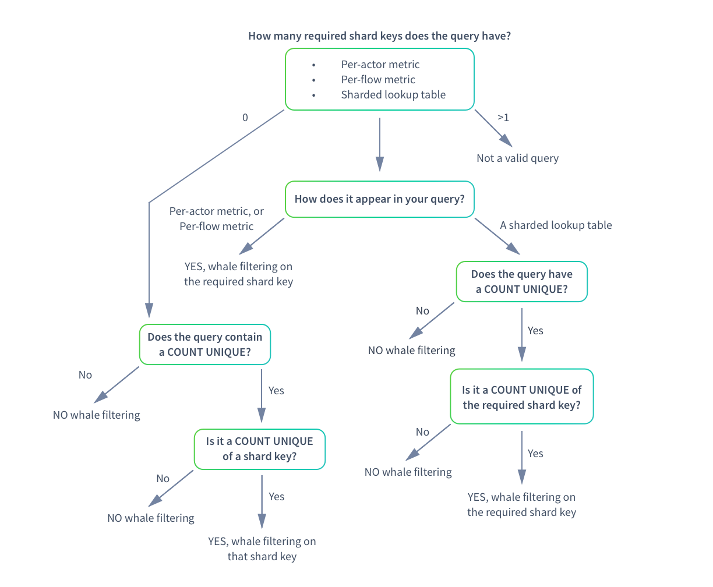

This document explains data whales, the problems unbalanced data can cause in a data tier, and solutions to remedy them. The following topics are covered:

- Data whales and the solution
- Filtering out whales from queries

## Data whales and the solution

In a perfect data tier, events would be allocated equally across all shards. However, this isn't always the case. There might be times when an actor creates a disproportionate volume of events in comparison to other actors. An extreme volume of events for any one actor can result in the following:

- Unbalanced sampled query results
- Poor-performing shards that are bigger than average
- Disk space issues for the data node

### Whales create unbalanced data

A person who is an exceptionally big spender in a gambling casino is known as a **whale**. Likewise, in behavioral data analytics, an actor that creates a disproportionate volume of events compared to the other actors in a dataset is a **whale**. The following illustration is a simplified example of a data node with six shards. The purple shard is a whale.

Whale actors can be any of the following:

- Real actor: Users who are an order of magnitude more active than most.
- System actor: Services, notifications, and other automated events.
- Bot: A utility that automatically generates events.

The imbalance a whale creates can cause sampling errors, especially if the whale happens to be picked as a sampling shard. For unsampled queries, the whale shard impedes performance. If the whale continues to expand unchecked, the node runs out of disk space much faster than the other nodes in the cluster. How do you resolve the imbalance a whale creates?

You *splash* the whale, of course.

### Splashing the whale

Scuba dissipates the data of an actor detected as a whale. In effect, the whale actor data is *splashed* across the other shards in the dataset. The act of *splashing* balances the distribution of data to ensure efficient sampling. Splashing is accomplished with shard function exceptions. Later when behavioral queries are run on the dataset, whale actors are filtered out.

Splashing results in efficient sampling, but also has the following effects:

- The actor associated with the whale data goes away. You cannot run a behavioral query on that actor.
- The actor is filtered out of certain types of queries, since its data was effectively spread across all shards in the dataset.

Whale events are filtered out under specific circumstances only, as described below in **Filtering out whales from queries**.

## Filtering out whales from queries

Whale actor events are distributed across all shards, and therefore excluded from behavioral and sharded count unique queries. The following diagram illustrates the process for filtering out whales in per-actor metric, per-flow metric, and shard lookup table queries.

