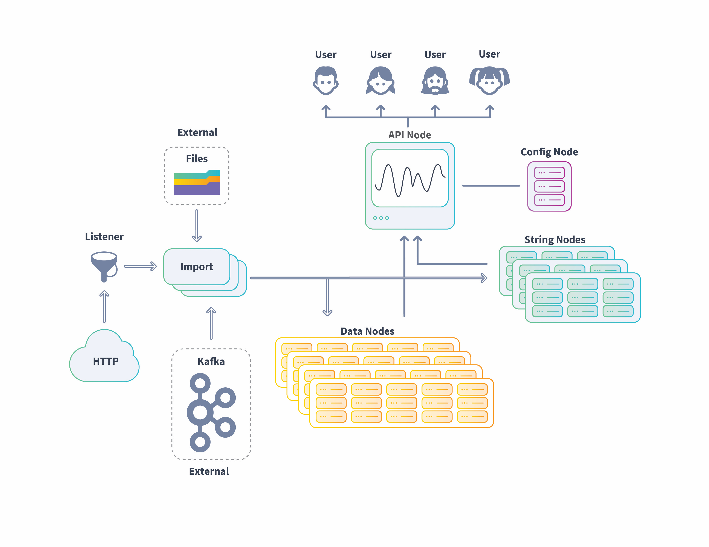

This document offers guidelines for planning a Scuba deployment that meets your company's current data analytics needs, as well as scaled growth for the future.

Note that for most deployments, you will work with a Scuba representative to determine sizing, set up cluster(s), and deploy to production. If this is not the case, please reach out to [help@scuba.io](mailto:help@scuba.io) to ensure you have access to all necessary Scuba Admin documentation.

## Scuba: Behavioral analytics for your whole team

Scuba is full-stack behavioral analytics software with a web-based visual interface and scalable distributed back-end datastore to process queries on event data.

Scuba's intuitive graphical user interface (GUI) provides interactive data exploration for a wide range of users across the spectrum of digital businesses. The Visual Explorer encourages rapid iteration with point-and-click query building and interactive visualizations. All without having to deal with complicated query syntax. You can go from any board to explore the underlying data, change parameters, and drill down to the granular details of the summary.

To plan a Scuba deployment that is optimized for your company, review the following topics:

- [High-level overview — How Scuba works](https://interana.atlassian.net/wiki/spaces/SGV/pages/2139261299#High-level-overview%E2%80%94how-Scuba-works)
- [The basics — Node types](https://interana.atlassian.net/wiki/spaces/SGV/pages/2139261299/Planning+Your+Scuba+Deployment+v5#%5BinlineExtension%5DThe-Basics-%E2%80%94-System-Requirements)
- [Production workflow — Test, review, revise, and go](https://interana.atlassian.net/wiki/spaces/SGV/pages/2139261299/Planning+Your+Scuba+Deployment+v5#%5BinlineExtension%5DProduction-Workflow-%E2%80%94-Test%2C-Review%2C-Revise%2C-and-Go)
- [Data types and formats — Consider your source](https://interana.atlassian.net/wiki/spaces/SGV/pages/2139261299/Planning+Your+Scuba+Deployment+v5#%5BinlineExtension%5DData-Types-and-Formats-%E2%80%94-Consider-Your-Source)
- [Set up checklist](#setup)

## A high-level overview: How Scuba works

Scuba is full-stack behavioral analytics software that allows users to explore the activity of digital services. Scuba includes both its own web-based visual interface and a highly scalable distributed back-end database to store the data and process queries. Scuba supports Ubuntu 20.x in cloud environments, as well as virtual machines or bare-metal systems. Scuba enables you to ingest data in a variety of ways, including live data streams.

The following image shows an example of the flow of data into the Scuba cluster from imported files (single and batch) to live data streams from HTTP and Kafka sources. Ingested data is transformed and stored in the appropriate node, data or string, then processed in queries, with the results delivered to the requesting user.

## The basics: Node types

A Scuba cluster consists of the following nodes that can be installed on a single server (single-node cluster), or across multiple servers (multi-node cluster).

- **Config node**: The node from which you administer the cluster. MySQL database (DB) is *only* installed on this node for storage of Scuba metadata. This node should be configured first.
- **API node**: This node serves the Scuba application, merges query results from data and string nodes, and then presents those results to the user. Nginx is *only* installed on the API node.
- **Import (ingest) node**: This node connects to data repositories (cloud, live streaming, remote or local file system), streams live data, downloads new files, processes the data, and then sends to data and string tiers, as appropriate.
- **Data node**: This node is for data storage. It must have enough space to accommodate **all** events and stream simultaneous query results.
- **String node**: This node contains string storage for the active strings in the dataset, in compressed format. It requires sufficient memory to hold the working set of strings accessed during queries.

## Production workflow: Test, review, revise, and go

It is strongly recommended that you work with your Scuba rep to set up a sandbox cluster with a sample of your data. This way any necessary adjustments can be made before deploying a production environment. This will allow us to assess the quality of your data and better determine the appropriate size for a production cluster.

For trial Scuba deployments, follow these steps:

1. Review the rest of this document to gain a preliminary assessment of the needs for your production cluster.
2. Work with your sales engineer to install a single node cluster in a sandbox test environment.
3. Load a week's worth of data.
4. Modify your data formats until you get the desired results.
5. Review the usage for the string and data nodes.
6. From the usage for one week's worth of data, we can estimate usage for one month, and then one year.
7. Factor in the estimated growth percentage for your company to create a multi-year usage projection.
8. Set up your Scuba production environment and ingest your data.

## Data types and formats: Consider your source

It's important to consider the source of your data, as well as the data type and how it's structured. Be aware that some data types may require transformation for optimum analytics.

### Data Types

Scuba accepts the following data types:

- **JSON:** This is Scuba's preferred data format. The JSON format is a flat set of name-value pairs (without any nesting), which is easy for Scuba to parse and interpret.

> [!INFO]
> If you use a different format, your data **must** be transformed into JSON format before it can be imported into Scuba.

- **Apache log format**: These are log files generated using mod_log_config. For details, see [mod_log_config - Apache HTTP Server Version 2.4](http://httpd.apache.org/docs/current/mod/mod_log_config.html). It's helpful to provide the mod_log_config format string used to generate the logs, as Scuba can use that same format string to ingest the logs.
- **CSV**: Scuba accepts CSV format with some exceptions. First, ensure sure you have a complete header row. Next, ensure you are using a supported separator character (tab, comma, semicolon, or ascii character 001). Finally, ensure your separator is clean and well-escaped—for example, if you use comma as your separator, make sure to quote or escape any commas within your actual data set.

For more information, see the [Data Types Reference](../admin-guides/managing-your-data/data-types-reference). For best practices in logging your data, see [Best Practices for Formatting Your Data](../admin-guides/managing-your-data/best-practices-for-formatting-data-for-ingest).

### Data Sources

Scuba can ingest event data in a variety of ways:

- Amazon Simple Storage Service (S3): [Cloud storage (Amazon Web Services, AWS)](https://aws.amazon.com/s3/)
- Microsoft Azure: [Blob storage](https://azure.microsoft.com/en-us/services/storage/blobs/)
- Google Cloud Platform: [Unified object storage](https://cloud.google.com/storage/)
- Live data on an HTTP port: [Streaming ingest](/measure_iq/glossary/streaming-ingest)
- Local file systems: See the Ingest file types and formats reference

### Logging and Adding Data

How your data is structured is important for optimum analytics results and performance. Please review the following topics:

- [What to Think About Before You Add Data](../admin-guides/managing-your-data/what-to-think-about-before-you-add-data)
- [Best Practices for Formatting Your Data](../admin-guides/managing-your-data/best-practices-for-formatting-data-for-ingest)
- [How Scuba Handles Data at Ingest](https://scuba.atlassian.net/wiki/spaces/SGV/pages/2139261299/Planning+Your+Scuba+Deployment+v5)

## Set up checklist

Below is a list of items that you should discuss with your Sales Engineer/Onboarding team:

- **AWS/Azure credentials for Resource Implementation & Import**: Ask your team for further details.
- **AWS Instance/Azure VM Count and Machine Types**: This will be based on the sizing estimates that the team will provide.
- **The exact name of your** [**Shard key**](https://docs.scuba.io/guides/shard-key) **column & data type(s)**: It is extremely important to have the exact name as it is in the data. Having the data type will reduce the time it will take to set up the cluster.
- [**Timestamp**](https://docs.scuba.io/guides/v5-timestamp) **column name and format**: Please note that the format must be consistent. Different timestamps in the same column will result in bad dates.
- **The name of your main event table(s).**
- **The domain you want for your cluster**: \[your_company_name\].scuba.io or scuba\[your_company_name\].com
- **SSO set up for customer authentication**: Please see and read through the appropriate [documentation about SSO](../admin-guides/set-up-an-authentication-provider-sso).
- **The time zone you want the cluster to default to.**
- **Expected daily event volume**: The more accurate the volume number, the more accurate the sizing will be. However, an estimate is fine.
- **If you intend on adding a lookup table, we will need to know the following**:
- event column & table to join on
- lookup column to join
- sharded/unsharded
