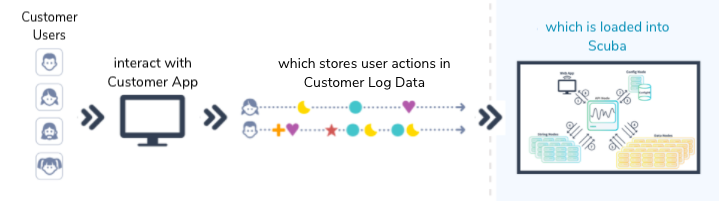

Scuba is a champion of individuals' privacy. Scuba's [privacy purge](../about-scuba-privacy-purges) feature was developed to protect individual privacy, and enable your company to comply with privacy regulations and voluntary policies your company may adhere to.

This article covers what your company must consider to comply with GDPR.

## What is GDPR? 

The European Union (EU) General Data Protection Regulation (GDPR) was designed to protect EU citizen data privacy, and has reshaped the way organizations approach data privacy. The GDPR covers all EU citizens' personal data and provides comprehensive rights to data subjects.

Even if your business is based in the United States, the EU’s new General Data Protection Regulation may affect you. Failure to meet GDPR requirements can result in fines up to EUR 20 million (around $22.3 Million) or 4% of the company’s total global revenue for the preceding fiscal year, whichever is higher.

## What type of data is protected by GDPR? 

Under GDPR, individuals have the right to access their personal data, correct errors, object to the processing and export of their personal data, as well as the right to erase their personal data. Personal data includes:

- Personal identity information (PII) such as name, address, and ID numbers
- Web behavioral data, such as search and cookie data
- Online data that reveals location, IP address, and Radio-frequency identification (RFID) tags
- Health and genetic data
- Racial or ethnic data
- Biometric data
- Political opinions
- Sexual orientation

> [!WARNING]
> Values with spaces in the name are not supported by Scuba privacy purge.

## Personally Identifiable Information in Scuba 

Personally identifiable information (PII) is data that can potentially identify an individual. The following diagrams illustrate the types of PII data Scuba's Privacy Purge encompasses.

**Behavioral information about your users—Scuba as the repository of privacy data.**

**Information about Scuba users—Scuba as the producer of privacy data.**

## Resources for compliance with GDPR 

The following resources will assist you in formulating a GDPR compliance strategy suitable for your company's business model.

- [Guide to the General Data Protection Regulation (GDPR)](https://ico.org.uk/for-organisations/guide-to-the-general-data-protection-regulation-gdpr/)
- [General Data Protection Regulation](https://gdpr-info.eu/)
- [Home Page of EU GDPR](https://gdpr.eu/)
