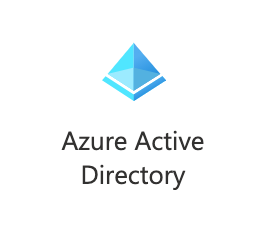
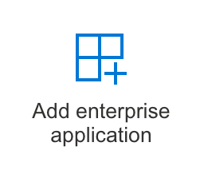
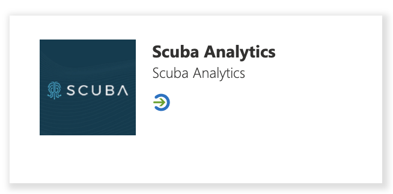

## Before you start…

Make sure you've spoken with your Measure IQ contact to determine which authentication provider best fits your needs. Your Measure IQ contact will also give you three pieces of information that you will need before you start: the **Sign-On URL**, the **Reply URL**, and the **AppID**. 

### Azure AD Configuration

Scuba Analytics has a published SSO application within the Azure AD Gallery. Simply follow the instructions below to set up your SSO app, then send us your **App Federation Metadata URL**.

Note:

1. Open the Azure portal and click on **Azure Active Directory**:  

2. At the bottom of the page (under “Quick actions”), click **Add enterprise application**:  

3. Search for and select the **Scuba Analytics** icon.  

4. Follow the instructions here to configure AAD SSO: [Azure AD SSO integration with Behavure AI](https://docs.microsoft.com/en-us/azure/active-directory/saas-apps/measure-iq-analytics-tutorial#configure-azure-ad-sso).
5. The only piece of information that we’ll need is the **App Federation Metadata URL**. No need to send any certs!

## What's next

Don't forget to send us your **App Federation Metadata URL.** Once we have that, we can get everything hooked up on our side, and then have someone on your team validate that everything is working properly. From there, simply assign your users to the application using [these guidelines from Azure AD](https://docs.microsoft.com/en-us/azure/active-directory/active-directory-applications-guiding-developers-assigning-users).