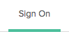
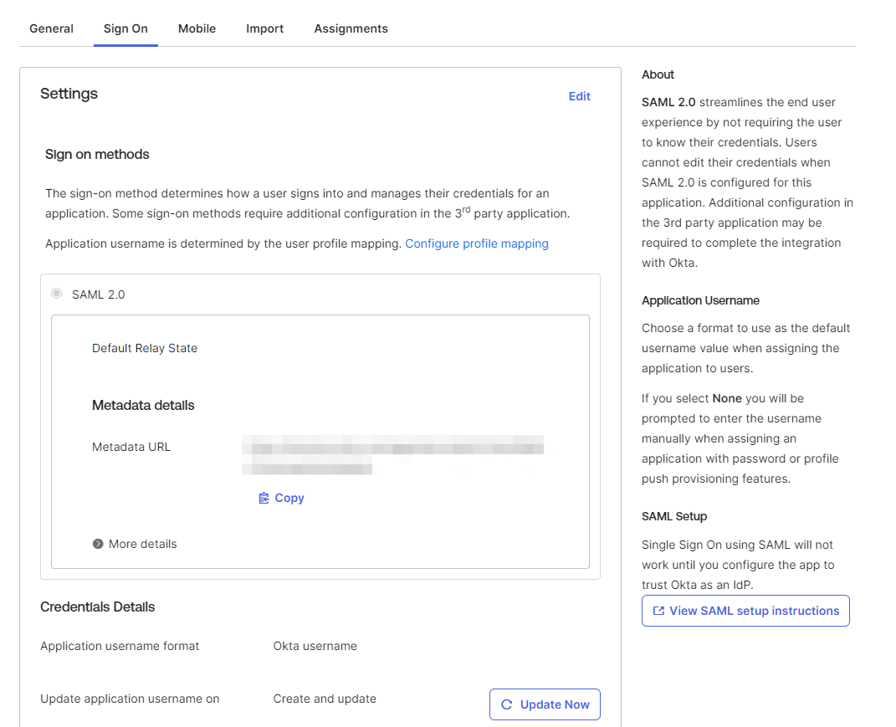

## Before you start...

Make sure you've spoken with your technical customer success manager (TCSM) to determine which authentication provider best fits your needs. Your TCSM will also give you two pieces of information that you will need before you start: the **Sign-On URL** and the **AppID**. 

## Okta Configuration

Now you're ready to set up your Okta authentication application!

1. Open the Okta Admin Portal.
2. On the right side, click Applications, then Applications .  

3. Then click Create App Integration.  

4. Choose "SAML 2.0" and click Create.  

5. In the General Settings section, name your application and optionally add a logo. Click Next.  

6. You will be prompted to fill out the SAML settings for your application. Please leave everything as the default except the following fields:
1.   Single sign-on URL: enter the **Sign-On URL** from your TCSM. Make sure to select "Use this for Recipient URL and Destination URL."
2.   Audience URI: enter the **AppID** from your TCSM.  
3.   Name ID format: select EmailAddress
7. Click Next to finish editing the SAML settings. You may be prompted to take a short survey; at the end, click Finish. This should return you to the main screen. 
8. Click Applications.  

9. Find the application you just created, then open it.

10\. Click Sign On.  

11\. Under SAML Setup, click View SAML setup instructions to find the IDP metadata at the bottom of the page.

12. **Please send this metadata to your TCSM or to** [**help@scuba.io**](mailto:help@scuba.io)**.** You can send us either the metadata file or a link to the hosted file. 

13\. Once we’ve confirmed SSO is active, you can assign users to the new application to allow your team to access Scuba.

## What's next

Don't forget to send us your Federation Metadata Document! Once we have that, we can get everything hooked up on our side. We will work with you to plan a time to switch over to the new authentication flow and have someone on your team validate that everything is working properly.