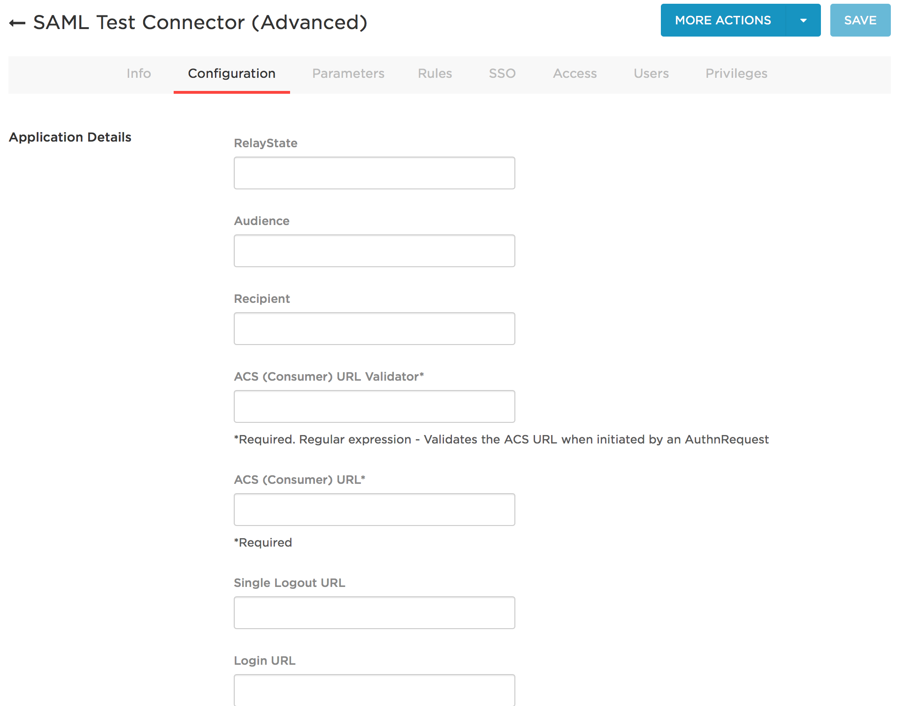
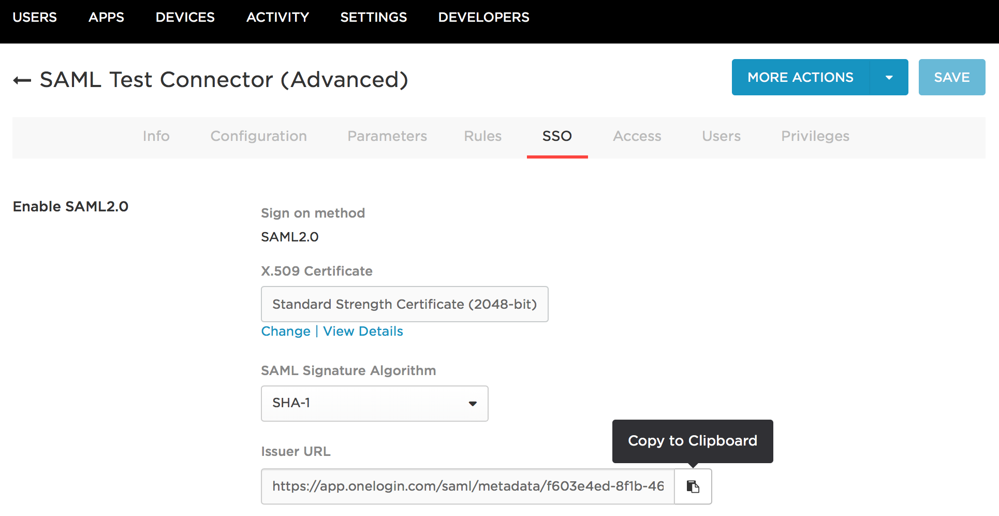

## Before you start...

If you've chosen to use OneLogin as your authentication provider, you'll need some information from Measure IQ before you begin configuring the Measure IQ application in OneLogin. Your Measure IQ team–likely your technical customer success manager (TCSM)–will provide you with a **Sign-On URL** and **Audience URL** that you will need for OneLogin configuration.

This documentation will use the following URLs as examples, but make sure you use the actual URLs provided by your Measure IQ team.

Example Sign-On URL: [https://yourcompany.behavure.ai/api/saml/onelogin](https://yourcompany.behavure.ai/api/saml/onelogin)

Example Audience URL: [https://yourcompany.behavure.ai/api/saml\_metadata/onelogin](https://yourcompany.behavure.ai/api/saml_metadata/onelogin)

Once you have these URLs, you are ready to configure Measure IQ in OneLogin.

## OneLogin Configuration

1. Open the OneLogin Admin Portal in a web browser.
2. At the top of the screen, click "Apps", and then select "Add Apps".

3\. Use the search bar to find "SAML Test Connector (Advanced)", then click on its icon. 

4\. On the Configuration screen, give your OneLogin Measure IQ application any name you want then click Save.

5\. You will now see a new set of screens. Click the Configuration tab again.  

6\. You will be prompted to enter information about the application. *Please leave everything as the default except the following fields*:

a. Audience: Enter the **Audience URL** from your TCSM.  
*Example:* [*https://yourcompany.behavure.ai/api/saml\_metadata/onelogin*](https://yourcompany.behavure.ai/api/saml_metadata/onelogin)

b. Recipient: Enter the **Sign-On URL** from your TCSM.  
*Example:* [*https://yourcompany.behavure.ai/api/saml/onelogin*](https://yourcompany.behavure.ai/api/saml/onelogin)

c. ACS (Consumer) URL Validator: Enter a **regular expression that matches the Sign-On URL**. See [OneLogin's help article](https://support.onelogin.com/hc/en-us/articles/202673944-How-to-Use-the-OneLogin-SAML-Test-Connector) for guidance.   
*Example: ^https:\\/\\/yourcompany\\.scuba\\.io\\/api\\/saml\\/onelogin$*

d. ACS (Consumer) URL:  Enter the **Sign-On URL** from your TCSM.  
*Example:* [*https://yourcompany.behavure.ai/api/saml/onelogin*](https://yourcompany.behavure.ai/api/saml/onelogin)

e. Login URL: Enter the **Sign-On URL** from your TCSM.  
*Example:* [*https://yourcompany.behavure.ai/api/saml/onelogin*](https://yourcompany.behavure.ai/api/saml/onelogin)

f. SAML Initiator: **OneLogin.**

g. SAML signature element: **Assertion.**

7\. Click Save, then click on the SSO tab. Copy the Issuer URL and send it over to your Measure IQ team.

8\. Now you can go ahead and assign users to your application.

## What's next

**Don't forget to send us your Issuer URL!** Once we have that, we can get everything hooked up on our side. We will work with you to plan a time to switch over to the new authentication flow and have someone on your team validate that everything is working properly.