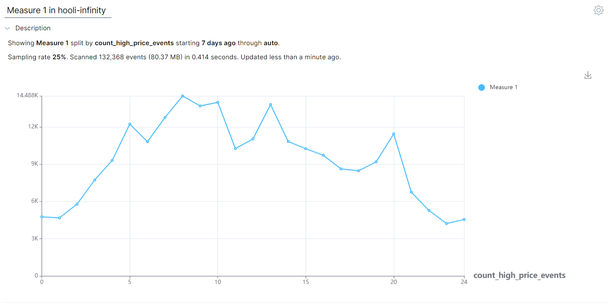

The **Line View** displays your query results as a line. A line view requires a numeric value as a Split By.   

## Related terms

- [Bar View](https://interana.atlassian.net/wiki/spaces/SGV/pages/2160230673/Bar+View+v5)