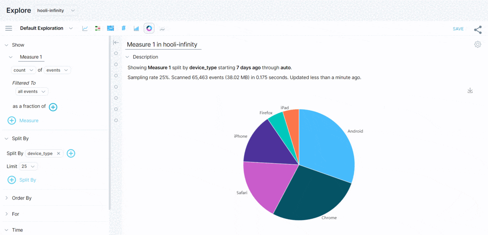

**Pie View** is a type of view that presents grouped query results as sectors of a circle. Each sector of the circle represents the proportion of the total query results represented per group. Hovering over each provides further details, including the percent of the total query results.

## Related terms

- [Number View](../number-view)
- [Views](../views)