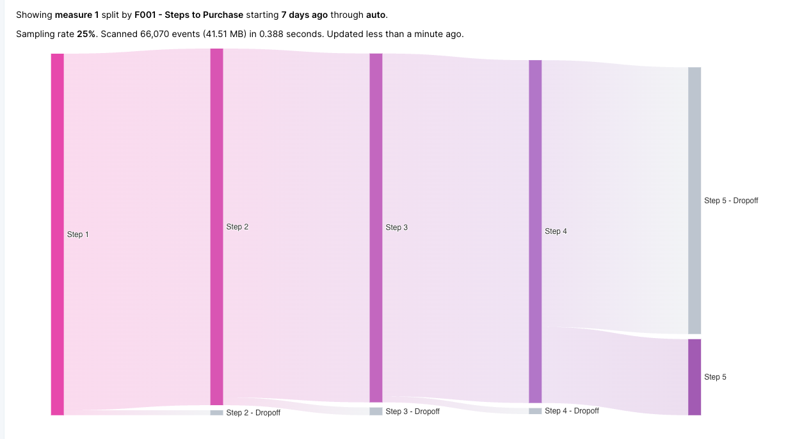

A **Sankey view** is a type of view that presents query results in a Sankey diagram based on the steps configured in a [flow](../../../glossary/flow).

**Sankey diagrams** depict flows of any kind, where the width of each flow pictured is based on its quantity.

Sankey diagrams are very good at showing particular kinds of complex information:

- Where visitors came from and went to on your website or application.
- Flows of energy from source to destination.
- Flows of goods from place to place.  
  

## Related terms

- [Flows](../../../glossary/flow)
- [Views](../views)
- [Visualization Window](../visualization-window)