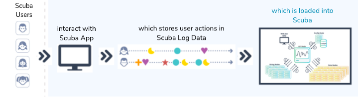

The European Union (EU) General Data Protection Regulation (GDPR) was designed to protect EU citizen data privacy and reshape the way organizations approach data privacy.

A Scuba privacy purge lets you comply with GDPR and other privacy regulations, as well as any voluntary privacy policies your company might adhere to. For more information about GDPR regulations, see [How to comply with GDPR](../how-to-comply-with-gdpr).

This document covers the following topics:

- What happens in a privacy purge
- Available scheduling of a privacy purge
- What you should know before scheduling a privacy purge
- Requirements of a privacy purge
- How to perform a privacy purge

## What happens in a privacy purge

A Scuba privacy purge lets you protect the privacy of Scuba users and users of services whose data resides in Scuba, as illustrated below.

**Behavioral information about your users—Scuba as the repository of privacy data.**

**Information about Scuba users—Scuba as the producer of privacy data.**

The following table lists the types of data affected during a purge, with an explanation of what happens to each data type in the process:

| Type of purge data                                                 | Meaning                                                                                                                                                                                                                                                                                                                                                                                                                                                                                                                                                           |
| ------------------------------------------------------------------ | ----------------------------------------------------------------------------------------------------------------------------------------------------------------------------------------------------------------------------------------------------------------------------------------------------------------------------------------------------------------------------------------------------------------------------------------------------------------------------------------------------------------------------------------------------------------- |
| Source event data files                                            | You are responsible for purging your source event data files of an individual's behavioral data.  If you do not sanitize your original material, we recommend that you maintain a cumulative set of purged IDs. Then if you have to reingest, you can rerun the purge.                                                                                                                                                                                                                                                                                      |
| Event data                                                         | When data stored in Scuba contains references to purged user actions, the entire event record is purged when it matches the purge user in any of the purge identifier columns.                                                                                                                                                                                                                                                                                                                                                                                    |
| String data                                                        | Strings that exactly match a purge identifier are deleted from the string server. Other strings that are associated with deleted events are de-linked and not purged.   **IMPORTANT:** Be careful to only pass purge identifier values that are Personally Identifiable Information (PII), such as email addresses and GUIDs. The delete agent will purge all values that exist in config requests, from all columns.                                                                                                                                       |
| Query result history                                               | Dashboard caches are refreshed or aged out within 30 days.                                                                                                                                                                                                                                                                                                                                                                                                                                                                                                        |
| Named expressions, global filters, dashboards, and derived columns | Named expressions, global filters, dashboards, and derived columns created by a purged user are considered the intellectual property of the company for which the purge user worked, and are not removed.   For named expressions, global filters, dashboards, and derived columns that reference the purged user in their filters or other query parameters, the purge command deletes them entirely. An Scuba admin has the option to run the purge in preview mode (without the --run flag) which will print a list of references without deleting them. |
| Scuba user account                                                 | Named expressions, global filters, dashboards, and derived columns created by the user, and any audit history of changes to these objects edited by the purged user, are considered the intellectual property of the company for which the purge user worked and are left intact. Scuba admins can remove them manually, as necessary.                                                                                                                                                                                                                            |
| System backups                                                     | For system backups, you can set a policy of not retaining backups for longer than your governing policies allow.  NOTE: If you are subject to the EU's GDPR, a 30 day retention policy ensures compliance.                                                                                                                                                                                                                                                                                                                                                  |
| Human readable and structured system logs                          | We recommend that you rotate the logs on the Scuba cluster within seven days.  If these files are downloaded off the cluster for longer storage, keep a cumulative list of purge user identifiers, so you can rerun privacy requests should the logs be needed for analysis at a later time.                                                                                                                                                                                                                                                                |

## Available scheduling of privacy purges

You can choose to request an ad hoc privacy purge, use the automated purge pipeline available, or a combination of both. To set up automated purges, or to schedule an ad hoc privacy purge, contact the Scuba Customer Support team at [help@scuba.io](mailto:help@scuba.io) or reach out to your Scuba TCSM.

The ad hoc privacy purge is intended to be used infrequently, once a month, or less. Some customers hosting Scuba on multiple clusters run custom-built middleware that makes use of the ad hoc purges by queuing purge jobs and running them in order.

## What you should know before scheduling a privacy purge

Before you schedule a privacy purge, it's important that you are aware of the downstream effects:

- Deleted references to a purged user can cause query issues and dashboard charts to disappear.
- A purge scans and deletes specified rows at a speed of 10 GB/hour per data node. Performance may be impacted by importing a large volume of data while the purge is running. Such as, the equivalent of one import node (with 4 CPUs) importing as much as it can into one data node (also 4 CPUs), or about 250 million events/day per data node CPU.
- A privacy purge is a cluster-wide operation with resource-intensive processes. Although it doesn't affect the performance of most queries, longer-running queries can take up to 30% more time to complete while a purge is in progress. For this reason, we recommend that you schedule privacy purges at non-peak hours.
- You can use query-structured logging to determine which objects were deleted in a privacy purge.
- We recommend that you maintain a cumulative set of purged IDs, if you do not purge your raw logs. That way if the original source files are re-ingested, you can rerun the necessary privacy purges.

The dashboard cache is not included in a privacy purge. However, the cache refreshes every week, clearing out old data. For this reason, there might be a short time when dashboards still display privacy information that has been purged.

#### A Scuba privacy purge removes the following PII data:

- Event data
- String data
- Query result history
- Query definition history
- References in derived columns
- References in funnels

#### You are responsible for removing the following PII data:

- PII data in original source logs
- PII data in lookup files

## Requirements for a privacy purge

This section covers the procedural and data structure requirements you must adhere to for a successful privacy purge.

A privacy purge runs across all data available on the cluster at the time of the purge, including data that is in the process of being imported. Data that is imported after the purge pass completes is not scanned unless a new purge is run.

#### Procedural requirements and limitations

- We will not schedule a privacy purge while a cluster rebalance is in progress;
- Privacy purges do not currently support lookup tables; lookup data will need to be purged at the source.

#### Data structure requirements

The following points are required for a successful privacy purge:

- If a column name exists in multiple tables, the columns must be of the same type.
- If there are columns with the same name but are of different types, change the column names in the Scuba UI so they are unique.
- Hexadecimal/Identifier columns *must be* in the format of the original ingested (raw source) data, such as the *original* value of a GUID:   
  "30dd879c-ee2f-11db-8314-0800200c9a66". A privacy purge requires the original ingested (raw source) value.
- String and integer sets are not deleted in a privacy purge.
- Each string must be individually specified for a purge. For example, a "userID" and the "userID@mailaddress" must be individually specified to be deleted.
- A userID that is in a column description (in the Scuba UI) will not be deleted in a privacy purge. You must manually remove any privacy information that appears in column descriptions.
- If a userID appears in a dashboard title, that dashboard will not be deleted in a privacy purge. However, the dashboard title will appear in the metadata delete preview, flagging it for manual deletion.
- Advanced filters, titles, descriptions, and derived columns that contain decimal values or a plain text string that contains a space, are not deleted in a privacy purge.
- Only exact instances of a string are deleted. If the string appears with a letter or number adjacent, it is considered a different string (because it's not an exact match) and is not deleted.
- Privacy purges do not currently support deleting UTF-8 characters, such as kanji and emoji.

> [!INFO]
>
> ### For more information or to request a privacy purge, please contact the Scuba Support team at [help@scuba.io](mailto:help@scuba.io).
