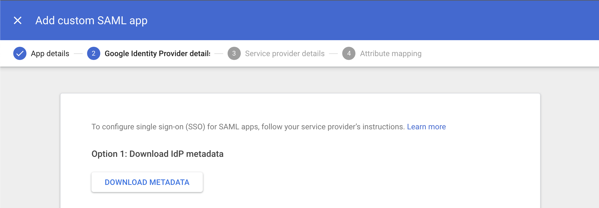
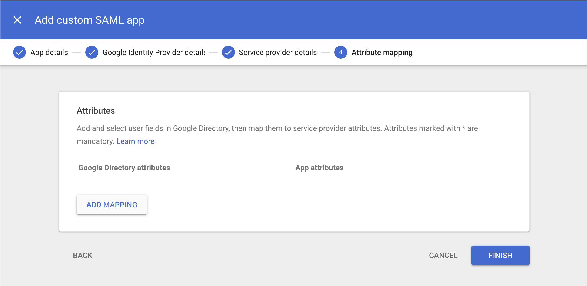

## Before you start...

Make sure you've spoken with your technical customer support manager (TCSM) to determine which authentication provider best fits your needs. If you've chosen to use Google as your SAML identity provider, you'll need some information from Scuba before you begin configuring the application in Google. Your TCSM will provide you with an **ACS URL** and an **Entity ID** that you will need for Google configuration.

This documentation will use the following inputs as examples, but make sure you use the actual inputs provided by your TCSM.

Example ACS URL: [https://scuba.yourcompany.com/api/saml/gsaml](https://scuba.yourcompany.com/api/saml/gsaml)

Example Entity ID: [https://scuba.yourcompany.com/api/saml\_metadata/gsaml](https://scuba.yourcompany.com/api/saml_metadata/gsaml)

Once you have these URLs, you can configure Scuba in Google.

## Google Configuration

1. Go to [http://admin.google.com](http://admin.google.com) and sign in with your administrator credentials.  

2. In the admin console, go to Menu > Apps > “Web and mobile apps”.  

3. Under “Add App” select "Add custom SAML app".  

4. Give your app a name, and optionally a logo, and then click “Continue”.  

5. Download IDP metadata. When you are done configuring SAML in Google, please send the metadata to your TCSM so that they can configure SAML on the Scuba side. Then proceed.  

6. Here's the most important part. Enter the ACS URL and Entity ID provided to you by your TCSM in their respective locations. Double-check your inputs! Leave the default for everything else. Then  
proceed.  

7. On the Attribute Mapping page, click "FINISH".  

8. Your newly created App will default to OFF for everyone:  

9. Click on EDIT SERVICE to turn the app on for the users you wish to be able to log in to Scuba.  

## What's next

**Don't forget to send us your SAML Metadata!** Once we have that, we can get everything hooked up on our side. We will work with you to plan a time to switch over to the new authentication flow and have someone on your team validate that everything is working correctly.