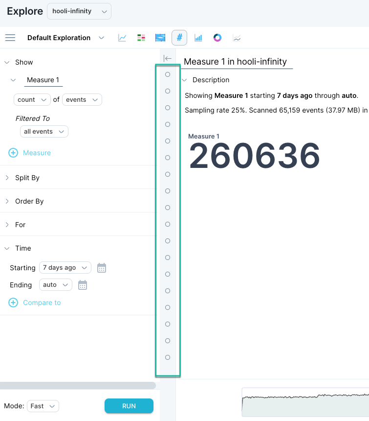

Scuba stores the search history for each individual user, which allows for easy retrieval of previous queries within the same browsing session or even from previous sessions. This feature is particularly useful as it provides a starting point for creating new queries based on previous ones.

The query history can be found between the exploration and visualization panes. A history of your recent queries is represented by each point, beginning with the most recent at the top of the list. You can see where points are located in the image below, highlighted with a teal border in the image.

Hover over each point to see a small thumbnail regarding the query. Click on the point to reveal the full query definition and visualization.

.gif>)

From here you can refresh the data, [modify the query](../../../modify-a-query), and further explore the data.

## What's Next

- [Share an Object](../../../scuba-guides/scuba-user-guides/manage-your-created-objects/share-an-object-with-other-users)
