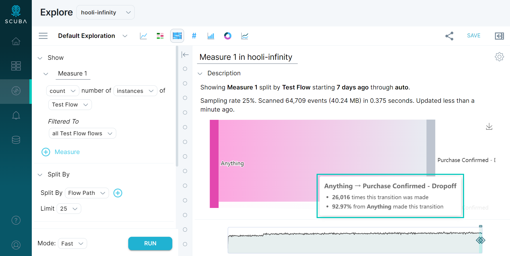
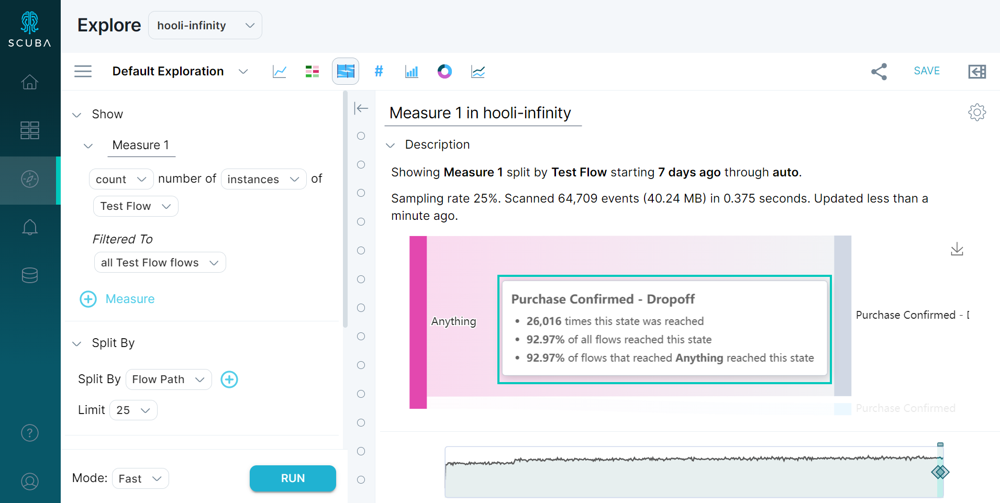

This article demonstrates a few ways you can inspect a flow and start analyzing results in the flow builder.

## Analyzing flow results

**Prerequisite:** Successfully [create a flow](../create-a-flow) to generate results.

To analyze flow results, open **Explore** and build a basic query using **Sankey View**. Then:

1. Hover over a path to view its details in a tooltip.  
   
2. Hover over the vertical bar for each step to view that step’s details.

The drop-off for a step (that is, the population of flow instances that did not reach the step) is indicated by a gray bar. The population that _did_ reach that step is indicated by a bar color that matches the overall flow path. The smaller population, whether unsuccessful or successful at reaching the step, is displayed.

## What's next

Now that you've created a basic flow and analyzed the results, you're ready to fine-tune parameters and explore the data at a granular level.

- [Create a Flow Property](../create-a-flow-property)
