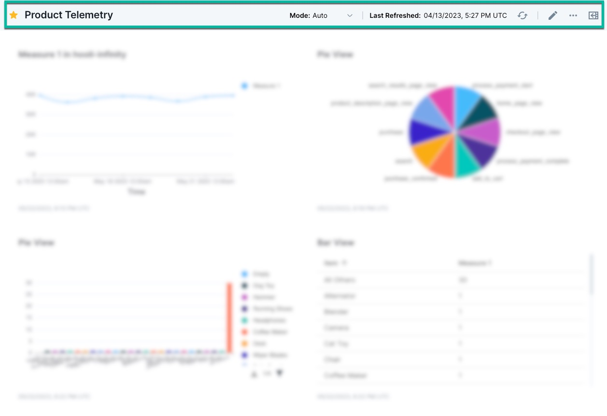

#### The Scuba UI is user-friendly and meant for daily use by a wide range of users, including those in non-technical roles like product, marketing, content development, support, and sales, as well as engineers and data scientists.

With Scuba, you can quickly iterate through point-and-click query building and interactive visualizations. You can move seamlessly from one panel to another using boards, exploring the underlying data by adjusting parameters and drilling down to get a better understanding of the summary. Even users who previously were passive viewers of data can become active investigators with Scuba.

In addition to running ad hoc queries and visualizations in Explore, Scuba also enables you to springboard into analyses with apps, work with your data using properties, and pin valuable queries and analyses to boards.

Before you can get to the fun part of interacting with your data, it's important to understand the basics of Scuba first. This article will help you do just that by describing the various elements of the platform, and how to navigate around the platform.

Let’s begin with a brief overview of Scuba’s primary features found in the side navigation bar.

.gif>)

## About

When you click on the Scuba Analytics logo at the top, a popup window will appear and inform you of what version the UI is in, as well as what username you are logged in as.

## Boards

Boards offer a convenient space to gather and categorize queries through visual panels. This dedicated space showcases boards that have been created and shared on the cluster, empowering users to effortlessly engage with boards they have authored or that were authored by others.

Moreover, these boards can be expertly curated, filtered, managed and shared, while also allowing users to effortlessly add customized panels and modify parameters to delve deeper and unlock new insights from the data.

The navigation sidebar for boards allows users to view **All Boards**, **Favorites**, boards created by the user (**Mine**), as well as **Groups** the user is part of.

The main navigation window showcases a comprehensive roster of boards, presenting crucial information for each. Users enjoy a range of functionalities, including creating new boards, searching and filtering existing ones, adding or removing favorites, selecting boards to include in a group, and deleting outdated or unused boards.

**Favorites:** Boards which have been selected as a favorite, will be listed first. Yellow stars indicate boards that have been saved as a favorite by the user, and grey stars indicate boards that have been saved by a Scuba admin, also known as global favorites.

**Mine:** Scuba has provided a quick way to access all boards that a user has created via this section.

**Viewing a board**

Within each board, you'll find a menu bar positioned at the top. This menu bar displays the board's name, accompanied by a star symbol that is highlighted if the board is marked as a favorite. Additionally, it showcases the sampling rate mode, the timestamp of the last refresh (with the option to refresh instantly), and various other features that empower users to edit and share the board.

**Mode** can be adjusted between Auto, Fast and Complete.

The pencil icon gives the ability to edit the name of the board, move panels around, resize, and delete them.

.gif>)

Read more about managing your objects in [Change the visibility of properties](../../../scuba-guides/scuba-tutorials/manage-objects-and-queries/change-the-visibility-of-properties).

**Panel menu**

The Panel menu allows users the ability to edit the panel. Explore is available via the panel.

#### Opening a panel in Explore or app view

You can open a panel in Explore by clicking **Explore** in the top right corner of the panel.

.gif>)

## Explore

Explore is where you construct queries and analyze results in various formats. You can also modify existing queries to explore the data on a granular level.

#### Constructing a query

The sentence model query builder lets you create queries that read like an actual sentence.

The sentence model query builder is on the left side of the Explore view window, as shown in the following example:

When you make a selection in the query builder, valid options—from the data and action dictionary—are shown from which you can choose. For more information, see the step-by-step instructions for creating a simple query in [Create a board and add a panel](../../../scuba-guides/scuba-tutorials/create-a-board-with-queries-panels).

#### Viewing queries in different formats

Switch between query result visualizations by clicking the icons at the center-top of the Explore window: Time, Table, Sankey, Number, Bar, Pie or Line.

Please note that initial query results are displayed in Time View by default. Not all query results apply to all formats.

#### Saving a query

You can save a query to make it accessible for monitoring and quick reference, by clicking **Save** on the far right of the query tool bar.

Queries can also be added to an existing board as a panel by clicking **Clone to Dashboard** and then select the board to save the query to.

.gif>)

For more information, see [Create a board and add a panel](../../../scuba-guides/scuba-tutorials/create-a-board-with-queries-panels) in the tutorial.

## Exploration templates

In additional to default exploration, additional templates are available to assist in streamlining analysis and reaching insights quickly. These templates can be accessed by clicking the arrow to expand the exploration menu.

#### Retention

Retention analysis reveals how long a user is spending with your product or service, when the user stops using, and when the user re-engages. This helps you learn which features are sticky, which features turn away users, and the level of customer loyalty.

See [Analyze user retention or engagement with the retention module](../../scuba-user-guides/streamline-analysis-with-additional-explorations/analyze-user-retention-or-engagement-with-the-retention-module) in the User's Guide.

#### A/B view

A/B testing helps you measure iterations of your experience using metrics that matter to you.

See [Analyze A/B testing results](../../scuba-user-guides/streamline-analysis-with-additional-explorations/analyze-ab-testing-results) in the User's Guide.

#### Distribution

Distribution view shows the range of events represented in the data and the frequency with which each event occurs.

See [Analyze a distribution](../../scuba-user-guides/streamline-analysis-with-additional-explorations/analyze-a-distribution) in the User's Guide.

## Signals

This feature offers users the functionality to define alert criteria based on their specific requirements. Users can specify the measures they want to monitor and set the frequency at which alert checks should occur. Additionally, they can specify a list of recipients who will be notified whenever an alert is triggered. The notifications sent to recipients include a data visualization that provides a visual representation of the detected change, as well as a link to the corresponding query for further analysis.

The main benefit of using Signals is that it saves users time and effort by automating the tracking of metrics and important changes in their data. Rather than manually monitoring and running queries regularly, users can rely on Signals to proactively alert them when critical changes occur. This feature provides peace of mind, knowing that they will be promptly notified if something significant happens in their data that requires attention or action.

To create a Signal from a query, select “Open Signals Drawer”.

To send a Signal from Board, navigate to the **Menu Board** and click “New Signal”.

Be sure to include specific details such as a name, frequency, and recipients. Adding a name will help distinguish the Signal from others, while specifying the frequency will determine how often the Signal is transmitted. Identifying the recipients will ensure that the information reaches the intended audience. While not mandatory, including a description can be beneficial in providing additional context if needed. Once all the necessary details have been added, simply click on the "Save" button located on the left side to finalize the Signal.

To view all Signals that have been created, select the Signals icon on the left hand navigation bar.

The Signals tab lists all signals that have been created, and provides useful information such as creation details and the Board from which the signal is generated.

See [Signals](https://interana.atlassian.net/l/cp/fwoZqz5J) in the User’s Guide for more information on how to create, modify and circulate Signals.

## Data

The Data Dictionary tab provides a comprehensive view of your event data, including user-defined objects such as Event Properties, Actor Properties, Flows, Flow Properties, and Measures. This tab allows you to conveniently edit, view, and manage existing objects, as well as create new ones. All of these actions can be performed within the data drawer located in the right-hand corner of the dictionary.

#### Event properties

The Event properties tab displays a table of event properties you can use to construct queries. You can also create a new Event property by clicking the button in the top right corner of the window. For more information, see [Create an event property](../../../scuba-guides/scuba-tutorials/create-an-event-property).

Click an event property in the table to view details for the property, as shown in the following example.

#### Actor properties

The Actor properties tab displays a table of actor properties you can use to construct queries. For more information. Click an actor property in the table to view details of the property. You can modify the property by opening it in the drawer, as illustrated with Event Properties above.

For more information, see [Create an actor property](../../../scuba-guides/scuba-tutorials/create-an-actor-property).

#### Flows

Use flows to take a sequence of events by a particular actor, then segment a chunk of those events to operate on with finer granularity.

Click a flow in the table to view the flow. You can modify the flow by changing the option selections in the panel on the left and then re-running the query.

For information, see [Create a flow](../../../scuba-guides/scuba-tutorials/work-with-flows/create-a-flow) and [Modify a query](../../../scuba-guides/scuba-tutorials/modify-a-query).

#### Flow Property

A flow property is an object created by the user that is associated with a flow. It can be used to track and analyze specific aspects of the flow.

For instance, you can define a flow property to keep track of the number of errors encountered by users during a series of actions. This property can then be used to calculate the total number of errors.

When creating a flow property, you have the option to choose a method. There are two main types of methods to consider:

- The "show" method aggregates data from events belonging to each flow instance and generates a single value for each instance. When using the "show" method, you can select objects tied to the events (such as event properties, actor properties, and other flow properties).
- The "label, filter, calculate, or flow time" methods allow for comparisons or arithmetic operations involving other flow properties, actor properties, and literal values. These methods also produce a single value for each flow instance. You can create a flow property using objects related to your flow and access actor properties, but event properties are not accessible in this case.

Click [here to learn how to create a Flow Property](https://interana.atlassian.net/wiki/x/74GCfw).

#### Measures

You can create a query using a Show or Calculate [method](https://scuba.atlassian.net/wiki/spaces/LEXICON/pages/1302495656/Method) and use the new measure in a top-level query. For more information, see [Determine a ratio](../../../scuba-guides/scuba-tutorials/work-with-queries/determine-a-ratio) in the Tutorial.

## Help

Clicking the **Help** icon takes you to our documentation guide. If the documentation doesn’t answer your question, or it’s unclear, please reach out to [help@scuba.io](mailto:help@scuba.io).

## What's Next

Now that you've gotten your bearings with the Scuba layout and functionality, you can jump in and [create a board and add a panel](../../../scuba-guides/scuba-tutorials/create-a-board-with-queries-panels).
