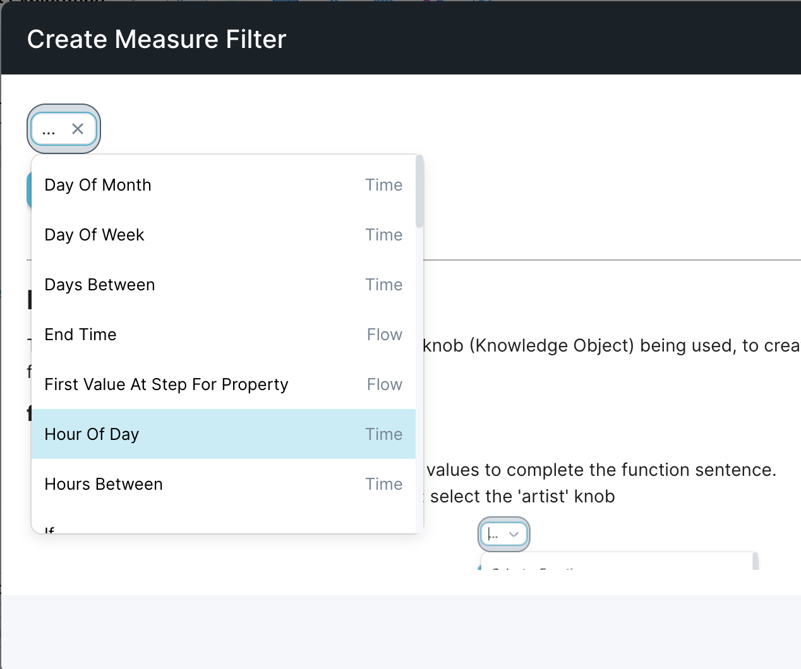
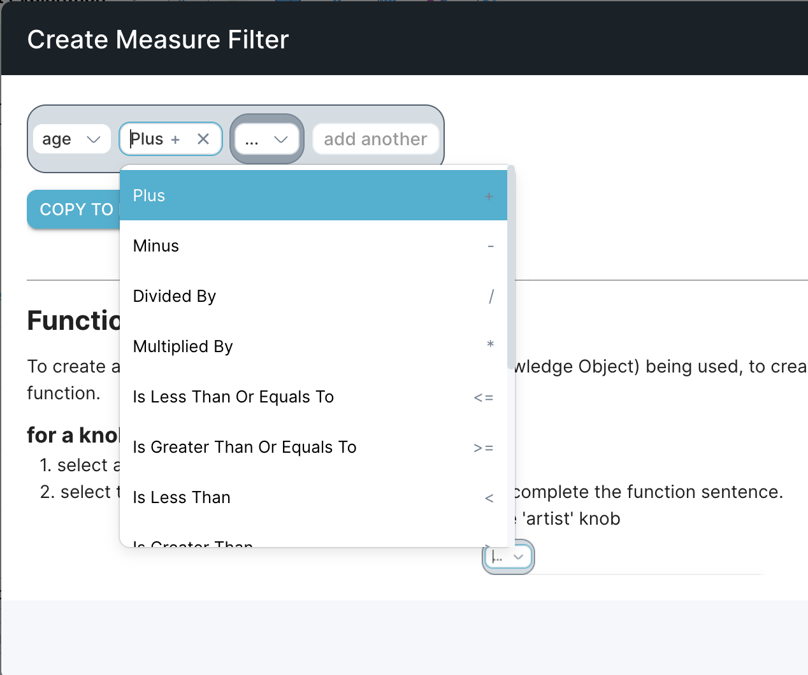

You can filter events at the start of a query using an arbitrary expression containing ANDs, ORs, or NOTs.

To create an advanced filter:

1. In your query definition, go to the **Filtered To** field.
2. Click the drop-down and select ‘**Create a function**’.
3. Type and use suggestions to build your advanced filter. You can start with either **Select a Function** or a knob to begin in the drop-down.
Selecting a function will provide a list of supported functions:
Selecting a knob will result in an operator drop-down appearing. Note that the types of operators available will depend on the data type of the knob you select. For example, numbers get math operators, strings get pattern-matching options, etc.

For more information about supported functions and syntax, see [Calculate measures and filters with the expression builder](../../scuba-user-guides/build-queries-and-visualizations/calculate-measures-and-filters).