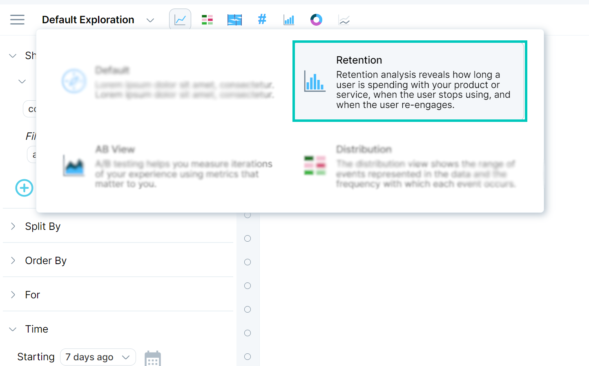
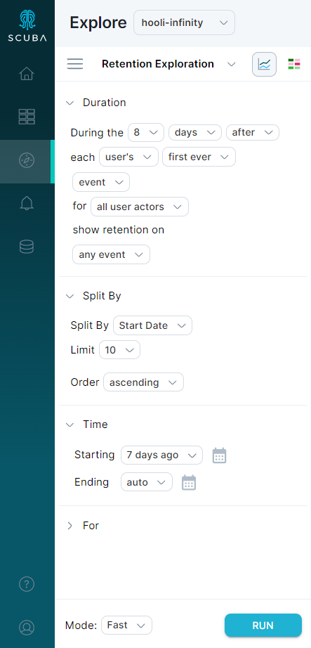
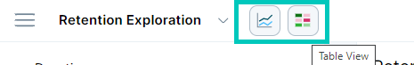
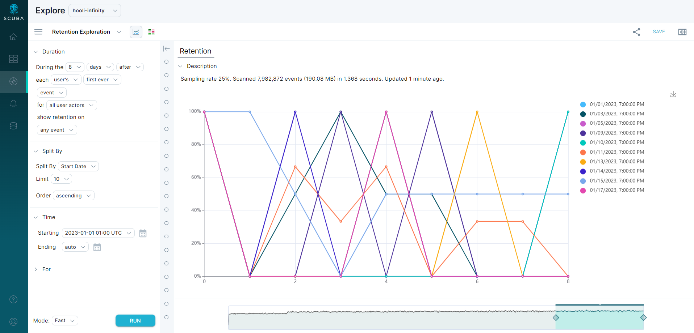
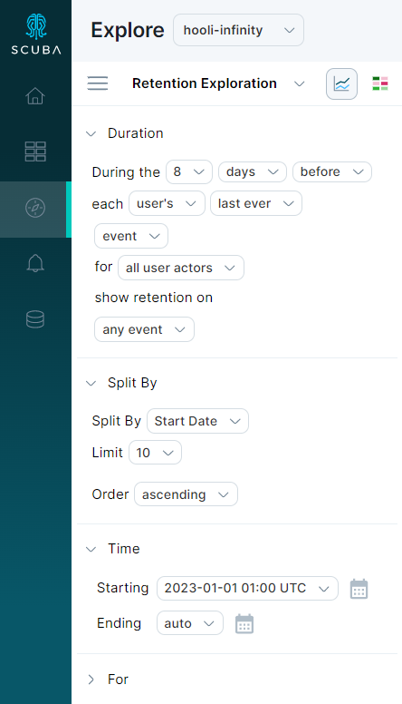

Retention analysis reveals how long a user is spending with your product or service, when they stop using, and when they re-engage. This helps you learn which features are sticky, which features turn away users, and the level of customer loyalty.

You can determine how many of your users return after an initial event (for example, a sign-up event) to perform other actions over time. You can track a rate across different entity groups or cohorts. Then you can drill down into the data to find out why. 

Use retention analysis to answer questions like:

- How many users registered and stayed active a week after the product launched?
- Did a new product feature increase or decrease retention? What is the user retention with respect to a specific dimension or property?
- Do users stick around for a few months and then leave? Or, do users return intermittently?
- What do new users do on their first day? Second day? Eightieth day? How do user actions on their first day compare to those 180 days later? What is the level of engagement of retained users over time?

## Use the streamlined retention module

You can analyze retention and engagement using Explore, or with the streamlined workflow in the retention module.

1. To access the retention module, click the **Default Exploration** drop-down menu, then select **Retention** in the list.
2. When you open the module, it presents a pre-filled valid query for your dataset. You can further segment your analysis by splitting by any actor property, or use the default to split by the **start date** for each actor.  

3. Click **Run**. The retention module can display two visualizations, a line chart, and a table. You can change the view in a similar way as you can in a regular query.
4. 
Examine the line view and dates. In our example, the line for “2023-01-15 7:00 PM” shows retention for actors that started at January 15th and goes 8 days out. The line for “2023-01-10 7:00 PM” starts on January 10th and goes 8 days out.

The [time scrubber](https://scuba.atlassian.net/wiki/spaces/LEXICON/pages/1302233848/Time+scrubber) sets the time range for the inclusion event (date) of each actor. To study all actors over the same amount of time, events that qualify as success in retention might occur after this time by the amount of time chosen in **days before**. Likewise, success events in engagement might occur before this time by the amount of time chosen in **days after**. 

## Analyze user engagement

Whereas retention measures a population of users over time *after* an event of interest, engagement analysis determines how engaged users were *leading up to* an event. Study user engagement to answer questions like:

- How many new, retained, churned, or re-engaged users do you have overall? What is our baseline for user engagement?
- How do these metrics change or compare to each other over time?
- How is user engagement affected by a specific feature or product? What makes a user churn, stay engaged, or re-engage?
- Which churned users are more likely to re-engage the fastest?
- How long does it take a user to complete a purchase? How engaged are users in the days, weeks, or months leading up to a purchase or registration?

To study engagement using the retention module:

1. To access the retention module, click the **Default Exploration** drop-down menu, then **Retention** in the list.
2. Toggle the **after** text to **before**. This toggles several settings, creating a valid engagement view for your dataset.  

3. Click to select the time range, actors, and other parameters that you are interested in for your engagement analysis.
4. Click **Run** at the bottom. The retention module displays the default line chart engagement.