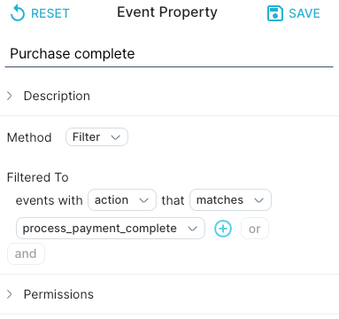
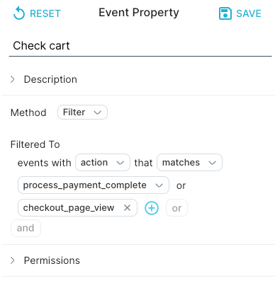
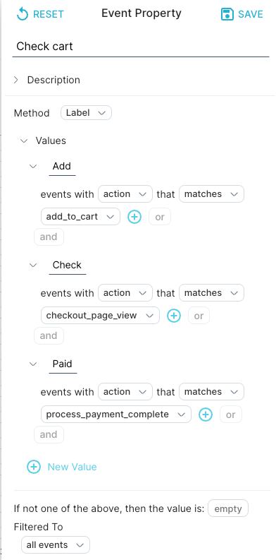

Every [event](../event) includes fields for timestamp and actor, but can also have other associated properties such as location, item type, or any other attribute that describes the event.

Event properties can either be present in the source data, in which case they are considered as raw event properties, or can be manually defined by the user, in which case they are identified as manual event properties. Each event property generates a single value for every event.

Event properties can be utilized in queries for summarizing, grouping, or filtering the data based on a reusable expression.

For instance, if the log data has start and end times, a new event property can be defined using the "duration" method, which calculates the time difference between the end time and start time. This "duration" event property can then be used in a complex query for aggregation, grouping, filtering, or to create another event property. When the main query is executed, it calculates the duration for each event in the data that has both start and end times.

## Defining an event property

This section demonstrates how to create an event property, in which you specify a [method](../method).

- You can specify one or more values for a filter or label event property, and optionally a value to assign if the event property definition does not return any results. To create a boolean segment, use **Filter**. To create a multivalued segment, use **Label** instead.
- To create an event property that is a function, use the **Calculate** method. Specify the actor or context used to evaluate the value, as well as the mathematical operation to perform (add, subtract, multiply, or divide).

#### To create an event property, do the following:

1. In the Measure IQ UI, click **Data** in the left navigation bar.

2\. Open the drawer on the far right, and click **Event Property** to create a new property.

3\. Enter a unique **Name** at the top of the window to describe the property. We named our example property **Purchase complete**.

- Next to **Method**, select the appropriate [method](../method) for your property. In our example, we use **Filter**.
- Select the appropriate options for the property from the drop-down lists. We chose events with **action** that matches **process\_payment\_complete**.

Optional: You can combine multiple actions or other event types in the same event property by clicking **+** or **or** in the filter definition.

4\. Multiple segments can be defined within the same event property by using the **Label** [method](../method) instead of **Filter**. For example, we could call our event property **Check cart**, and do one of the following:

- Click **+** in the Filter method to combine **process\_payment\_complete** events and **checkout\_page\_view** events.

- Use the **Label** method and create distinct segments, one each for **process\_payment\_complete** events, **checkout\_page\_view** events, and **add\_to\_cart** events.

*Note: For both Filter and Label properties, it is good practice to name a bucket for any events that do not match the rules.*

5\. Click **Save** in the top right corner of the page. You can now use your event property as a building block in top-level queries.

### More information

For more information and examples of event properties defined with other methods, see [Building an event property](../../measure_iq/measure-user-guides/enrich-your-data-with-properties/build-an-event-property) in the User's Guide.

## What's Next

You've successfully created an event property. Now you'll want to learn how to:

- [Create an actor property](../measure-tutorials/create-an-actor-property)
- [Create a flow](../measure-tutorials/work-with-flows/create-a-flow)