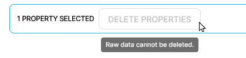
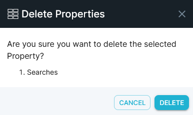

After your property lists become extensive, you'll still want to be able to find the properties you need quickly. This article shows you how to search for properties, as well as how to delete obsolete properties.

## Searching for properties

This section demonstrates how to search for, and quickly locate, properties that you need.

#### To search for a property or group of properties, do the following:

1. In the left menu bar, click the **Data** icon, then click inside the **Search** field and enter the text or string to search for. The list updates dynamically as you type, displaying matching results either by name or by description.
2. To refine your search, enter new parameters in the Search field based on the initial results.

You can also search in Explore by accessing the Query Menu.

1. In the left menu bar, click the **Explore** icon.
2. Click the hamburger menu to the left of the Default Exploration drop down.
3. Enter the text or string to search for inside the **Search** field.

## Deleting properties

If you have **write** permissions, or are the **owner** of a user-created property, you can delete properties that are no longer in use to help prevent property lists from becoming unmanageable. Keep in mind that raw data properties cannot be deleted, and deleting properties with dependencies may have unintended consequences.

#### To delete a property, do the following:

1. In the left menu bar, click the **Data** icon.
2. Search for the property or group of properties to be deleted.
3. Select the property check box in the list. A check mark appears.
4. If the property can be deleted, you can click on **Delete Properties.** Otherwise it will be greyed out as shown below. If Raw data is detected you’ll see a bubble displaying the reason.  

Once you click on Delete Properties, a confirmation pop up will appear.  

## What's Next

- [Create a flow](../../measure-tutorials/work-with-flows/create-a-flow)