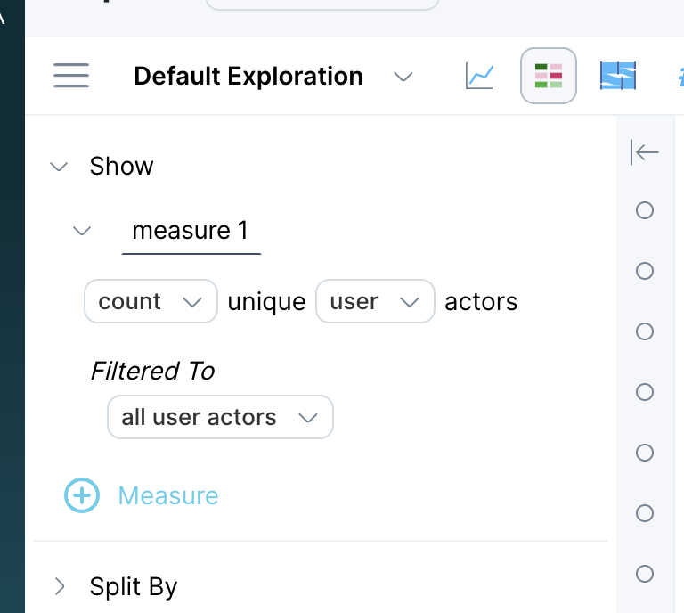

This article demonstrates modifying a query from Explore and from a panel, starting with the query example from [Create a Board with Queries & Panels](../measure-tutorials/create-a-board-with-queries-panels).

## Modify a query from Explore

This section demonstrates how to use **Explore** to modify the query you constructed in [Create a Board and Add a panel](../create-a-board-with-queries-panels), and discover how many actors there were over the last 180 days.

> [!INFO]
> When you modify a query in Explore, you can pin the new query to your board as a new panel while retaining the original query.

#### To modify a query in Explore, do the following:

1. Navigate to the panel you wish to modify.
2. Hover over the top right corner of the panel you want to modify, then click **Explore**. The details for the query you created appear on the left.
3. In the first line of the query, click **events** and select an actor from the drop-down list. In this example, our actor field is named `user`. **Count** becomes count unique, and **Filtered To** automatically changes to all user actors.
4. Leave the **Split by none** setting as is.
5. Click the **Starting** text, enter **180 days ago,** and accept **Ending now**.
6. Click **RUN** to validate the query, then click the pin icon to pin the query to a board as a new panel.

> [!INFO]
> A trailing window (the default is 1 day) specifies how far back from each data point's end time Measure IQ should look at when aggregating over events. We did not specify a trailing window for this example.

## What's Next

Now that you're comfortable constructing and modifying basic queries, you're ready to learn how to create properties for use with more complex queries:

- [Create an event property](../create-an-event-property)
- [Create an actor property](../create-an-actor-property)
