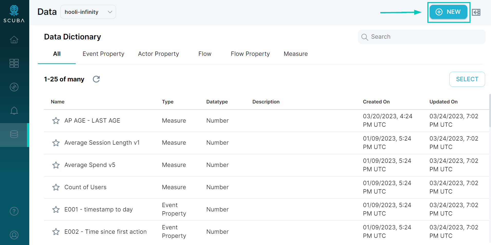
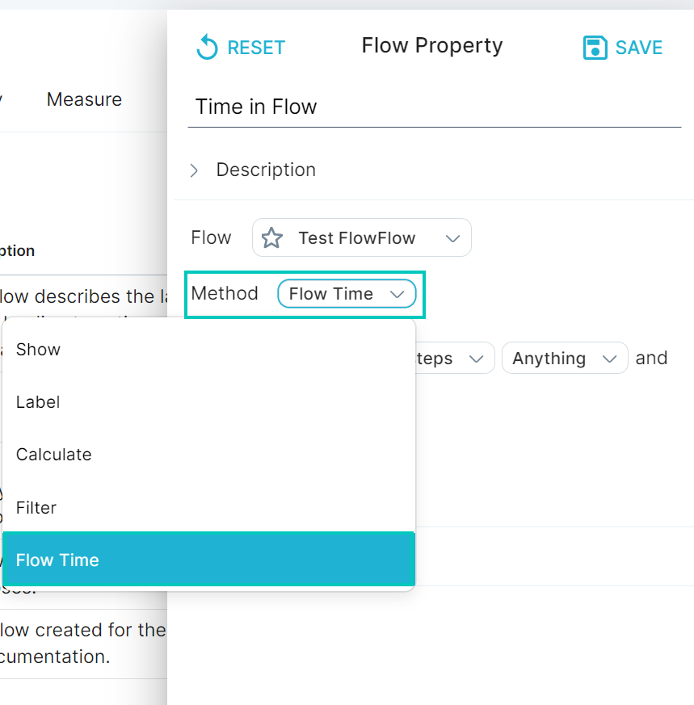
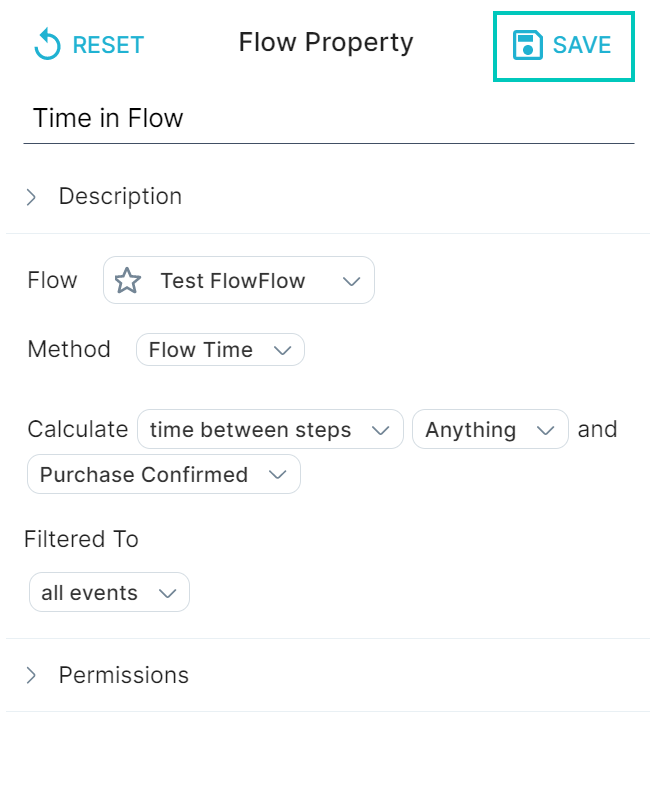
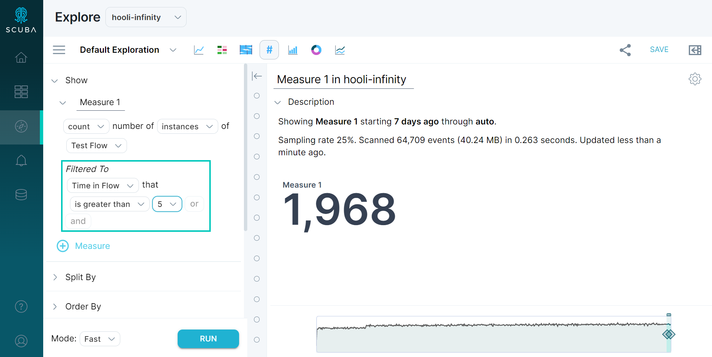

This section demonstrates how to create a custom property for a flow. You must first [create a flow](../create-a-flow) before you can create a custom flow property.

You can create a flow property using one of the following [methods](../method):

- **Show**: The most common properties aggregate events, such as counting the unique number of session IDs.
- **Filter**: You can group and label one segment of your flows, for example, "Did reach shopping cart".
- **Label**: You can group your flows into multiple labels. For example, if "Num5MinSessions > 10" then "heavy user" otherwise "light user".
- **Calculate**: You can perform a mathematical function and apply it as a property. For example, if you have Num5MinSessions and Num60MinSessions, you can create a flow property that applies a function that returns a ratio of the two.
- **Flow time**: You can create a time-based flow property based on the time spent in the flow or between steps within the flow. (For example, the time between Add to cart and Purchase.)

In this example, we create a flow property for our "Test Flow" flow that will calculate the time between the two steps in the flow.

To create a flow property, do the following:

1. Click **Data** in the left navigation bar, then the **+New** button in the upper right corner.
   _Note: The Data Drawer can be accessed almost anywhere in the UI, which means that flows and properties can be created on the fly._
2. Select Flow Property from the drop down menu. The **Data Drawer** will slide out.
3. Enter a unique name for the property at the top of the window.
4. In the Definition tab, select a method from the dropdown. In our example we use **Flow Time**.
5. Choose the appropriate options from the drop-down lists. In this example, we chose to calculate the time between steps Anything and Purchase Confirmed, filtered to all events. Once you’re satisfied, click **Save**.
6. You can now use your new Flow Property in Explore.

## More information

For more information about flows, see the following information in the User's Guide:

- [Analyze User Paths with Flows](../../../measure_iq/measure-user-guides/analyze-user-paths-with-flows)
