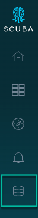
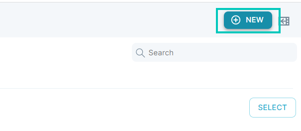
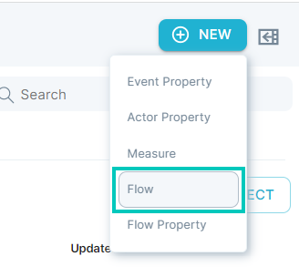
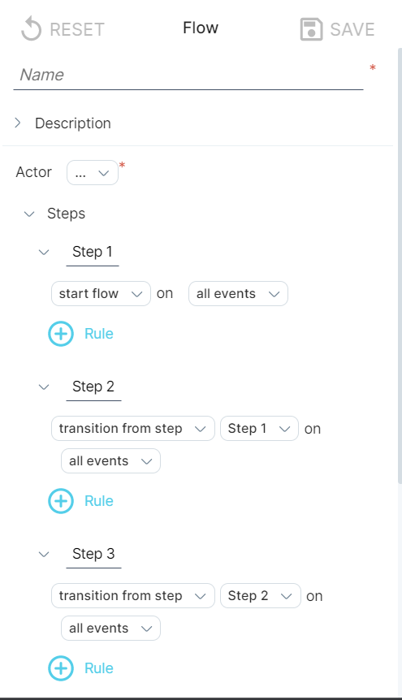
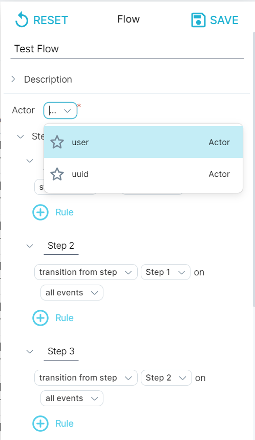
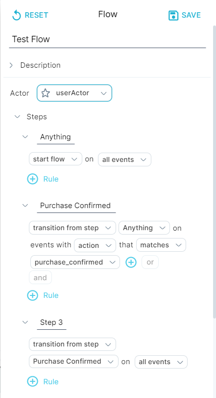
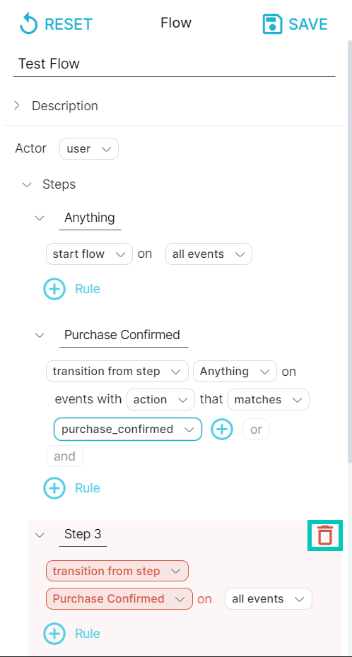
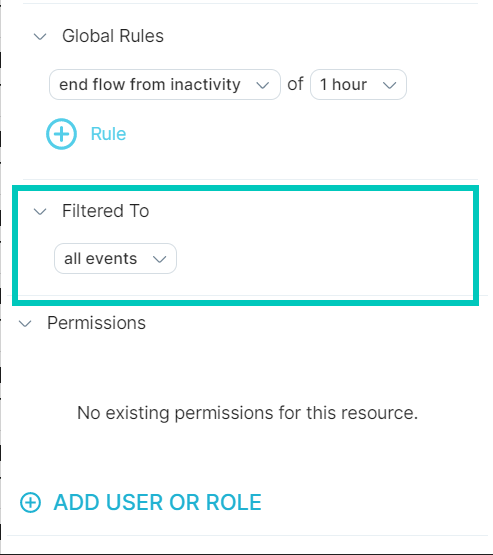

A flow helps you visualize the path of actions taken by a group of actors.

You can view the discovery paths of all [actors](../../../../../measure_iq/glossary/journey-actor-user) simultaneously, investigate the events of all actors on an individual path, or use information from a flow as input in a top-level query. In this way, flows provide you with the tools to track trends and determine projected user behaviors over time.

## Creating a basic flow

Among their many uses, flows help you analyze actor engagement, conversion, and path discovery. This section demonstrates how to create a flow that shows the paths for users who purchased a movie. 

### To create a basic flow, do the following:

1. In the Measure IQ UI, click the **Data** icon in the left navigation bar.

2\. Under **Data Dictionary**, click on the +New button in the upper right corner, then select the flow option.

3\. The **Data Drawer** will slide open.

*Note: The Data Drawer can be accessed almost anywhere in the UI, which means that flows and properties can be created on the fly.*

4\. Enter a name for the flow.

5\. Select an **Actor** from the drop-down list. We chose **user** for our example.

6\. Enter a descriptive **name** for Step 1 and select a filter from the drop-down menu. We entered **Anything** for the name and accepted the default filter **all events**. 

7\. Enter a descriptive name for Step 2 and select the appropriate filter options from the dropdown lists. We entered **Purchase Confirmed** and click on **all events** to select events with **action** that **matches purchase\_confirmed**. See [Understand Flow Definition Conditions](../../../measure_iq/measure-user-guides/analyze-user-paths-with-flows/understand-flow-definition-conditions) in the User's Guide for more information.

*Optional: Add another step, enter a step name, and select filter options.*

8\. To end the flow, click the trash icon next to the last, empty step and scroll down to Global Rules.

9\. Select `end flow from inactivity` or `end flow for max total time` option, and enter or select a time interval.

10\. Specify **Filtered to** pre-filter values, or accept **all events** as we did for our example.

## What's next

Now that you've created a basic flow, you're ready to analyze the results.

- [Analyze a Flow](../work-with-flows/analyze-a-flow)