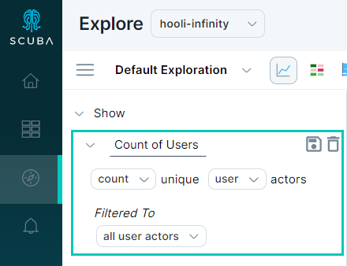
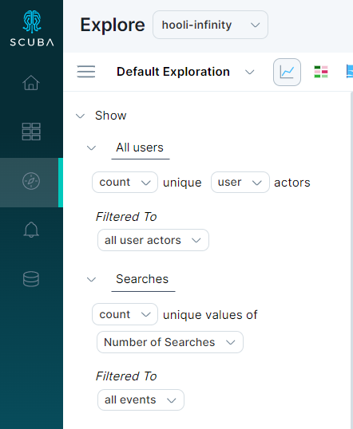
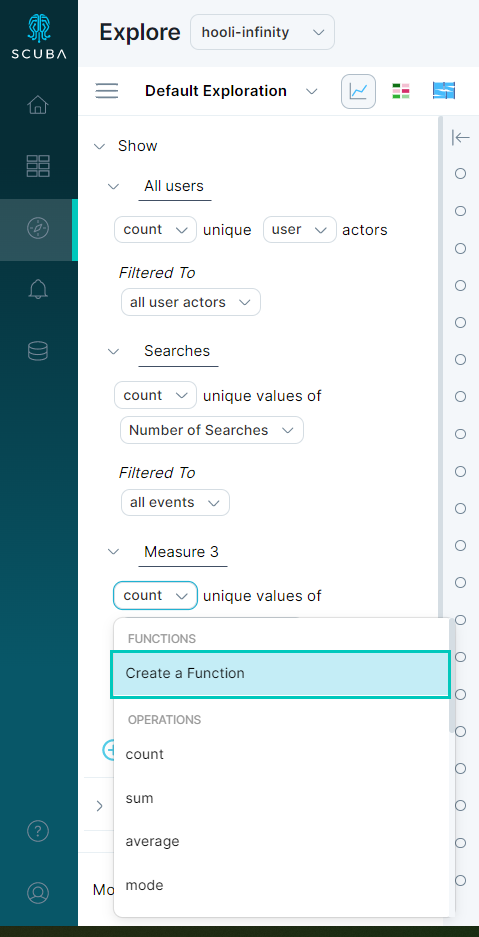
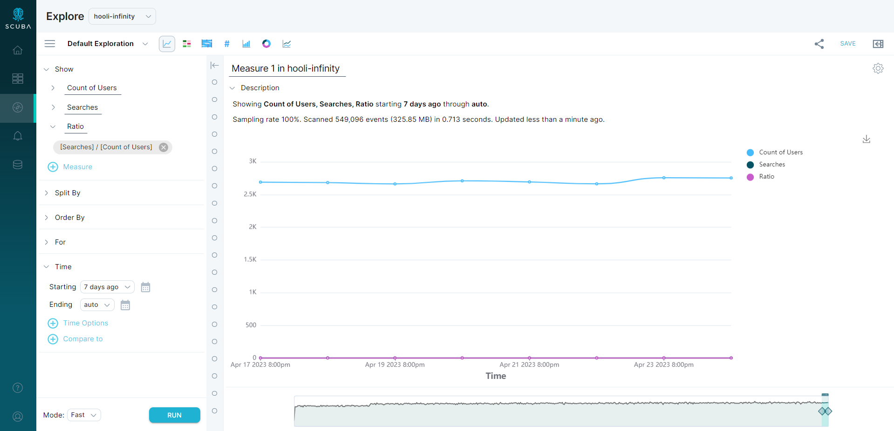
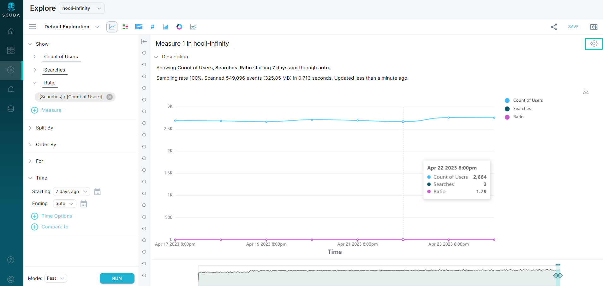

Sometimes you may want to determine the ratio between two events:

- A **measure** assigns a value to a set, which is interpreted as its size.
- A **ratio** is the relationship between two measures, indicating how many times the first measure contains the second. 

This article demonstrates how to construct a query using two measures, then how to determine the ratio between the two measures.

## How to determine the ratio between two measures

This section demonstrates how to create a query that determines a ratio between two measures. In our example, we want to determine the number of unique users who performed a search, and the ratio of searches performed to the number of unique users.

Determining a ratio between two measures involves three steps:

1. Define the first measure.
2. Define the second measure.
3. Define a third measure that is the ratio of the first two measures.

#### To create a query that determines a ratio between two measures, do the following:

1. Click **Explore**. 
2. To define the first measure, select the appropriate variables from the dropdown lists. We did the following:
1.   Accept the default **count** aggregation.
2.   Click **events** and select **user** from the dropdown. The text auto-updates to **Count unique user actors** and **filtered to all user actors**.
3.   Click measure 1 and enter a unique name for the measure. We entered **Count of Users**.
4.   Click the **Save** button to save the measure to be able to use it later.  
  
3. Click **+Measure** to begin defining measure 2.
1.   For measure 2, select the options from the dropdown lists. We chose to show **count** unique values of an actor property defined previously, **Number of Searches**. We accepted the filter, **Filtered to all events**. 
2.   Click **measure 2** and enter a name. We named the measure **Searches**.
3.   Click the **Save** button to save the measure to be able to use it later.  
  
4. Click **+Measure** to begin defining measure 3. This measure will be the ratio of the first two measures.
5. In measure 3, click **Count**, then select **Create a Function**.  

A pop-out will appear with a dropdown list of saved measures.
6. Select the numerator from the dropdown list. The **Plus +** operator will be automatically selected in the list of operators. Select **Divided By /** from the list.
7. Select the denominator, then click **Save**.
8. Accept, or change, the **Split By**, **Starting,** and **Ending** values.
9. Click **Run** to see results.
10. 
If you only want to see the ratio results, click the gear icon in the upper right of the chart.
11. 
In **Chart Options**, uncheck **Count of Users** and **Searches**. You should only see the **Ratio** line in the query now.  

## More information

See [Calculate Measures and Filters](../../../measure_iq/measure-user-guides/build-queries-and-visualizations/calculate-measures-and-filters) for information about building expressions.

## What's Next

Now that you've created a query to determine a ratio, you can move on to [analyzing user sessions with flows](../../../measure_iq/measure-user-guides/analyze-user-paths-with-flows/example-analyze-user-sessions-with-flows).