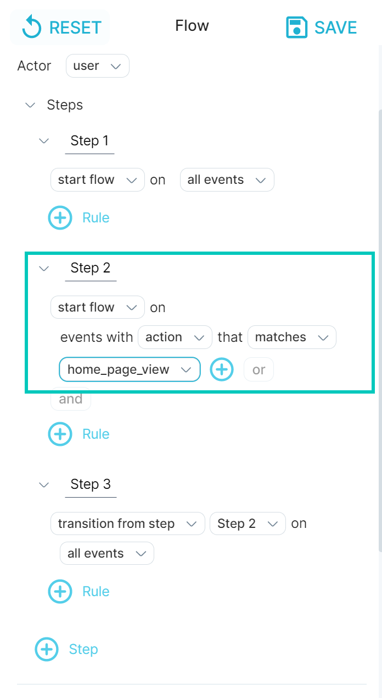
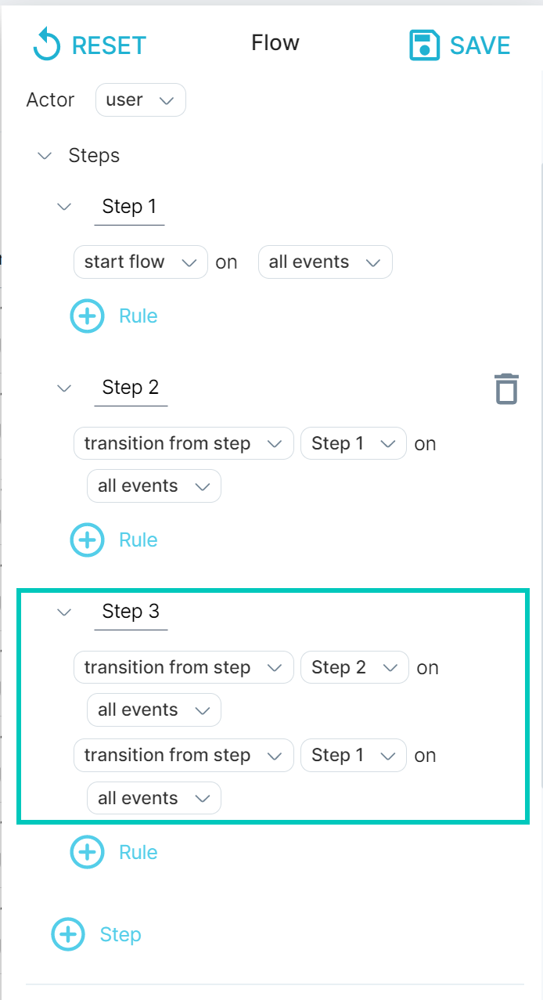

When you define your [flow](../flow), you can identify one or more steps as optional.

For example, you might want to include users that had to log in before purchasing, in addition to users that were already logged in and went directly to purchasing. In this case, login is an optional step.

## Define an optional step

To define a flow with an optional first step:

1. Create a flow, or edit an existing flow.
2. In addition to starting the flow on the first step, add a “start flow” rule at the second step. This means that the first step is optional.
3. Complete the flow definition.

To define a flow with an optional step within the flow:

- Create a flow, or edit an existing flow.
- In the step *after* the one you want to make optional, add two or more rules to transition from the previous steps.

1.  Add a rule to transition from the previous step, as usual for a basic flow.
2.  In the same step definition, add another rule. This second rule should be a transition from two steps back.  
    For example, in a three-step flow where step 2 is optional, create two transition rules in step 3: (1) transition from step 2 and (2) transition from step 1.

- Complete the flow definition.

For more information about flow transition rules, see [Understand Flow Definition Conditions](../understand-flow-definition-conditions).
