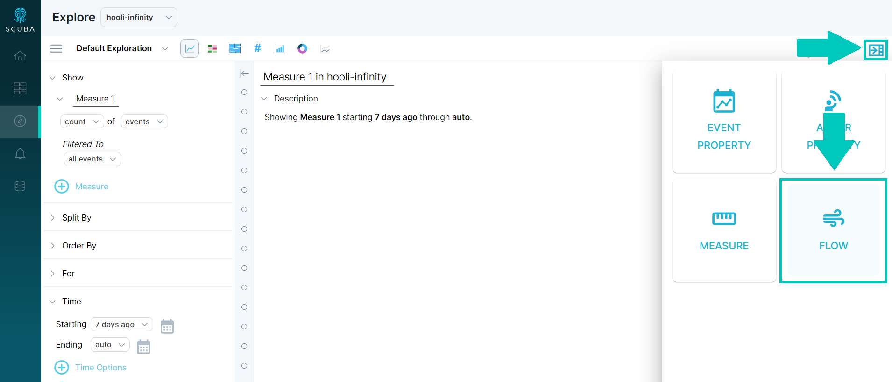
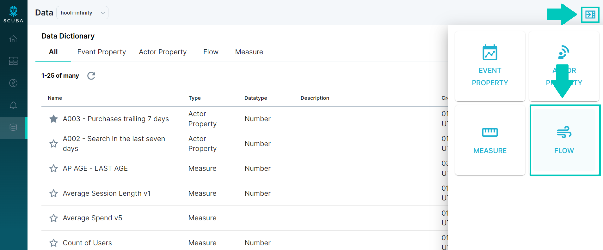

You can perform session analysis in Measure IQ using a flow. At a high level, you [create a flow](../../../measure-guides/measure-tutorials/work-with-flows/create-a-flow) that contains only one flow step, and choose a condition or a timeout due to inactivity to end the flow.

To analyze a standard web session, you might choose an inactivity timeout of 30 minutes. Or for a marketing campaign, you might start a window when you start the campaign, and end it at either a purchase or a 30-day timeout.

## Create a session using a flow

1. From either **Explore** or the **Data** tabs, open the **Data Drawer** and click on the **Flow** icon.
2. 
   
   Define your first (and only) step. Typically, you might start the flow on a login or on any event (**all events**), for example.
3. Delete the remaining flow step templates.
4. Define an inactivity timeout to end the flow as follows:
5. Below **Global Rules**, click **+** **Rule** or edit the default option.
6. Define a timeout appropriate for a session in your experience. For example, for a web session, choose an inactivity timeout of 30 minutes. See [Understand Flow Definition Conditions](../understand-flow-definition-conditions) for more information.  
   
7. Specify a name for the flow and then click **Save** at the top right.

Now that you've defined a flow that models your session experience, you can analyze the session using [Distribution View](/measure_iq/glossary/distribution-view) or **Explore**. Define a session metric using a [flow property](/measure_iq/glossary/flow-property), and use the flow property to filter or split by.

### For more information

- For a basic example of how to analyze a session using Explore, see [Example: Analyze User Sessions with Flows](../example-analyze-user-sessions-with-flows).
