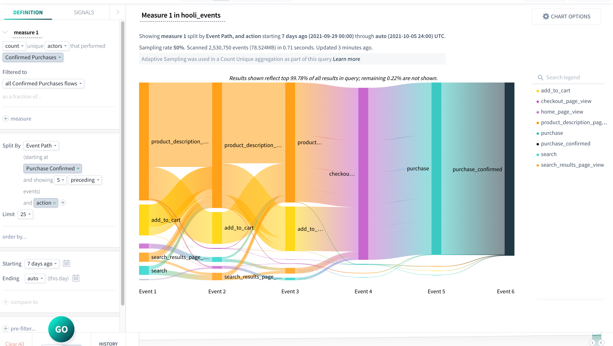

You can use [flows](../flow) to analyze user actions or sequence of actions over time. You can create a flow using existing properties, or create your own custom properties. This article shows you how to create a flow and analyze the actor paths to a conversion state.

This example uses a flow created with a sample dataset. For step-by-step instructions on creating a flow, see [Create a flow](../../../measure_iq/measure-tutorials/work-with-flows/create-a-flow) in the Tutorial.

## Analyzing flow paths to conversion

In this section, we'll explore the results of the flow we created previously. In particular, we want to discover the user paths leading to confirming a purchase.

##### To analyze user paths to purchase, do the following:

1. In Explore, open the flow you want to analyze.
2. Locate the state and step you want to analyze in greater depth. 
3. Select the step and choose **See events leading up to this state** from the drop-down menu.
4. Hover over individual steps and paths for details leading up to conversion.

In the example of our Confirmed Purchases flow, performing this action lets us see the five events that happen immediately prior to each user's `purchase_confirmed` event within the flow. The diagram filters to the events prior this state and splits by event path. We received the following results for our example flow. Hover the cursor over a path to view specific details, or add another **Split By** to bring more detail to your chart. In the example below, we added the event property **action** to better understand what actions led to the **purchase\_confirmed** event.

