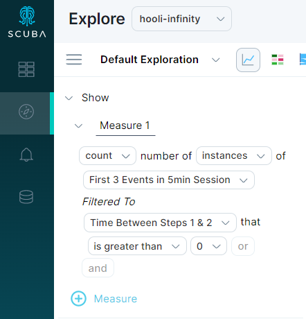

This article explains how you can use a flow to explore the details of user sessions, such as the number of comments each user makes, how often they make a purchase or perform other conversions, or how long they stay engaged on your site.

## Using flows to analyze user sessions

This section demonstrates how to explore user sessions for actor events, such as the number of comments made, the number of errors per session, as well as periods of inactivity. To accomplish this, you do the following:

1. Create or use an existing session flow. See [Define a user session using a flow](../define-a-user-session-using-a-flow) for an example.
2. Create or use an existing flow property to segment your flow.
3. Open the flow in Explore to analyze it.

### To analyze user sessions with a flow, do the following:

1. Create or use an existing flow that uses an inactivity timeout and the [actor](../../../../../measure_iq/glossary/journey-actor-user) with the data you want to analyze.
2. To create a flow property, open the **Data Drawer** in the right corner.
3. When the drawer slides out, click the **Flow Property** tile. Enter a property name, specify property details, and click **Save** in the right corner.
4. To use the flow property, click **Explore.**
5. In the left pane, choose to count the number of instances of the flow you created. Click **Events** and search for the flow name in the dropdown. 
6. Under **Filtered to**, select the new flow property and specify an interesting value. We filtered to flow instances with greater than 0 time between steps.
7. Click **RUN**. The default visualization is time view.
