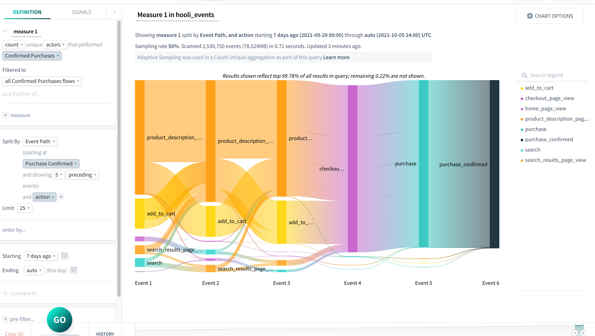
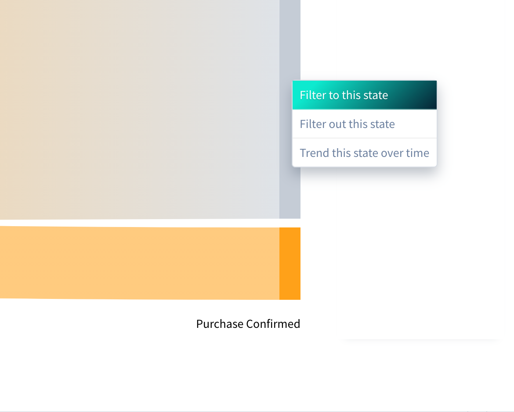
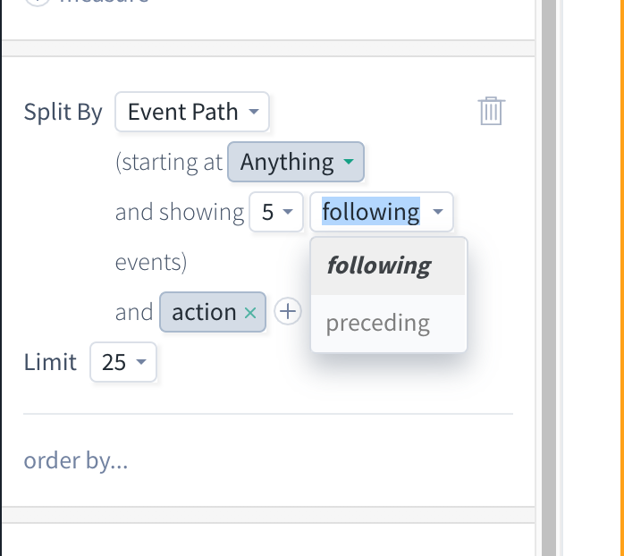
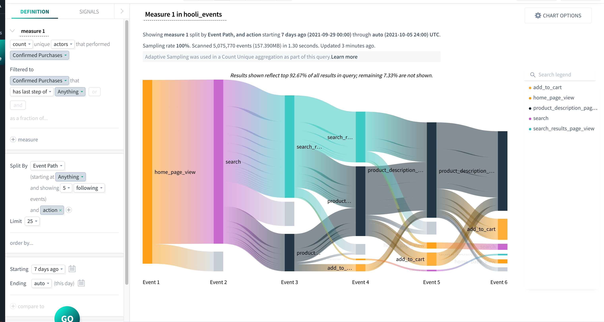
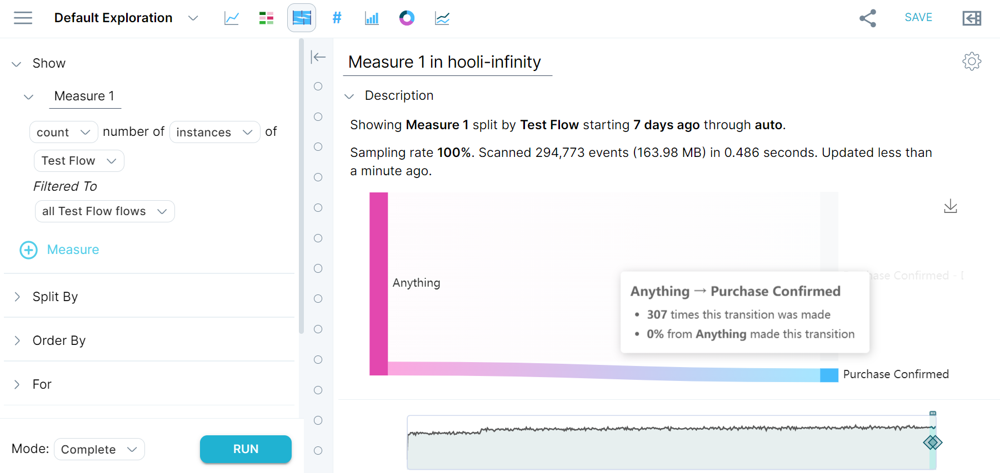
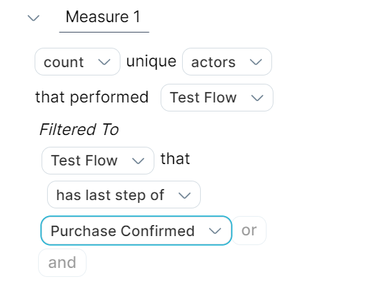

A flow represents the path of actions taken by your actors. You can view the discovery paths of all actors simultaneously, and study the events of an individual path. You can also analyze a sequence of events for a particular [actor](/measure_iq/glossary/journey-actor-user) at a granular level. Flows let you track trends and project user behaviors over time.

This article shows how to use a previously-created flow to show actor paths and determine:

- the events leading up to success,
- the events leading up to failure, and
- the steps completed by a single segment.

## Prerequisites

If you haven’t already, please review the following articles:

- [Create a flow](../../../measure-guides/measure-tutorials/work-with-flows/create-a-flow)
- [Analyze a flow](../../../measure-guides/measure-tutorials/work-with-flows/analyze-a-flow)
- [Create a flow property](../../../measure-guides/measure-tutorials/work-with-flows/create-a-flow-property)

## Showing paths leading to success

Click **Explore** to build a query using your flow for further analysis. Then:

1. In the measure 1 definition, change **count unique instances** to **count unique actors** that performed your flow. In this example, we are using our two-step **Confirmed Purchases** flow. Click **RUN** to view your results.
2. Hover over a non-gray bar indicating a successful step, and click to show a drop-down menu. Select **See events leading up to this state** to automatically adjust your query.  

3. Notice that the **Split By** now says **Event Path**. For more detailed information on the events leading up to the Purchase Confirmed step, add another Split By property such as **action**.

## Showing paths leading to failure

To explore events leading to “failure,” or the drop-off state, navigate again to the query showing **count unique actors** the performed your flow. Then:

1. Click on the gray bar indicating drop-off and select **Filter to this state** to automatically add a new filter to your query.  

2. Change the Split By **Flow Path** to Split By **Event Path**, then change **preceding** to **following** events. In our example, we also add another Split By property, **action**, for more event details.
3. Click **RUN** to view your results.

## Showing steps completed by a segment of actors

There are multiple ways you can view the flow steps completed by a segment of actors.

The first is to **Explore** a flow that has at least two steps in it (our example has four). In the chart results, hover over any of the Sankey visualization paths to see a tooltip with the number of occurrences of that particular path, and the specific steps that each actor followed.

The second way is to filter your results to a specific flow state or other property. Go into **Explore** for further analysis of your flow. Then:

1. In the measure 1 definition, change **count unique instances** to **count unique actors** that performed your flow.
2. Add a new filter to your measure definition - this can be a flow property, an event property, or a specific flow state. For example: our flow has four steps in it, but we only want to see the steps taken by actors who *completed* the flow, so we added **Filtered to Test Flow** that has last step of **Purchase Confirmed**.  

3. Optional: include additional filters in your measure, or change the Split By to **Event Path** to view specific events rather than flow steps.