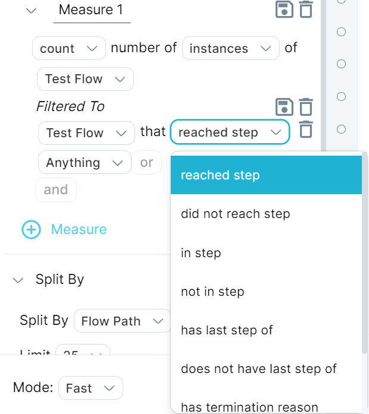

If you're aggregating over events, you can access information about flows in your aggregation. That is, you can use flows and flow steps as a filter when creating a query. This lets you measure the distribution of any event property at any stage of a flow. For example, you can count the events in a flow step, or compare counts of events in different flow steps.

You can filter to and examine events that occur between flow steps, and look for patterns in your customer behavior. You can also split by events that reached `EVENT_FLOW_STEP(name_of_flow_step)`.

You might ask an exploratory question to understand your customer behaviors before and after a milestone, then test these behaviors in regards to conversion rate to the desired milestone. Understanding and simplifying these behaviors help a product or growth team focus on behaviors to encourage before a milestone.

Answer questions like the following:

- What do teams do before they add their fifth unique user?
- What types of events were people doing on desktop before they switch to mobile?
- What do users do when they switch between a channel or a chat, then return to the same channel?
- How many times did a particular action occur in a particular step in a flow?

## Use flow information in an aggregation

To access flow information:

1. Click **Explore** in the left menu bar or open a query in Explore.
2. Create a query that uses an aggregation.
3. Add a Filtered to or Split by condition as needed. The list of available options is as pictured:

You can access flows in aggregations in a simple aggregation, in filter or group by, or in a nested flow. You cannot access flows in a [pre-filter](../pre-filters).

## More information

When you use information from a flow in an aggregation, you are bringing a flow scope property into an event-scoped query. For a discussion of scope in Measure IQ, see [Understand scope](../../measure-user-guides/queries/understanding-scope).