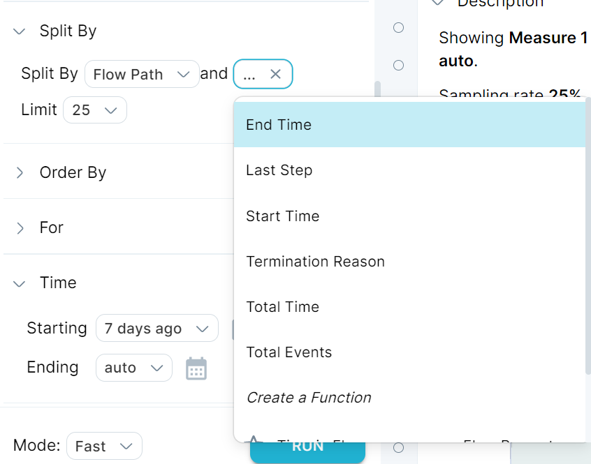

A duration flow property is a [flow property](../flow-property) that uses the flow time [method](../method).

When working with flows, you can use default Measure IQ flow properties or create your own. Recall, you can use a property in a few ways:

- Mark an [actor](../../../../../measure_iq/glossary/journey-actor-user), [event](../event), or [flow](../flow) as belonging to a segment you define (typically based on behavior).
- Measure the value of an attribute that defines a behavior. You might use a time-based property for this.
- Aggregate the previous property types into a metric that describes a population of actors, events, or flows. For example:
-   Use a counting metric to answer questions like, how many users reached a particular step in your flow?
-   Use an averaging metric to answer questions like, what was the average length of songs played by your users?
-   Other metrics can help you answer questions like, what is the minimum or maximum value of a population of measurements?

An important Measure IQ flow property is the time duration within a flow, or the elapsed time. A flow time property lets you specify which steps you want to measure time duration between and then apply an aggregation.

The following quantities are well suited to using a flow time property:

- Average time between steps.
- First, last, minimum, or maximum of events in a flow.

## Why use a duration flow property?

Time is important in most experiences. A shorter time between steps in your experience often results in higher conversion rates. Otherwise, you might have to remind your users (via a push notification, for example) to complete a task that they have been distracted from or abandoned.

Use a duration flow property to:

- Examine the distribution of time spent within your experience or even between steps. You can segment user passes through your experience based on total time spent or event time between steps.
- Create segmentation properties so that you can quantify the conversion rates between steps based on session time spent.
- Adjust your experience to encourage your users to complete workflows and tasks.

## Create a duration flow property

To create a duration flow property:

1. [Create a flow](../../../measure_iq/measure-tutorials/work-with-flows/create-a-flow) that describes a relevant part of your experience.
2. [Create a flow property](../../../measure_iq/measure-tutorials/work-with-flows/create-a-flow-property) using the “Flow Time” method.

## Use a duration flow property

You can always create and use your own custom duration flow property. Alternatively, Measure IQ offers some useful built-in flow properties. To access one of the built-in duration flow properties:

1. Open your flow in Explore.
2. Click **Split By**:  

3. Select a time option, such as `Time Total`. Some other options require additional input, such as selecting a step for `Last Step`.
4. Click **RUN**.