When building a Measure IQ query, instead of selecting a property or operator, you can create a mathematical expression and use it in your measure or property definition. You can do so in the following places in the UI:

1. At the start of a measure
2. In the filter section

## At the start of a measure

- At the start of a measure, click the down arrow in the operator (`count`) to see the list of options. Select **‘Create a Function'**:

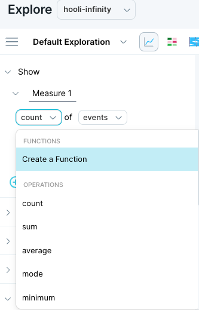

## In the filter section

- In the filter section, you can also click the down arrow in the operator (i.e. count) to see the list of options. Select **‘Create a Function'**:

## Function Editor

With the v5 function editor, you can create **knob-first functions** or **operator-first functions**.

### To create a knob-first function:

1. Select a [knob](/measure_iq/glossary/knowledge-object-knob) from the dropdown.
2. Select the operator, then select the values to complete the function.

#### Example 1:  

- Select the 'artist' knob.  
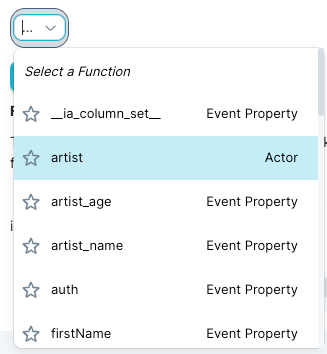
  
- The 'Starts With' option is automatically selected:

- and other operators can be selected within the dropdown:  
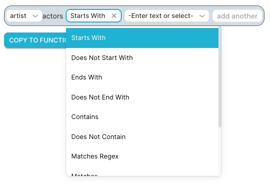
- In this case, because we selected a string function, select a string from the final dropdown or enter a string of your choice. Here is an example of a completed function:

- To add multiple match values from the same knob, click 'add another':

#### Example 2:

If you select a knob with a numerical value, then the operators available will be mathematical operators or numeric comparisons.

For example:  
Select `artist_age` and select a mathematic or comparison operator:

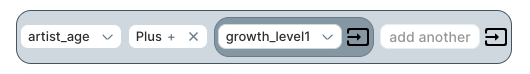

The last dropdown will allow you to:

- Enter a value.
- Select knobs.
- Select an additional operator, in order to create calculations like a + (b/c).

In order to group knobs or literals, click the 'grouping' icon:

To the right of a knob or a literal, and then you will be able to create a nested expression,

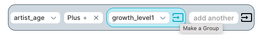

which then becomes:

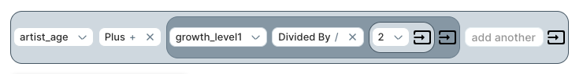

### To create operator-first functions:

To create 'Operator first’ functions like 'day of week' or 'is Empty':

- Choose the 'Select a Function' option in the initial dropdown:

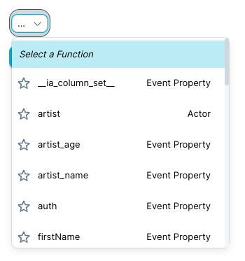

- Then select the actual function:

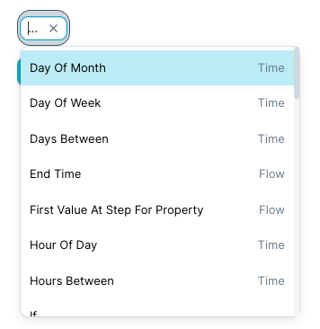

These will also read like a sentence:

- Day of week (\[ts\]).
- Is empty (\[address\]).

The flow functions available here (i.e. time after reaching step, time between steps, total time, etc.) will only work only if you have previously referenced a flow in your query. In case no flow is present in your query, you will need to back out and choose one before using the flow functions.

## Tips to help you calculate filters and measures

### 1\. Deletion

To delete unwanted clauses or values, click on the 'x' in the element or hover over to the right of the element to bring up the trash icon.

Note that the trash icon only appears when you hover on the component and then activates when directly hovered:

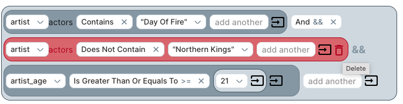

To ungroup a nested function, click on the 'x' in the menu item right after the nesting, like so:

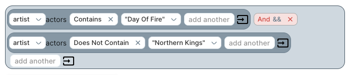

To ungroup a function within the knob:

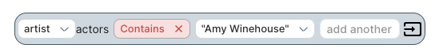

### 2\. Copy/Paste

The entire contents of the created function can be copied into the function clipboard by clicking the ‘Copy to Function Clipboard’. This clipboard only holds functions. It cannot be accessed from your computer.

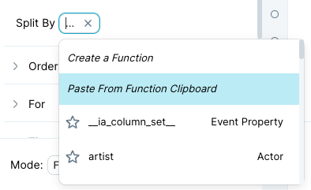

After copying your function, you can then paste it directly into the Explorer pane query with the ‘Paste from function clipboard' option in the selector’.

You can also paste the function as a clause in as any part of another function. For example:

- In the conditional in an 'if' function.
- As a clause in a Boolean function.

Note that the function clipboard works across tables. Since the knobs are by ID and the IDs are different table-to-table, the user will have to edit the individual knobs before running the query to make sure it is valid.