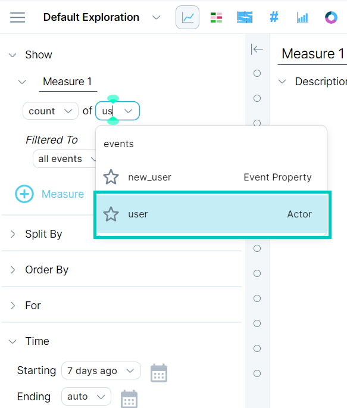
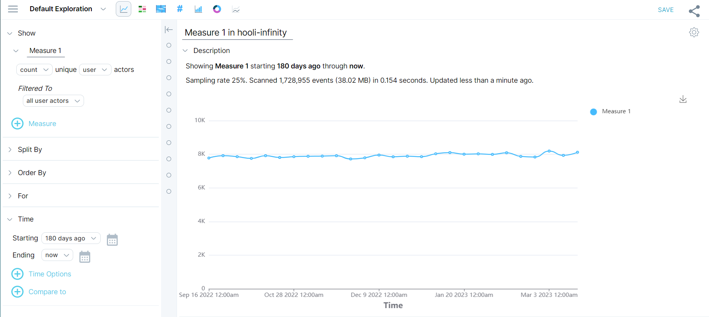

Being able to determine the number of actors in data sets of any size is a basic requirement for most businesses today. You can determine the number of actors across all events over a set period of time in a number of ways. 

## Show a count of actors over a set period of time

Finding the number of actors over a set period of time is a basic query that does not require any custom built properties. 

#### To show a count of actors over a set period of time, do the following: 

1. In the left menu bar, click **Explore.** 
2. In the first line of the query builder, accept the defaults **count** and select **user** (actors) from the drop-down list.

3\. In the second line of the query builder, accept the default: Filtered to **all user actors**.

4\. Specify the **Starting** time for the query by either selecting from the drop-down list, clicking the calendar icon and selecting a date from the pop-up calendar, or clicking text field and entering the desired value. In our example, we entered a value of **180 days ago**. For more information on how Measure IQ handles time intervals, see [Specify time in a query](https://behavure.ai/docs/wiki/spaces/SGV/pages/1894221052).

5\. For the **Ending** time, select **now**.

6\. Click **RUN**. The query results appears in the window on the right. We received the following results for our query.

