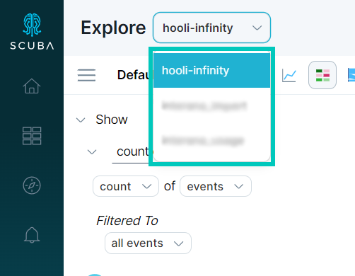
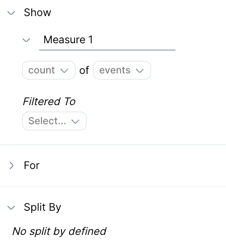
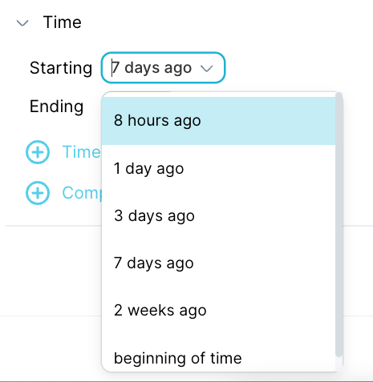
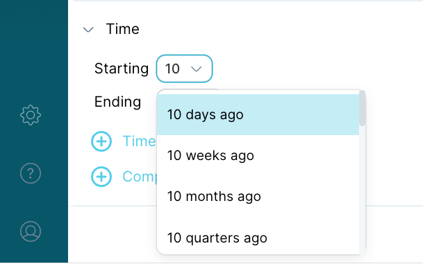
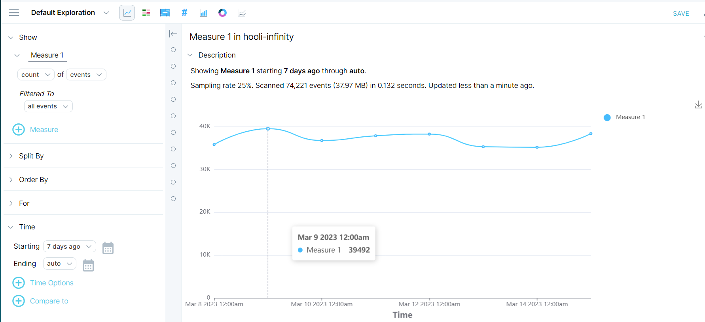

A **count of events** query lets you count the number of events in a dataset. This article shows you how to create a basic show count of events query.

## Show a count of events

You can calculate the number of events over a set period of time in a number of ways.

#### To show a count of events, do the following:

1. In the left menu bar, click on **Explore.**
2. 
In the top left corner of the window, select the dataset. In our example, we chose `hooli-infinity`.
3. 
In the first line of the query builder, accept the defaults: **count** of **events**.
4. In the second line of the query builder, accept the default: Filtered to **all events**.
5. Specify the **Starting** time for the query by
1.   choosing from one of the default options available when you click on the dropdown.
2.   Entering a number to select from a timeline option. For example, you can type a number to select from a series of options.
6. For the **Ending** time, accept the default: **auto**.
7. Click **Run**. The query results appears in the window on the right. We received the following results for our query.

This query example does not require you to build a custom event property. For information on how to build an event property, see [Building an event property](../../measure-user-guides/enrich-your-data-with-properties/build-an-event-property).