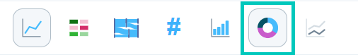
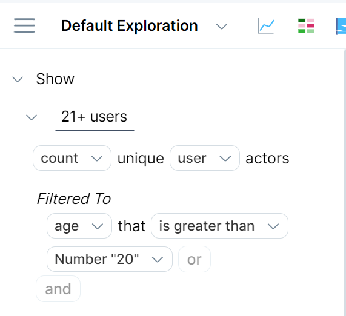
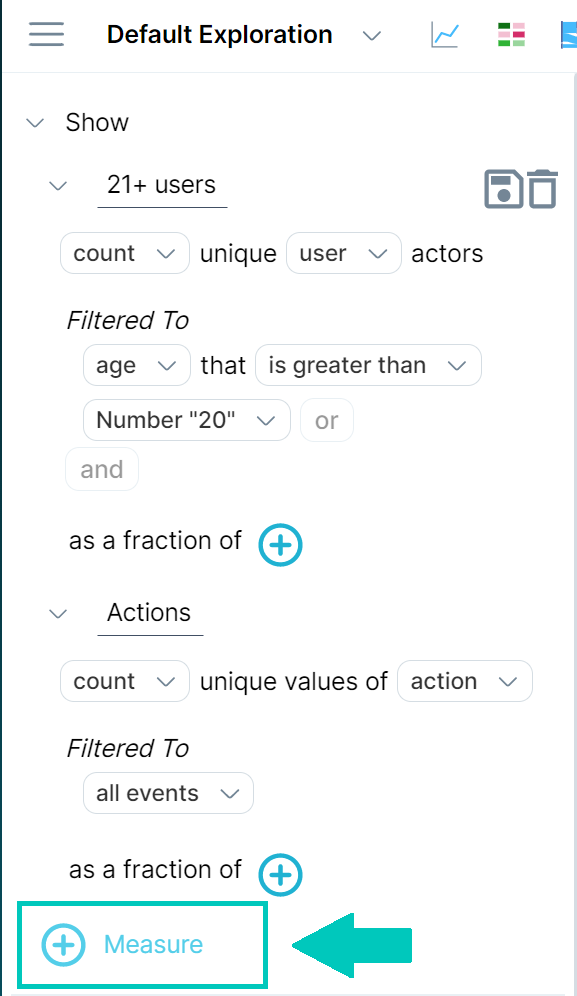
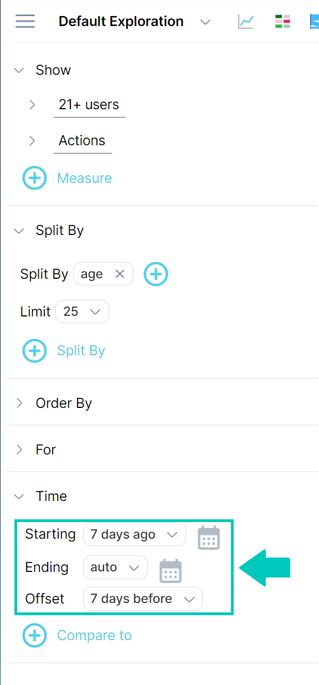
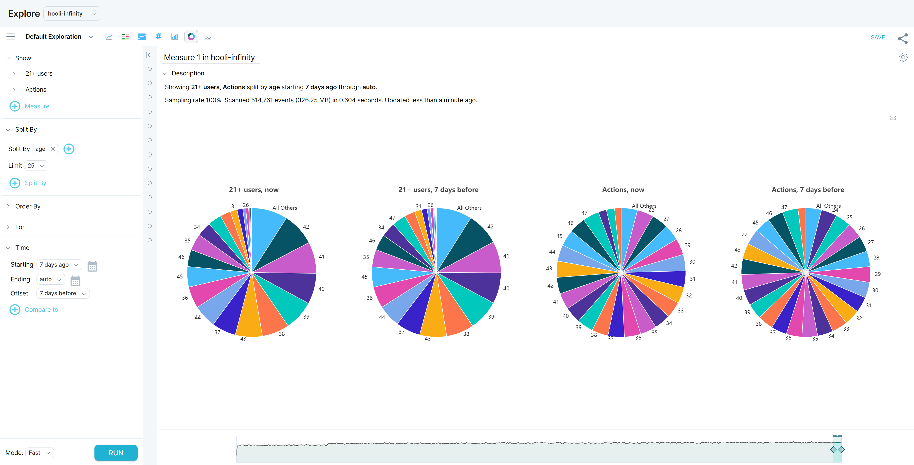

Sunburst charts, known in Measure IQ as pie charts, are an effective way to display and analyze hierarchical data. Each level of the chart (hierarchy) is shown as a ring or circle. The innermost circle is the root (or top) of the hierarchy.

Rings are sliced and divided based on their hierarchical relationship. The angle of each slice is either divided equally under its parent node or can be made proportional to a value. Color is used to highlight hierarchical groupings or specific categories.

## Working in Pie View

A pie chart in Measure IQ can be a single circle with no hierarchical data or a series of concentric circles that represent multiple levels of hierarchical data. The measures that make up a query denote the relationships between the outer and the inner rings, as well as how the rings are broken into contributing pieces.

This section demonstrates how to create a multi-level pie chart. We start by structuring a query that compares two measures, then splits the results into two groups.

#### **To create a multi-level pie chart, do the following:**

1. Click **Explore**, then click the **Pie View** icon at the top of the screen.  
2. 
Specify filters for `measure 1`, then enter a unique name for the measure.  
In our example, we selected the **hooli\_events** dataset, then chose to show the **count** of unique **user** actors **Filtered To** user actors with the event property **age** is **greater than 20**, then named the measure **21+ users**.  

3. Click the **\+ Measure** icon to add a second measure, then specify the variables for measure 2 and optionally give it a unique name. Your second measure will be shown as another ring in the pie chart. In our example, we chose to **count** the unique values of **action** Filtered To **all events**, and named the measure **Actions**.
4. Specify options to **Split By**, clicking **none** and choosing from the drop-down list. Click the plus (**+**) icon to add another Split By option. This groups the data into the selected categories that are displayed as circles in the pie chart. In our example, we chose to split by the **age** event property.
5. Specify Starting and Ending times. In our example, we entered a **Starting** time of **7 days ago** and an **Ending** time of **now**. Optional: Click **\+ compare to** and specify a time **Offset**. This shows another set of charts for the offset time.  

6. Click **RUN** to view your results!

