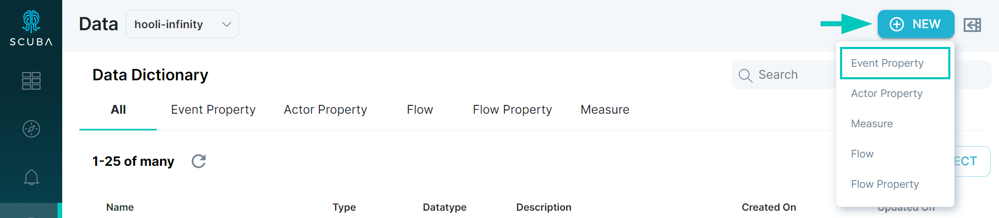

Event properties help "clean up" your data by transforming names and values post-ingest. In queries, event properties are reusable expressions on which you can sum, split by, or filter. An event property can be a direct reference to data columns (for example, the sum of two similar fields from different data sources), a reference to values derived from lookups, or a logical expression evaluating multiple data columns.

This article demonstrates how to build an event property using one of the following [methods](/measure_iq/glossary/method):

- **Filter:** An event property with one specified value.
- **Label:** An event property with more than one specified value.
- **Calculate:** An event property that performs a mathematical function.

## Creating an event property

The initial steps for creating an event property are the same for all methods: filter, label, or calculate.

To create an event property, do the following:

1. In the left navigation bar, click **Data** to access the **Data Dictionary**.
2. In the top right corner of the window, click **+New** button and select **Event Property** from the dropdown.

1. In the **Data Drawer** window, enter a descriptive **Name** for the event property. Use a name that conveys the purpose of the event property, so that it will be easy to find in a list of event properties. 
2. Optional: Click the **Description** tab and enter a description of the purpose and function of the property.
3. Specify **Filter**, **Label**, or **Calculate**. Instructions for each [method](/measure_iq/glossary/method) follow.

### For a filter event property:

Specify one value for a filter event property, and optionally a value to assign if the definition does not return any results. To assign more values, use the label method instead.

### For a label event property:

Specify at least two values for a label event property, and optionally a value to assign if the event property definition does not return any results.

1. Select **Label**.
2. Enter a descriptive name for the first segment in your event property. In our example, we name the segment **Consumer**.
3. Click **all events** and then choose the desired value from the drop-down list. Type to find suggestions. You can specify multiple values and multiple **AND** / **OR** conditions for each value.
4. To add an additional value, click **+ New Value** and repeat steps 2 and 3. Be sure to order the cases correctly! The statement is evaluated in the order that it displays in the UI.  
  
For example, if the first label buckets events with some field greater than 10, and the second label buckets events with that field greater than 100, the second case will not identify any events. You can reorder buckets by dragging and dropping.
5. Click **Save** at the top right. You can now reuse this definition in other queries.

### For a calculate event property:

You can apply a function to a specific action, a flow, a flow that is compared to another action, an event property, or all events (the default).

1. Select **Calculate**.
2. Click inside the **For each event value is ...** field, and select the value to assign to each event. You can choose from the following:
-   An actor, action, time, event property, actor property, or flow property.
-   A function (to view the available functions, type an equals sign).
-   A mathematical operator (add, subtract, multiply, or divide).
-   Numerals.
3. Click **Save** at the top right. You can now reuse this definition in other queries.