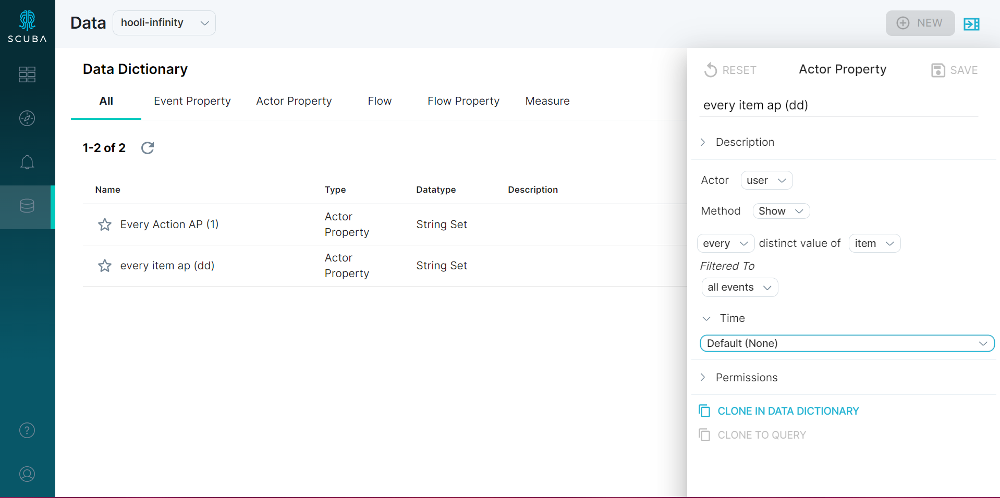

To enable actor or flow property comparisons on the fly, create an actor or flow property that contains a list of values (referred to as a set in the Measure IQ UI) using the **Every** aggregation.

For example, you can create an actor property that consists of all values of a different column for each actor.

Consider this dataset consisting of several events where users A, B, and C purchase items X, Y, and Z:

|               |                          |            |          |
| ------------- | ------------------------ | ---------- | -------- |
| **Timestamp** | **User**  **(Actor)** | **Action** | **Item** |
| July 8        | A                        | purchase   | X        |
| July 9        | B                        | purchase   | Z        |
| July 10       | C                        | purchase   | X        |
| July 11       | A                        | purchase   | Z        |
| July 11       | C                        | purchase   | Y        |
| July 11       | B                        | purchase   | X        |
| July 12       | A                        | purchase   | X        |

Say you are interested in segmenting the user population according to which item they purchased. That is, you might want to compare the total amount spent by users who purchase item X to the total amount spent by users who purchase item Y or Z.

To enable this kind of segmentation, you can create a new actor property, Every item purchased, consisting of the set of all items that each user purchased:

1. In either the **Data** section or the **Data Drawer** (in Explore, click the drawer at the upper right-hand corner), click the Actor Property tile.
2. Select the **Show** method.
3. Click the default **count** and select **every** from the dropdown menu.
4. Complete the property definition.

The values of the actor property for each user are as follows:

|          |                |
| -------- | -------------- |
| **User** | **Every item** |
| A        | X, Z, Y        |
| B        | Z, X           |
| C        | X, Z, Y        |

Like with all user-created objects in Measure IQ, the query is saved but the results of the query are not. When you use the actor property for analysis later, Measure IQ runs the query to populate the actor property at the same time that it runs the main query.

Each value of **Every item** is a set containing all values of the **Items** column for the corresponding Actor in the **User** column.

Now you can use **Every item** in a filter or split-by. For example, you can find the total amount spent by users whose purchases include item X and compare that to the total amount spent by users whose purchases include item Y. Previously, for this calculation, you had to create a property for each item you want to compare. With actor and flow properties that are sets, you can compare these quantities on the fly.

:::caution
The Every aggregation does not support identifier columns.
:::

#### Advanced example: set of sets

You can also use the every aggregation on columns that themselves are sets. For example, consider the above example, but with an additional column describing product categories for each item:

|               |                          |            |          |                          |
| ------------- | ------------------------ | ---------- | -------- | ------------------------ |
| **Timestamp** | **User**  **(Actor)** | **Action** | **Item** | **Tag**                  |
| July 8        | A                        | purchase   | X        | electronics, home        |
| July 9        | B                        | purchase   | Z        | electronics, children's  |
| July 10       | C                        | purchase   | X        | electronics, home        |
| July 11       | A                        | purchase   | Z        | electronics, children's  |
| July 11       | C                        | purchase   | Y        | art supplies, children's |
| July 11       | B                        | purchase   | X        | electronics, home        |
| July 12       | A                        | purchase   | X        | electronics, home        |

Creating an actor property using the every aggregation would produce results like the following:

|          |                                             |
| -------- | ------------------------------------------- |
| **User** | **Every tag**                               |
| A        | electronics, home, children's               |
| B        | electronics, children's, home               |
| C        | electronics, home, children's, art supplies |

Measure IQ deduplicates the contents of the resulting set.

### Example: How much time do listeners of Artist A vs. of Artist B spend using your music service?

Compare the time people spent in your service when they listened to Madonna vs. Kings of Leon vs. various artists.

Without a set actor property, you would need to create an actor property for each artist you're interested in (one for Madonna, one for Kings of Leon, and so forth). With the Every aggregation, you can create an actor property that's a set that you can later use as a filter or split by.

The new actor property is a set of all artists listened to, named "Every artist listened to", on the actor called "user".

Then you can filter to users that contain "Madonna" in that actor property set on the fly, rather than having to create a property for each artist you want to compare.

You could also split by artist to see the other artists that users listened to.

### Example: Of people who saw error pages, what else did they look at?

Rather than explicitly defining a segment of people who had error pages, you can create a set that's a list of all pages they saw.

Then you can use the new set property to segment your population on the fly. For example, you can compare how much people spend when they see error pages vs. help pages vs. other pages.
