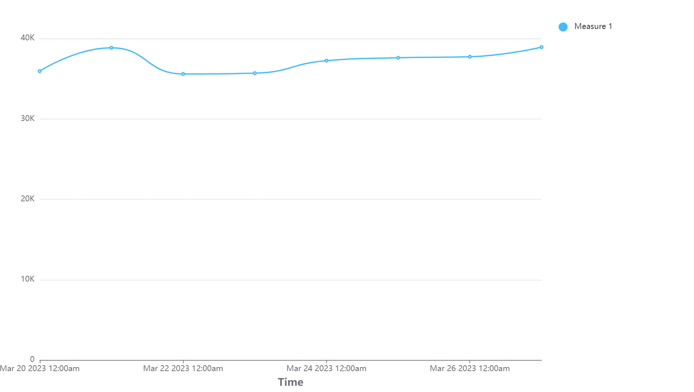
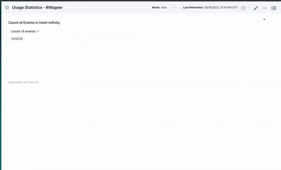
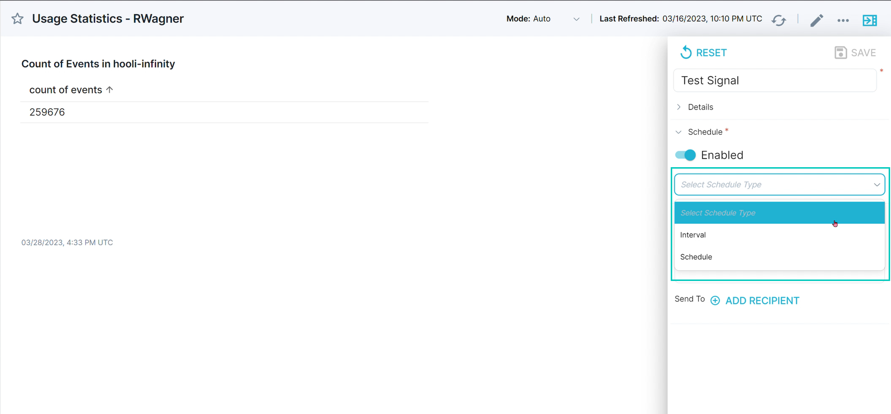
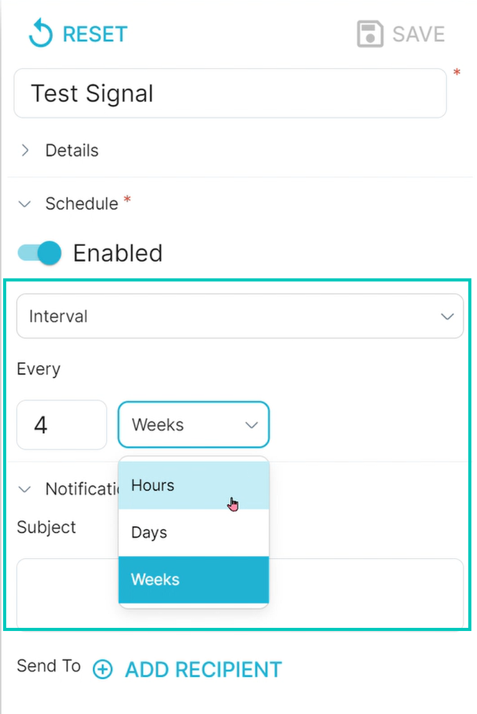
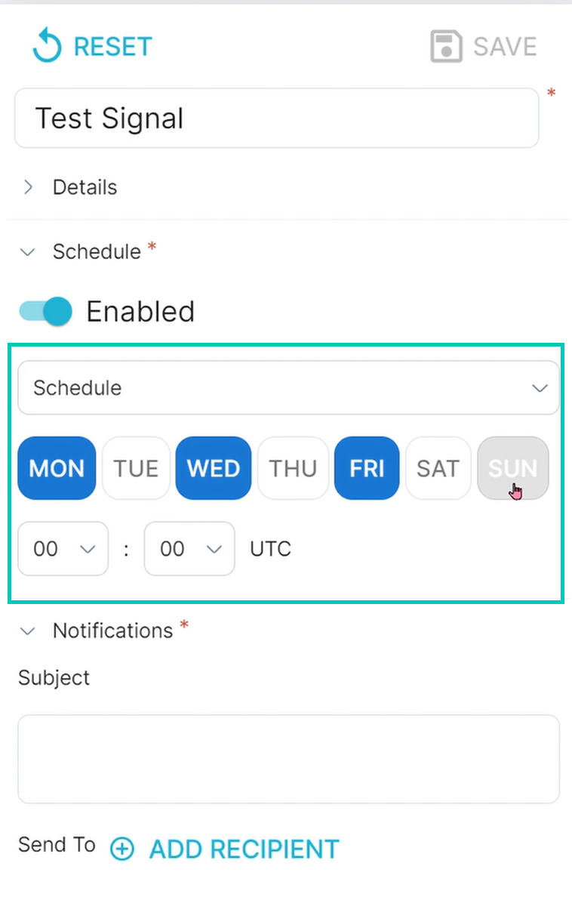
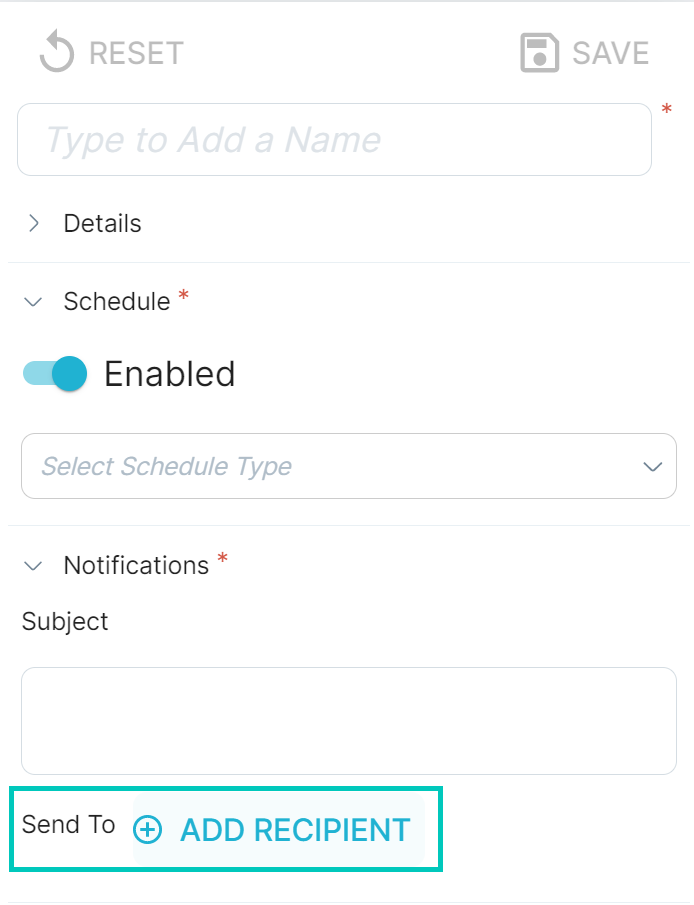
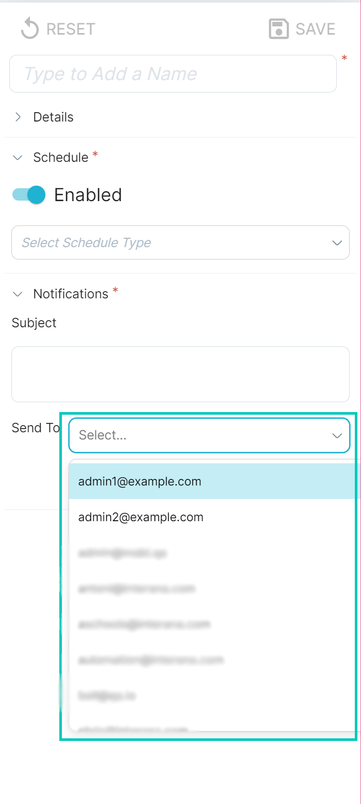
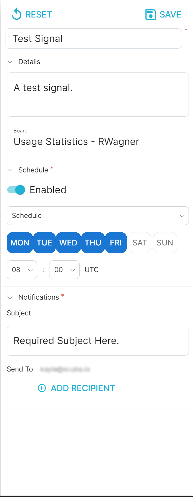

## How to download query results as an image: 

You can do this from any view by clicking the `Save As Image` icon to the right of the chart.

Clicking the icon will download just an image of the chart, as shown below:

## How to create Signals for dashboards

Signals can be scheduled to send a snapshot of the entire dashboard to yourself or other users.

Simply navigate to the board you would like to schedule a Signal for, then click on the three dots in the upper right-hand corner. When you click on Signals, a pop-out will slide into view.

Choose a descriptive name for your Signal, then select a schedule type by clicking on the **Select Schedule Type** dropdown menu.

Select either **Interval** or **Schedule** and then select the time that you want the Signal to be sent.

Before you save the Signal, you’ll need to add a recipient and add a subject. Enter an appropriate subject to describe the Signal.

Click the **Add Recipient** button and either select an email to send to, or type one in.

After that, click the **Save** button in the upper right-hand corner.

