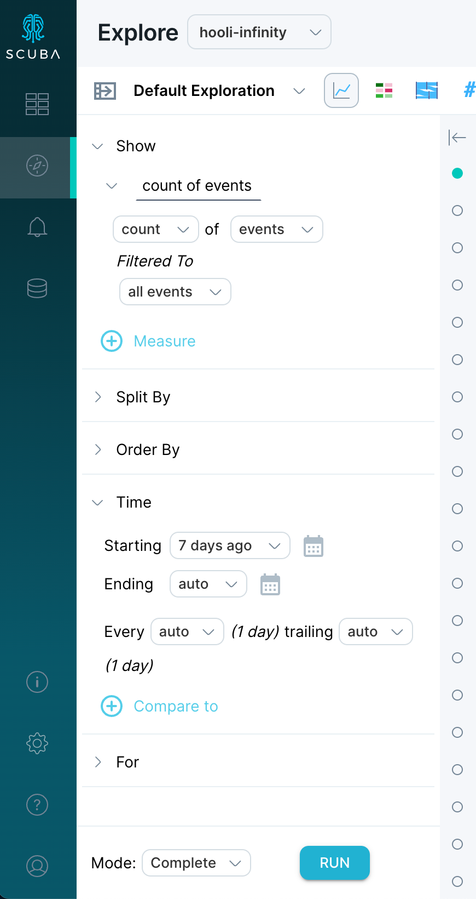
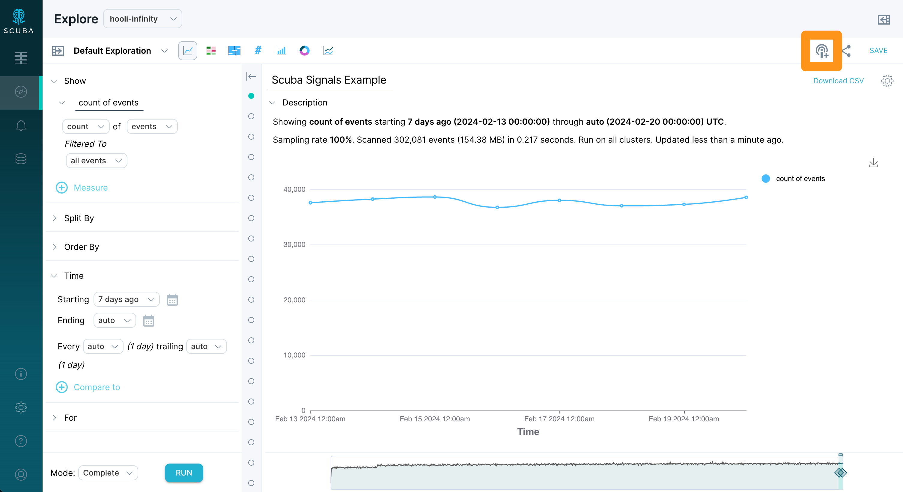
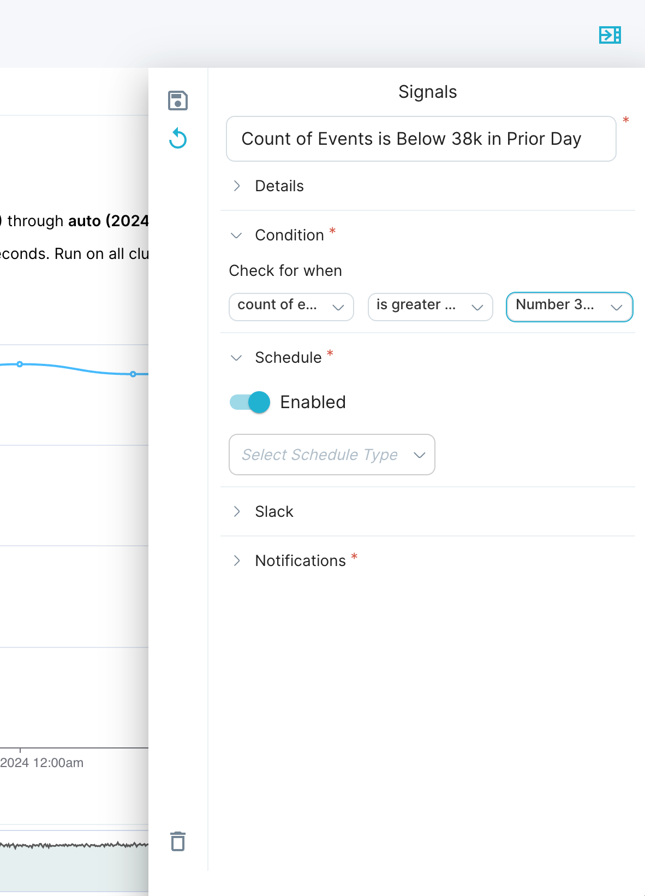
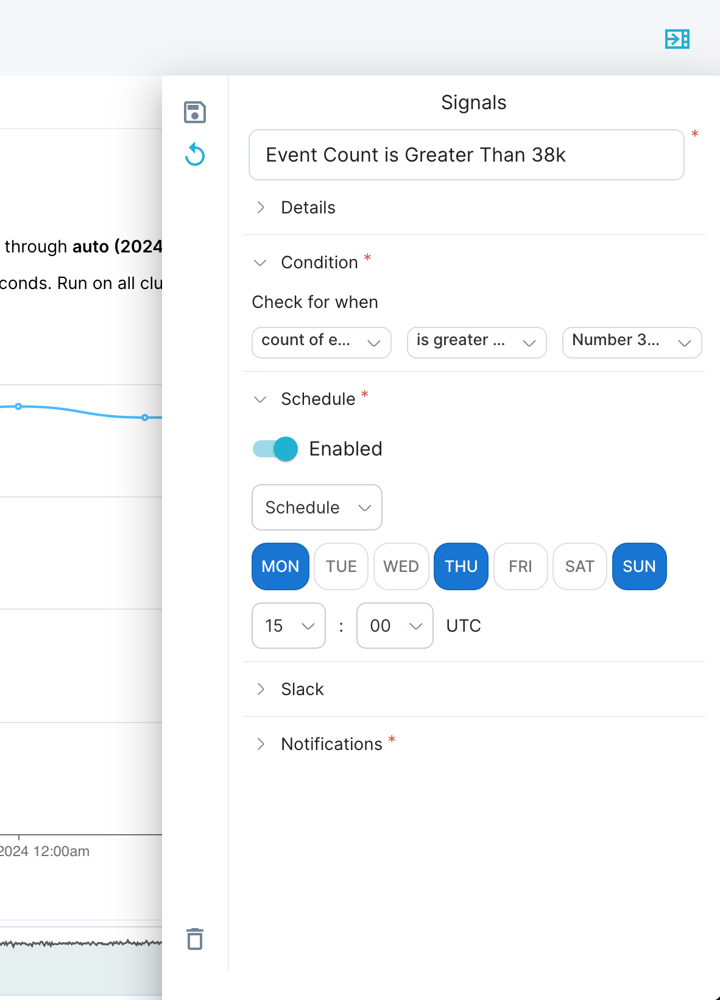
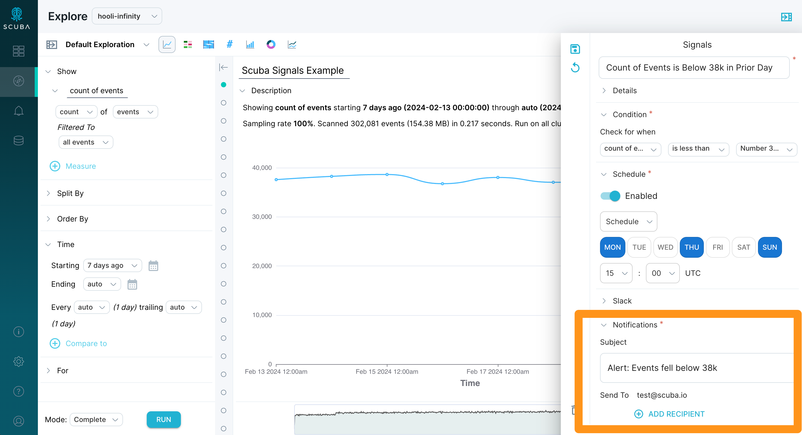

**Scuba Query Signals** is an alert and monitoring feature that enables users to:

- Define measure and alert criteria
- Define the frequency of alert checks
- Specify notification channel and recipients (if needed) that will be notified if an alert is triggered
- Receive notifications with an attached data visualization and a link to specific alerting Query and Signal

### Why use Query Signals?

Nobody has enough time to manually track **every metric**, **every hour**, **every day**, and maintain full visibility of all the important changes in their data. Query Signals save you time and provides peace of mind knowing that you will be notified if something critical changes in your data.

### How it Works

Imagine you're working at a rapidly growing SaaS company that sees a consistent increase in their overall usage week over week. You may find it insightful to discover that contrary to the typical trend there has been a recent decrease in overall usage. Rather than manually running a query every week to see if such a decrease has taken place, Query Signals can be used to schedule the query and automatically alert users when those usage numbers are above or below pre-selected thresholds.

#### Step 1 - Defining Measures for Use in Query Signals

First, set up the measure(s) you would like to be alerted on. This is the same as any other query definition, but in our example we are using a simple `count of events`.

#### Step 2 - Navigating to Signals 

Query Signals can be defined from the Explore page at the top right "Signals" antenna icon near the "Share" and "Save" options. The measures that you want to use in a Query Signal configuration need to be defined in advance under the "definition" section. If the measures are not defined, they will not show up for use under **Condition**.

Now that you have defined the measure(s) you want to monitor, we can head over the Scuba Signals by clicking on the **Signals** icon. Note that existing Signals can also be viewed from the left navigation menu, just below the Explore icon.

#### Step 3 - Set Condition

Enter a name for your Signal, and optionally a description in Details. Then, designate your Signal **Condition**. If you have multiple measures, a Split By, or a Time Offset defined, you can use them in your condition check. Alternatively, enter a number in either drop-down pill to set a static numeric threshold in relation to your measure.

#### Step 4 - Scheduling Signal Frequency

Lastly, specify how frequently you want the comparison to be evaluated. You can set this to be at a certain interval (X hours, days, weeks) or at the same time on given day(s) of the week as shown below.

Bear in mind that in most cases, the selected Frequency will become the date range by which the selected condition will be evaluated. For example, if you select an **Interval** frequency of `every 3 days`, the conditions and measures will be evaluated on the data spanning the prior 3 days exactly from the point of Signal recreation (and subsequent evaluation times). Alternatively, if you select a **Schedule** frequency of `Mon, Thu, Sun`, the conditions and measures will be evaluated for the date range _since the prior daily scheduled evaluation_; i.e. Monday will span the prior 24 hours, whereas Thursday and Sunday will span the prior 72 hours.

**Note on Advanced Evaluation:** If you would like to create a Signal whose frequency is _not_ the same as the date range used for threshold evaluation, this is _currently only supported with Time View chart type_. In this case, you must change the `auto` Trailing Window to the relative date range you wish to evaluate your Condition over when your Signal is run.

For example: if a Signal is set to run on Frequency every 2 hours, but you would like it to check the last 72 hours of data for a Condition match, simply set a Trailing Window of `every 72 hours` when you are creating (or updating) your Signal. Notifications will be sent when your Signal's threshold is met for any of the datapoints in the Time View chart over the evaluation-frequency time-range meet the condition specified in the Signal. The resulting chart may contain more than one data point, depending on the frequency; any one of these data points meeting your threshold will result in your Signal message being sent.

For more information about how Measure IQ handles time resolution and trailing windows, please see [**Specify Time in a Query: Set the time resolution and trailing window**](https://behavure.ai/docs/wiki/spaces/SGV/pages/2139259987/Specify+Time+in+a+Query+v5#Set-the-time-resolution-and-trailing-window).

#### Step 5 - Selecting Notifications

Finally, select how you would like to be notified if/when your Signal's Condition is met. Enter the Slack message title or email subject, specify the Slack channel (if your admin has connected a Slack workspace) or email addresses that should receive the email alert, and click the **Save** icon.

:::note
**Measure IQ Signals are available for integration with Slack in addition to sending alerts via email. Contact your Measure IQ representative or reach out to us at** [**support.behavure.ai**](http://support.behavure.ai) **to learn more about setting up your Slack integration.**
:::

After creating your Signal, the specified notification channel(s) will receive an alert any time the Signal condition is met at the set evaluation frequency. This alert will include a snapshot of the chart from when the condition was met, along with a link to bring the recipient directly to the specific query in Measure IQ so that deeper analysis can be performed as necessary.
