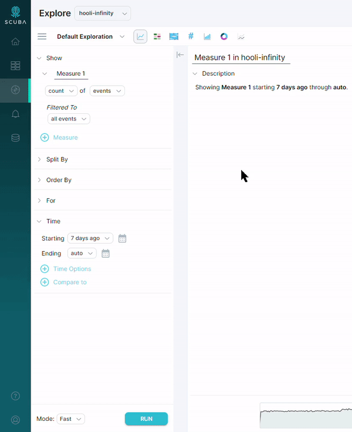

Every time you run a query in Measure IQ, you can choose to run it in **Fast** or **Complete** mode. Select these options with the drop-down Mode menu at the bottom left of the UI. Keep in mind using **Complete** mode can use significantly more resources and is usually not necessary unless your query filters to individual actors.

This article explains how Measure IQ **population sampling** is determined. Read about adaptive sampling [here](../adaptive-sampling-in-scuba).

## Cluster architecture

A Measure IQ [cluster](/measure_iq/glossary/cluster) has multiple nodes (machines), and the number of nodes scales to match the demands of the data and concurrent users. Each machine has one or more jobs within the overall solution. The import nodes ingest event data from event logs, traces, and so on. The data nodes manage efficiently storing and scanning the event data. The string nodes compress and deduplicate all the strings in the event data, handling storage and lookup for query results so that all data operations can take place efficiently using compact integers. For smaller clusters, nodes can take on several of these roles as needed. These machines can be bare metal, virtualized, or securely running inside a public cloud service.

## Consistent organization and representative populations

One mechanism to support accurate behavioral sampling is to make sure all the data for an actor is stored together on the same node. And that the storage and placement of individual actors are fair and even for all actors in the population. Measure IQ does that mathematically by using a hash with appropriate properties, followed by selecting one of many shards (containers) to hold that particular actor. All events associated with that actor are held within the same shard. That shard is managed by one node at a time, so all the events for a single actor are managed efficiently on a single machine. Because the actors are evenly distributed among shards, every shard contains a representative slice of the overall population.

## Sampling actors to get an entire time stream

We can take advantage of the fact that a single shard holds a representative cross-section of the population when it comes to sampling. When we sample, each data node processes a single shard and scans the requested time range for all the actors in that shard. Because even a single shard may hold more actors than necessary for a statistically valid sample, we can sample with progressively larger subsets of the shard until we have sufficient confidence in the sampled result.

Scanning the sample shard is usually very quick, because the common time ranges tend to be cached in memory. Even when the data is scanned directly from disk, the process usually takes just a few seconds. Measure IQ only scans the columns required for that particular query, and those columns are stored very efficiently and processed with a highly optimized C++ backend. The end result is quick, accurate sampling for behavioral analytics and the ability to interactively explore vast amounts of data.

## Parallelized queries, sane results

You might be wondering how Measure IQ knows that the sample from a single shard is actually representative of the population. That’s where the scale-out nature of Measure IQ comes in. The query isn’t just run on a single shard. It’s run on a shard for each data node of the cluster in parallel. The algorithm balances actors evenly across all nodes and shards, so each node should complete the query on its shard at roughly the same time.

The results from each data node are merged together and compared. If the statistical profile of the actors in each shard is roughly the same then the sampling is held as valid. The results are scaled up based on the size of the sample relative to the overall population, and the results are returned to the user. Any strings in the results are translated on the string servers at this time, generally eliminating string operations during the query processing.

The product is a fast, accurately sampled result that reflects behavioral information across billions of events in seconds.

## Knowing when not to sample

Of course, sampling isn’t always appropriate. Certain data isn’t evenly distributed among the shards. Some events are very rare and unlikely to show up in a sampled result. Sometimes you’re looking for a tiny specific set of events but aren’t sure when they occurred. Sometimes the selection filters leave too few events to sample accurately. In these cases, you can either reformulate your query, or choose to disable sampling (by selecting `Complete` from the drop-down menu) and compute the query across the full set of data.

In general, unsampled queries are needed only when exploring a very small (relative to your overall data size) or irregular data set. For example, when the scope of the query is so narrow that it covers fewer than 10% of your total actors or events.

In all of these cases, Measure IQ recommends that the query be re-run unsampled, but even when running a query on the full set of events, Measure IQ returns results in seconds. The entire system was designed around the proposition that scanning billions of events is the common case and needs to complete quickly: and Measure IQ delivers on exactly that.

## Conclusion and more information

So let’s wrap up. Measure IQ is a purpose-built solution for behavioral analytics of event data at scale. The solution consists of a highly scalable cluster which is combined with an intuitive visual interface to interactively explore trillions of events in seconds. Part of how that’s possible is the architecture of the solution and, in addition, the integral role sampling plays.

We’ve explained how sampling for event data needs to be handled correctly. Measure IQ effectively and appropriately handles sampling for behavioral analytics, and uses this powerful technique to give you the freedom to rapidly explore your data without fear of asking the wrong questions—and enables you to zero in on the right questions to ask and significantly reduces time to discovery.
