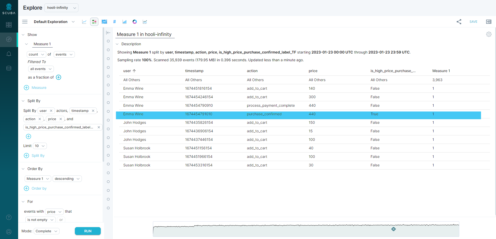
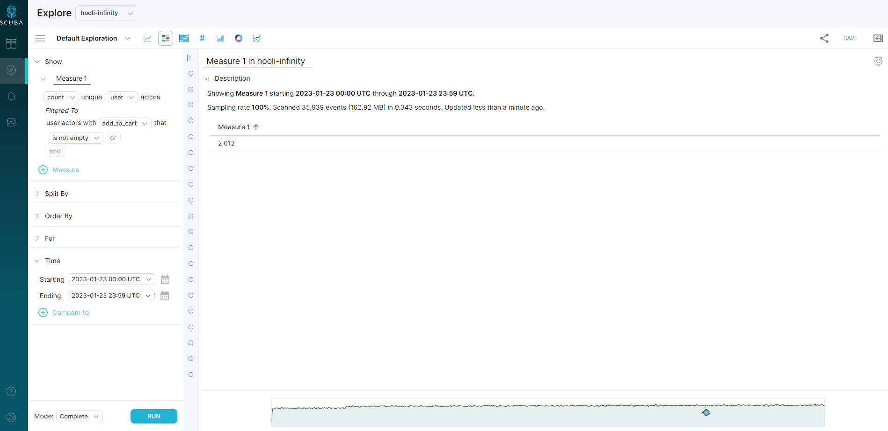
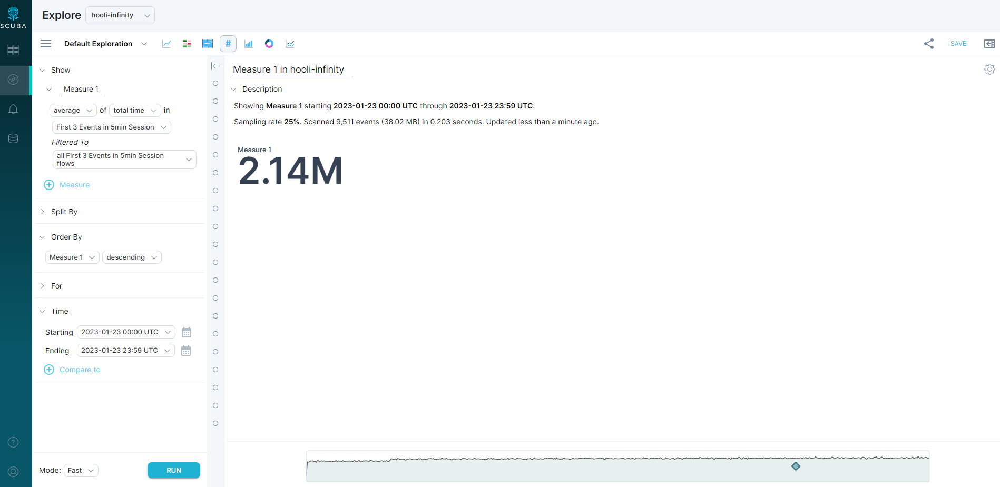

Understanding the concept of query scope in Measure IQ is important to understand exactly how Measure IQ derives query results. This article describes:

- What we mean by query scope
- How changes in query scope affect how results are calculated
- How to apply knowledge of query scope to construct and interpret queries in Measure IQ

We begin with a definition of scope. We then inspect each of the scopes (event, actor, and flow) in Measure IQ. Finally, we discuss how a query that references multiple types of properties (event, actor, or flow) interprets those properties so that properties of a different type fit into the query scope.

This article provides example queries, accompanied by explanations of how the queries are calculated. The goal of these explanations is not to describe the exact calculations Measure IQ performs to arrive at the example result, but to provide a mental model for Measure IQ users that wish to understand the role scope plays in the query calculation. This article does not cover topics like merging results from the distributed data tier, scaling sampled queries, or performance optimizations. In some cases, the exact order of operations might be slightly different or asynchronous, but the results will be the same as if the query followed the described order of operations exactly.

## Query scope: A general definition

In general, every Measure IQ query or measure involves some sort of aggregation. Here are some aggregations (with example context) that you can specify in Measure IQ:

- **Count unique** users that viewed the support page
- **Average** session durations for Android devices
- **Sum** play time per music service

The scope of a query refers to the type of entity an aggregation in Measure IQ iterates over to produce a result. An aggregation can iterate over events, actors, or flows. It follows that Measure IQ's three query scopes are called event scope, actor scope, and flow scope.

An example of a query in each scope is as follows:

|           |                                                                           |
| --------- | ------------------------------------------------------------------------- |
| **Scope** | **Example Query**                                                         |
| Event     | count(events) for events where event_name = purchase                      |
| Actor     | average(purchases per actor) for actors with at least two purchase events |
| Flow      | average(session duration) for Android device sessions                     |

As you can see, counting each individual event is an event scope query, averaging a per-actor value is an actor scope query, and averaging a per-session value is a flow scope query. When computing these query results, Measure IQ iterates over event, actors, and flows, respectively.

Measure IQ automatically determines the scope of a query by inspecting query arguments. If a query is averaging something that is calculated on a per-actor basis, it is highly likely that the scope of that query is actor scope.

With that, let's study each individual scope.

## The scopes of Measure IQ queries

In this section, we investigate each query scope independently.

To do so, consider queries on a sampled event dataset. Here are some of the events that would have been ingested into Measure IQ for the following examples:

`{"user":"Emma Wine","ts":"2023-01-23T12:00:00Z","action":"add_to_cart","price":140}{"user":"Emma Wine","ts":"2023-01-23T12:03:00Z","action":"add_to_cart","price":300}{"user":"Emma Wine","ts":"2023-01-23T12:05:00Z","action":"process_payment_complete","price":440}`

`{"user":"Emma Wine","ts":"2023-01-23T12:05:00Z","action":"purchase_confirmed","price":440}{"user":"John Hodges","ts":"2023-01-23T12:13:06Z","action":"add_to_cart","price":150}{"user":"John Hodges","ts":"2023-01-23T1:00:00Z","action":"add_to_cart","price":15}{"user":"John Hodges","ts":"2023-01-23T1:07:09Z","action":"add_to_cart","price":100}{"user":"Susan Holbrook","ts":"2023-01-23T1:07:09Z","action":"add_to_cart","price":40}{"user":"Susan Holbrook","ts":"2023-01-23T11:35:29Z","action":"add_to_cart","price":100}{"user":"Susan Holbrook","ts":"2023-01-23T11:40:00Z","action":"add_to_cart","price":30}`

### Event Scope

A Measure IQ query in event scope iterates directly over the events imported to a Measure IQ table (also known as a dataset).

You can visualize the data aggregated over in an event scope query as a spreadsheet or relational database table, **with one row per event**, and each column corresponding to either a raw event property imported directly from the source data, or a manual event property created in Measure IQ. For instance, you can visualize event scope for a query in our sample dataset as (where `is_high_price_purchase_confirmed` is a user-created manual event property that returns `true` if `action == purchase_confirmed` and `price >= 100`):

|                |                      |                          |           |                                      |
| -------------- | -------------------- | ------------------------ | --------- | ------------------------------------ |
| **user**       | **ts**               | **action**               | **price** | **is_high_price_purchase_confirmed** |
| Emma Wine      | 2023-01-23T12:00:00Z | add_to_cart              | 140       | false                                |
| Emma Wine      | 2023-01-23T12:03:00Z | add_to_cart              | 300       | false                                |
| Emma Wine      | 2023-01-23T12:05:00Z | process_payment_complete | 440       | false                                |
| Emma Wine      | 2023-01-23T12:13:06Z | purchase_confirmed       | 440       | true                                 |
| John Hodges    | 2023-01-23T1:00:00Z  | add_to_cart              | 150       | false                                |
| John Hodges    | 2023-01-23T1:07:09Z  | add_to_cart              | 15        | false                                |
| John Hodges    | 2023-01-23T1:07:09Z  | add_to_cart              | 100       | false                                |
| Susan Holbrook | 2023-01-23T11:35:29Z | add_to_cart              | 40        | false                                |
| Susan Holbrook | 2023-01-23T11:40:00Z | add_to_cart              | 100       | false                                |
| Susan Holbrook | 2023-01-23T11:47:19Z | add_to_cart              | 30        | false                                |

In an actual query, Measure IQ loads only the columns that are used in the query to perform the calculation. The table above represents a sample of the data iterated over only if the event scope query accesses all of the columns and manual event property. For example, in a simple average (price) query, Measure IQ loads only the price column (still one row per event) to produce the result.

With this table in mind, we can now think about aggregating over the rows (events) in the table in order to produce a query result.

Let's do so now, answering the question **_how many unique users did a purchase_confirmed action on 2023-01-23?_** using an event scope approach.



First, since this query relies on the **user** and **action** event properties, we can visualize the data we iterate over to produce the result as a table with two columns (representing the **user** and **action** event property values) and 10 sample rows (one row for each event because this query is in event scope):

|                |                          |
| -------------- | ------------------------ |
| **user**       | **action**               |
| Emma Wine      | add_to_cart              |
| Emma Wine      | add_to_cart              |
| Emma Wine      | process_payment_complete |
| Emma Wine      | purchase_confirmed       |
| John Hodges    | add_to_cart              |
| John Hodges    | add_to_cart              |
| John Hodges    | add_to_cart              |
| Susan Holbrook | add_to_cart              |
| Susan Holbrook | add_to_cart              |
| Susan Holbrook | add_to_cart              |

Also, since we applied a filter for our events, we can filter to just the events where `action == purchase_confirmed`:

|           |                    |
| --------- | ------------------ |
| **user**  | **action**         |
| Emma Wine | purchase_confirmed |

Finally, we can apply our `count_unique(user)` aggregation over these sample events to produce our result:

```
count_unique("Emma Wine") = 1
```

> [!TIP]
> The key takeaway here is that our count unique aggregation iterated over **events** to produce the result. Iterating over events is what makes a query event scope.

### Actor scope

A Measure IQ query in actor scope iterates over the actors contained within the Measure IQ table or dataset. Unlike in event scope, the actor-based tables that an actor scope query iterates over are not stored on disk or generated during the Measure IQ import process. Instead, Measure IQ produces an actor-based table from a subquery over the event data, and then produces results from the actor-based table.

We can answer the question posed in the event scope section **_how many unique users did an add_to_cart action on 2023-01-23?_** by issuing an actor scope query instead of an event scope query. Let's see what that looks like.



First, we need to instruct Measure IQ to produce data in the actor scope that we can iterate over. We do this by creating an actor property. To answer the question, we create an actor property that calculates the number of add-to-cart actions per user.

When we use an actor property like this in a query, behind the scenes, Measure IQ issues a subquery to calculate the per-actor result. The result of this subquery is a (temporary) table in actor scope. We can visualize this similarly to how we visualized the event scope data in the previous section, with one key difference: **in actor scope, the data that our aggregation iterates over has one row per** **_actor_** **instead of one row per event.**

The subquery that Measure IQ runs in the case of our `add_to_cart` actor property is quite simple:

```
count(events where action = add_to_cart) split by user
```

This subquery produces our actor scope data, which in our sample data looks like this:

|                |                 |
| -------------- | --------------- |
| **user**       | **add_to_cart** |
| Emma Wine      | 1               |
| John Hodges    | 1               |
| Susan Holbrook | 3               |

From this table, it is easy to produce a query result for our query **_how many unique users had an add_to_cart action on 2023-01-23?_** We can apply a filter to filter to the sample actor table above on `add_to_cart > 0`, and then do our unique user aggregation:

```
count_unique("Emma Wine","John Hodges","Susan Holbrook") = 3
```

Or, because we are in actor scope where we have one row per actor, we could even answer this with a simple count aggregation as an optimization:

```
count(per-actor rows where add_to_cart > 0) = 3
```

> [!TIP]
> The key takeaway here is that our final aggregation iterates over actors to produce the result. Iterating over actors is what makes a query actor scope.

### Flow scope

As you have likely now deduced, a Measure IQ query in flow scope iterates over the flows contained within the Measure IQ table / dataset. Similarly to actor scope queries, the flow-based tables that a flow scope query iterates over are not stored on disk or generated during the Measure IQ import process. Instead, Measure IQ produces a flow-based table from the events imported to Measure IQ using the logic defined in the flow definition, and then produces results from the flow-based table.



For our flow scope example, we'll use a simple flow that starts and transitions on the first three events of a session as defined by 5 minutes of inactivity.

The count flow instances query that produces the results that the Sankey view displays is flow scope, but for the sake of simplicity we'll run a more straightforward query to illustrate flow scope in action:

For this query, Measure IQ produces flow scope data that looks something like this from the 10 raw events ingested into Measure IQ:

|             |                |                        |
| ----------- | -------------- | ---------------------- |
| **flow_id** | **user**       | **total_time_in_flow** |
| 1           | Emma Wine      | 120s                   |
| 2           | John Hodges    | 120s                   |
| 3           | Susan Holbrook | 60s                    |
| 4           | Susan Holbrook | 92s                    |

And then to produce our final result, we simply average(120s, 120s, 60s, 92s) to get an average time of 98s.

> [!TIP]
> The key takeaway here is that our final aggregation iterates over flows to produce the result. Iterating over flows is what makes a query flow scope.

### Related

- [Event Properties vs. Actor Properties](../../../measure-guides/measure-tutorials/event-properties-vs-actor-properties)
- [Resolving Scope Mismatch](./understanding-scope/resolving-scope-mismatch)
