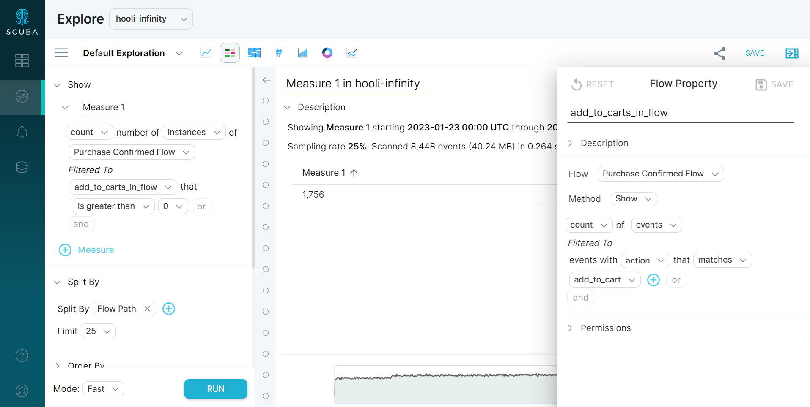

After reading our article on [understanding scope](../understanding-scope), hopefully, you are gaining confidence in your understanding of the event, actor, and flow scopes of Measure IQ. With this understanding, we are now equipped to investigate the behavior of Measure IQ queries when event, actor, and flow properties are combined in the same query.

Recall our model of the actor scope data in the previous section example:

|     |     |
| --- | --- |
| **user** | **add\_to\_cart** |
| Emma Wine | 2   |
| John Hodges | 3   |
| Susan Holbrook | 3   |

Now imagine adding a filter such as `price(event property) >= 10` to this actor scope query. The event property has a value that varies per event, and the data being iterated over has only a single row for each actor. A single actor can have many values of price for a given time range! Measure IQ software cannot automatically combine these two properties. Instead, we need to somehow bring the event property into the actor scope for this query to be valid. 

Each time an actor or flow property is referenced in an event scope query, the actor or flow property must be brought into the event scope for the query to make sense. The same goes for an event or flow property in an actor scope query, and an event or actor property in a flow scope query. Measure IQ often does this automatically, but to fully understand queries that mix these different types of properties, it is important to understand exactly how Measure IQ resolves these differences in scope.

The following sections detail the ways to resolve these scope mismatches, as well as the Measure IQ defaults for doing so. For jump links to the appropriate section, see the following matrix:

|     |     |     |     |
| --- | --- | --- | --- |
|     | **Event Property** | **Actor Property** | **Flow Property** |
| **Event Scope Query** | No action needed | [Bringing actor properties into event scope](#actor-event) | [Bringing flow properties into event scope](#flow-event) |
| **Actor Scope Query** | [Bringing event properties into actor scope](#event-actor) | No action needed | [Bringing flow properties into actor scope](#flow-actor) |
| **Flow Scope Query** | [Bringing event properties into flow scope](#) | [Bringing actor properties into flow scope](#) | No action needed |

### Bringing actor properties into event scope

In Measure IQ, you can access actor properties in event scope queries by left-joining actor scope data (produced by an actor property subquery) to the event scope data on actor.

For instance, the following query is an event scope query that references an actor property:

In this query, the user has requested the average(price) of the events associated with actors who have had at least one `add_to_cart` events. Let's apply what we have learned to understand how Measure IQ calculates this query result.

First, actor scope data is produced by an actor property subquery, as defined in the actor property definition:

|     |     |
| --- | --- |
| **user** | **add\_to\_cart** |
| Emma Wine | 2   |
| John Hodges | 3   |
| Susan Holbrook | 3   |

Next, the actor scope data is left joined to the event scope data on user:

|     |     |     |
| --- | --- | --- |
| **user** | **price** | **add\_to\_cart** |
| Emma Wine | 140 | 1   |
| Emma Wine | 300 | 1   |
| Emma Wine | 440 | 0   |
| Emma Wine | 440 | 0   |
| John Hodges | 150 | 1   |
| John Hodges | 15  | 1   |
| John Hodges | 100 | 1   |
| Susan Holbrook | 40  | 1   |
| Susan Holbrook | 100 | 1   |
| Susan Holbrook | 30  | 1   |

Measure IQ filters the events to the events where add\_to\_cart > 0:

|     |     |     |
| --- | --- | --- |
| **user** | **price** | **add\_to\_cart** |
| Emma Wine | 140 | 1   |
| Emma Wine | 300 | 1   |
| John Hodges | 150 | 1   |
| John Hodges | 15  | 1   |
| John Hodges | 100 | 1   |
| Susan Holbrook | 40  | 1   |
| Susan Holbrook | 100 | 1   |
| Susan Holbrook | 30  | 1   |

And finally Measure IQ performs the average(price) aggregation:

average(140, 300, 150, 15, 100, 40, 100, 30) = 109.375

### Bringing flow properties into event scope

Similarly to actor properties, flow properties can be accessed in event scope queries by left-joining flow scope data (produced by a flow property subquery) to the event scope data on an internal flow ID.

Let’s take a query that produces the average(price) of events involved in flows that lasted less than 90 seconds, then apply what we have learned to understand how this query result is calculated.

First, Measure IQ produces flow scope data by iterating over events and calculating flows according to the flow definition:

|     |     |     |
| --- | --- | --- |
| **flow\_id** | **user** | **total\_time\_in\_flow** |
| 1   | Emma Wine | 120s |
| 2   | John Hodges | 120s |
| 3   | Susan Holbrook | 60s |
| 4   | Susan Holbrook | 92s |

Next, Measure IQ joins that flow scope data to event scope data in preparation for our event scope aggregation:

|     |     |     |     |
| --- | --- | --- | --- |
| **user** | **flow\_id** | **total\_time\_in\_flow** | **price** |
| Emma Wine | 1   | 120000 | 140 |
| Emma Wine | 1   | 120000 | 300 |
| Emma Wine | 1   | 120000 | 440 |
| John Hodges | 2   | 120000 | 440 |
| John Hodges | 2   | 120000 | 150 |
| John Hodges | 2   | 120000 | 15  |
| Susan Holbrook | 3   | 60000 | 100 |
| Susan Holbrook | 3   | 60000 | 40  |
| Susan Holbrook | 4   | 92000 | 100 |
| Susan Holbrook | 4   | 92000 | 30  |

Measure IQ then applies the filter to our events:

|     |     |     |     |
| --- | --- | --- | --- |
| **user** | **flow\_id** | **total\_time\_in\_flow** | **price** |
| Susan Holbrook | 3   | 60000 | 100 |
| Susan Holbrook | 3   | 60000 | 40  |

Finally, Measure IQ performs an event scope aggregation to produce the desired result:

average(100, 40) = 70

For instructions on using a flow property in an event scope query, see [Query on Stages in a Flow](../../../measure-user-guides/analyze-user-paths-with-flows/query-on-stages-in-a-flow).

### Bringing event properties into actor scope

A common use case for Measure IQ queries is to reference event properties in actor scope queries. Bringing an event property into actor scope is a bit more complicated than the other way around, because there are several valid ways to bring an event property into actor scope (instead of a simple left join). The correct way to go about doing this depends on the question you are trying to answer.

The ways to do this fall into two categories:

- An event property can be brought into actor scope by creating an actor property from that event property.
- Existing actor properties in the actor scope can be modified to include the event property in their definitions.

For example, imagine we have the following actor scope query:

Often, Measure IQ analysts want to apply an event property filter to a query like this, such as price >= 50. At this point, there are multiple reasonable queries that could result from adding a price >= 50 filter to such a query. For instance:

1. what is the average per-user `add_to_cart` count for users with at least one high price event on 2023-01-23?
2. what is the average per-user `add_to_cart` count for users with at least one high price event in that user's entire lifetime?
3. what is the average per-user `add_to_cart` count for users whose median price over all events on 2023-01-23 >= 50?
4. what is the average per-user high price `add_to_cart` count on 2023-01-23?

All of the above queries are valid interpretations of adding a price >= 50 filter to an average(add\_to\_cart) actor scope query. All of these queries can be answered in Measure IQ by either creating an actor property from the event property ([Queries 1](#), [2](#), and [3](#)) or modifying the existing actor property ([Query 4](#)).

You can do this by creating or altering the properties manually. Let's do so now for the four queries above.

#### **Query 1:** ***What is the average per-user add\_to\_cart count for users with at least one high price event on 2023-01-23?***

First, we produce actor scope data with a subquery that produces add\_to\_cart and count\_high\_price\_events columns:

|     |     |     |
| --- | --- | --- |
| **user** | **add\_to\_cart** | **count\_high\_price\_events** |
| Emma Wine | 2   | 1   |
| John Hodges | 4   | 1   |
| Susan Holbrook | 3   | 1   |

Next, we filter to actors that satisfy the condition set in the filter:

|     |     |     |
| --- | --- | --- |
| **user** | **add\_to\_cart** | **count\_high\_price\_events** |
| Emma Wine | 2   | 1   |
| John Hodges | 4   | 1   |
| Susan Holbrook | 3   | 1   |

Finally, we average(add\_to\_cart):

average(3, 4, 2) = 3.

#### **Query 2:** ***What is the average per-user add\_to\_cart count for users with at least one high price event in that user's entire lifetime?***

This query executes similarly to the previous query, except the actor properties **must** be calculated in separate subqueries, since they have different time specs. We still end up with actor scope data that we iterate over to produce the final result.

#### **Query 3:** ***What is the average per-user add\_to\_cart count for users whose median price over all events on 2023-01-23 >= 50?***

Same general process as [Query 1](#): produce actor scope data from count(add\_to\_cart), median(price) group by user subquery:

|     |     |     |
| --- | --- | --- |
| **user** | **add\_to\_cart** | **median\_price** |
| Emma Wine | 1   | 25  |
| John Hodges | 1   | 27  |
| Susan Holbrook | 3   | 28  |

#### **Query 4:** ***What is the average per-user high price add\_to\_cart count on 2023-01-25?***

This approach is different, since we modify the existing add\_to\_cart actor property instead of creating a new actor property.

For this approach, we simply modify the definition of add\_to\_cart to include a filter for price >= 50. From here, the query is calculated as you would expect an actor scope query to be calculated—we produce actor scope data from a subquery defined by our actor property, and aggregate over that actor scope data.

It is possible to add an event property to an actor scope query in Measure IQ without manually resolving the scope difference with the methods listed above. The behavior of Measure IQ in this case is similar to the approach in [Query 4](#) above, in that the actor properties in the query are modified to incorporate the event property. Instead of adding to the filter of the actor property, however, the actor property is actually calculated on a per (user, event property) basis. This allows a consistent behavior for adding event properties to actor scope queries in both filter and split-by, but can produce surprising results if not ready for them.

### Bringing flow properties into actor scope

Bringing a flow property into actor scope is similar to bringing an event property into actor scope in that it is possible for an actor to have multiple values of a flow property for a given time range (if they start multiple flow instances within the time range, for example). It follows that the methods of bringing flow properties into actor scope are similar to the methods used for bringing event properties into actor scope. We can either construct a new actor property that performs an aggregation over flow scope data, or modify an existing actor property to incorporate events associated with a particular flow property.

For instance, we can produce the average add\_to\_cart count for users whose total session duration > 2 minutes by creating an actor property that references flow total time:

Produce actor scope data from actor property subqueries:

|     |     |     |
| --- | --- | --- |
| **user** | **add\_to\_cart** | **total\_time\_in\_add\_to\_cart\_flow** |
| Emma Wine | 1   | 120000 |
| John Hodges | 1   | 120000 |
| Susan Holbrook | 3   | 152000 |

Add the filter:

|     |     |     |
| --- | --- | --- |
| **user** | **add\_to\_cart** | **total\_time\_in\_add\_to\_cart\_flow** |
| Susan Holbrook | 3   | 152000 |

Average(3) = 3

Or we could add flow filter to the definition of our add\_to\_cart actor property:

Here our actor property subquery is in event scope, so for this filter set to work Measure IQ will bring the required flow properties into event scope for the actor property subquery. The top-level query will be executed over the data:

|     |     |
| --- | --- |
| **user** | **add\_to\_cart** |
| Emma Wine | 1   |
| John Hodges | 1   |
| Susan Holbrook | 0   |

Average(1, 1, 0) = .67

### Bringing event properties into flow scope

Bringing an event property into flow scope is similar to bringing an event property into actor scope. The event property can be integrated by either using the event property in a flow property, or altering the definition of the flow itself.

For instance, to filter to [flow instances](../flow-instance) with at least one add to cart event, create a flow property that counts add\_to\_cart events per flow instance. This is what the query looks like in the Measure IQ UI:

First Measure IQ produces flow scope data using the flow definition and collect flow scope `add_to_carts_in_flow` property:

|     |     |     |
| --- | --- | --- |
| **flow\_id** | **user** | **add\_to\_carts\_in\_flow** |
| 1   | Emma Wine | 1   |
| 2   | John Hodges | 0   |
| 3   | Susan Holbrook | 0   |
| 4   | Susan Holbrook | 0   |

Filter

|     |     |     |
| --- | --- | --- |
| **flow\_id** | **user** | **add\_to\_carts\_in\_flow** |
| 1   | Emma Wine | 1   |

Count(rows) = 1

We could also incorporate event properties directly into the flow definition (note the action matches read filter in the flow definition):

Produce flow scope data using new flow definition that filters to 'add to cart' events only.

|     |     |     |
| --- | --- | --- |
| **flow\_id** | **user** | **total time in add\_to\_carts\_in\_flow** |
| 1   | Emma Wine | 0s  |
| 2   | John Hodges | 0s  |
| 3   | Susan Holbrook | 60s |
| 4   | Susan Holbrook | 0s  |

*A flow that has only one event has a total time of 0 seconds, since total time = timestamp(last event in flow) - timestamp(first event in flow)*

Average(0,0,60,0) = 15s.

### Bringing actor properties into flow scope

Bringing actor properties into flow scope works similarly to bringing actor properties into event scope. Since actor data is present in both flow and actor scopes, we can simply left-join actor scope data to flow scope.

Here is a Measure IQ query where this happens:

First, we produce flow scope and actor scope data independently:

|     |     |
| --- | --- |
| **flow\_id** | **user** |
| 1   | Emma Wine |
| 2   | John Hodges |
| 3   | Susan Holbrook |
| 4   | Susan Holbrook |

|     |     |
| --- | --- |
| **user** | **add\_to\_cart** |
| Emma Wine | 1   |
| John Hodges | 1   |
| Susan Holbrook | 3   |

Next, left join actor scope data to flow scope data:

|     |     |     |
| --- | --- | --- |
| **flow\_id** | **user** | **add\_to\_cart** |
| 1   | Emma Wine | 1   |
| 2   | John Hodges | 1   |
| 3   | Susan Holbrook | 3   |
| 4   | Susan Holbrook | 3   |

 Filter:

|     |     |     |
| --- | --- | --- |
| **flow\_id** | **user** | **add\_to\_cart** |
| 3   | Susan Holbrook | 3   |
| 4   | Susan Holbrook | 3   |

And finally, aggregate:

Count(Rows) = 2