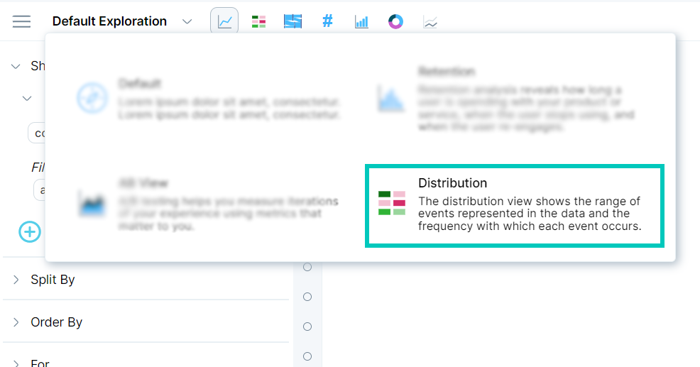
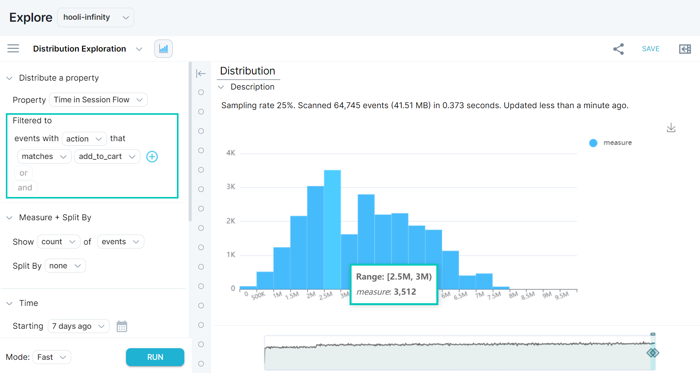
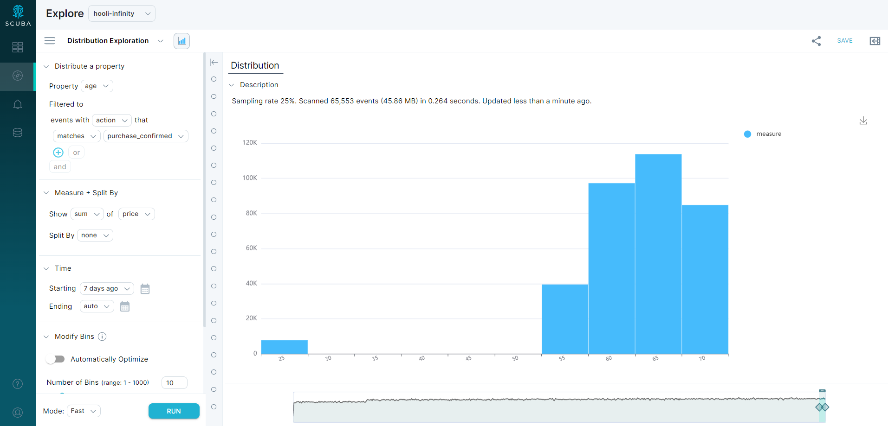

Analyze the distribution of numeric properties that describe people, their behaviors, and how they traverse through your experience using Measure IQ's distribution view.

Why use distributions? Sometimes it’s not enough to know what the average user is like in your experience. For example, if you have different user segments who exhibit different behaviors, you might find that there are different modes according to your usage metrics. Or you might want to look for power users who act like extreme outliers. Distributions can help illuminate these cases.

## Use distribution view

To get started:

1. In **Explore**, click the **Default Exploration** drop-down menu, then click **Distribution**.
2. You will be prompted to pick an actor property, event property, or a flow property. Only numeric properties are available.
3. In the **Starting** and **Ending** fields, select a time range you want to examine that property over.
4. Hit **Run**. Measure IQ suggests a default binning and displays a histogram.

### Adding a filter in distribution view

To look at one part of the distribution, you can apply a filter to your property, similar to how you would in a measure.

Note that ranges (and percentiles) identify inclusive and exclusive elements. A *bracket* indicates an inclusive range, and a *parenthesis* indicates an exclusive range. For example, integers described with this notation are as follows:

- (0, 3) = 1, 2.
- \[0, 3) = 0, 1, 2.
- \[0, 3\] = 0, 1, 2, 3.

### Adjusting binning

In v5, Measure IQ offers you the choice of automatically optimizing the bins, so that they are evenly distributed. If you don’t want to do that, then you can adjust the number of bins or the size of the bins. Use the sliders to select an amount.

Note: When you change one slider, the other will automatically shift to match. If you want them to be specific values, you’ll have to change both sliders.

Adjusting binning also lets you create interesting analyses. When investigating event properties, you can bin by either a count of all events, over a property, or over a [calculation of a property](/measure_iq/glossary/event-property).

#### Example: Find total spending per age bracket

For example, consider a commerce dataset with an event property called **Age**.

If you are interested in the distribution of all types of events, you can select the **Age** event property and filter to **all events**.

But you can also find the distribution of total money spent per age bracket, as follows:

1. Under Distribute a property, click the first line and select the **Age** event property from the dropdown.
2. Filter to events with action that matches **purchase\_confirmed**.
1.   In the line that says **Filtered to all events**, click **all events** and type **action** to find the **action** event property.
2.   Select **action** from the list. The UI updates to say **Filtered to events with action that matches ...**
3.   Click the ellipses and select the value of interest from the dropdown. In this example, the value is **purchase\_confirmed**.
3. Click **Modify Bins**
1.   Adjust the **Number of Bins** to 10 and **Size of Bins** to 5 to see fewer bins with more data in each.
4. The default measure specified is **Measure count of events**. Modify to **Measure sum of price** as follows:
1.   Click **count** to access the list of available functions.
2.   Select **sum**.
3.   Click **events** to access the list of available properties.
4.   Start typing and select **price**.
5. Click **RUN**.

The result is a distribution of total money spent per age group.

