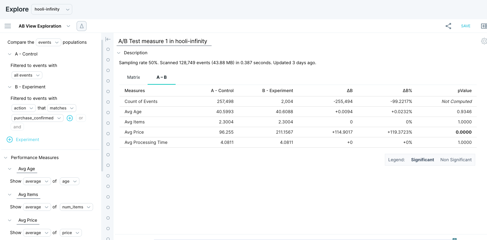

When you are making changes to your experience (for example, a website or app), you can use A/B testing to understand how much of an effect your change had, and how confident you are of that result.

For example, you might want to draw in visitors to your website to sell a service or introduce an important idea. Small changes in messaging and component placement can have a material impact in guiding a visitor to take some action (for example, completing a purchase).

You can run an experiment on just a landing page: the control is the original website, and a variant is an experiment. A visitor to the website is directed to either the original or the variant. The visitor then becomes part of the population of people experiencing that landing page.

Then, you can measure the performance of the two landing pages by looking at their conversion rate. That is, the percentage of visitors who opt to go to the next part of the website, or who complete a purchase.

## About Measure IQ A/B view

A/B view in Measure IQ can compare averages of properties between populations of events, actors, or flows. For example (respectively):

- Compare iOS and Android events measuring differences in latencies.
- Compare the average posts per actor between actors that have seen an experimental web page vs. actors that have seen the control web page.
- Compare the average posts per session between sessions that include viewing a help page vs. sessions that do not.

Use your existing data to segment events, actors, and flows for an A/B test. Or, you can prepare your data to define your populations before your data is ingested into Measure IQ. Then perform A/B analysis by specifying a categorical experiment property (that is, a column) and the experiment label.

#### Optional: Prepare your data for A/B analysis

To perform A/B analysis, you need to specify groups of actors. You can accomplish this in a few different ways:

- You can group actors by behavior. Use an actor property to create an experiment group.
- You can include active experiment information in your groups. One way to do this is to specify an "Experiments" column. Use that column to define, per user, which experiments they're in. Use the experiment column for every event that is part of the experiment. Use consistent naming conventions to differentiate between experiments and groups. For example, "myexperiment\_control", "myexperiment\_group\_A", etc. In JSON, this would be: `"experiments": "[myexperiment_control]"`.
- If you want to use a lookup table to assign users to an experiment group, be aware that this does not retain start and stop times for the experiment. If you use a lookup table, make sure you track the start and end times when you perform the query. In addition, using a lookup table can increase the workload on your cluster.  
Lookup tables can be a good choice if your first query involves a separate scan. For example, if you have four years of data and you need to scan over all four years of data to find out whether a user ever did action x, then it may be more efficient to store that information in a lookup table.

### Finding Measure IQ A/B view

To access A/B view, click **Default Exploration** in the menu bar above ‘Show’ in the explore view, then click **AB View**.

When you access A/B view, it automatically fills in fields to create a valid (if of dubious interest) experiment based on events in your data set. Use the drop-downs to create a more interesting experiment.

### Creating an A/B test

Use A/B view to define experiments that measure how your users behave so that you can optimize their experience. You are typically trying to do one of the following:

- Compare a variant of your user experience (for example, a web page) to a pre-existing one. 
- Measure which version performs better according to important performance metrics (for example, monetization, conversion rate, or engagement).

In Measure IQ, **you’re not required to define your experiment beforehand.** You can create actor properties that allow you to run experiments in the past so that you can prepare for upcoming ones.

### Define an experiment

The basic steps for defining an experiment are as follows:

- [Who or what are you comparing?](#population) 
- [What performance metrics do you want to do the comparison?](#performance)
- [Over what time period?](#time-period)
- [Validate](#validate)

#### **Define your populations: Who or what are you comparing?**

To start an A/B test, select a population type. A population can be any of the following:

- People: In Measure IQ, this means actor populations. You can look at counting metrics per person and compare them over a period (for example, average song length per user).
- Flows: How do people traverse your experience? If you have a linear experience (for example, onboarding), you might prefer to view these as funnels. But flows also capture behavior when you’re unsure of their path to a desired milestone (for example, purchasing). Flows are helpful when you want to measure conversion rates from one step to another every time people pass through your experience.
- Events: Sometimes you want to compare populations on a particular behavior (for example, the average song length of all plays). To compare the behaviors of people in a group, you can use actor properties in your filters.

#### **Compare your populations: What performance metrics do you want to compare on?**

Choose your performance metrics and map them to properties in Measure IQ. Here are some tips:

- To measure behavior per user, create actor properties.
- To measure how people traverse your experience, use flows and flow properties to measure conversion rates between steps.
- To measure behaviors over a population of users, use event properties.

#### **Over what time period?**

Estimate how long you need to run the experiment to be sure of the results. That way, when you get results, you know not only which page performed the best, but also have certainty about the repeatability of those results. 

Use the time picker to define the evaluation period for your experiment. You can examine an experiment in the past or try comparing different population segments to test out A/B View.

#### **Determine whether your experiment is statistically valid with p-values.**

The general measure of statistical validity used is *p*\-value. A generally accepted value for this is < 0.05, indicating a 5% chance that your variant is actually pulled from your control population. Look for bolded values in the *p*\-value column, which identify a correlation of at least 95% confidence level (*p*\-value < 0.05).

> [!INFO]
> The statistical test used in the Measure IQ A/B application(commonly known as “Z-test”) compares the average event property, actor property, or flow property values between two event, actor, or flow populations. In order for the test to be performed and for p-value calculated, you must select the “average” aggregation in your performance measure.

#### **Example A/B experiments**

The following example experiments show you how to create properties to use as performance metrics.

#### Example 1: Music service

In this example, we find the conversion rates for users who navigate (1) from their home page to playing a song, and (2) from playing a song to upgrading.

The important user actions or event names in the data set are as follows:

- Home
- PlaySong
- Upgrade
- Events logged with numeric performance attributes

To count the number of actions per User, create a **Show** type actor property: **count** of **events** filtered to **PlaySong**.

To measure conversion rates and time spent in a flow:

1. Create a flow with steps:
1.   Step 1: **Home**
2.   Step 2: **PlaySong**
3.   Step 3: **Upgrade**
2. Measure IQ automatically calculates some flow properties that you can use to compare populations, as follows:
-   Time spent in flow
-   Time between steps
-   Total events  
  These resulting flow properties help you quickly understand whether a change leads to faster traversal through your experience. Use these properties as follows in the next step.
3. To find conversion rates, create flow properties that count events at each step:
1.   Create a **Show** type flow property: **count** of **events** filtered to **Home** (name: **CountHome**)  
2.   Create a **Show** type flow property: **count** of **events** filtered to **PlaySong** (name: **CountPlaySong**)
3.   Create a **Show** type flow property: **count** of **events** filtered to **Upgrade** (name: **CountUpgrade**)
4. Next, create flow properties that use your counting properties to do a math operation: 
1.   Create a **Calculate** type flow property for the Home->PlaySong conversion rate: **CountPlaySong/CountHome**
2.   Create a **Calculate** type flow property for the PlaySong->Upgrade conversion rate: **CountUpgrade/CountPlaySong** 
5. Compare different parts of your experience by using event properties. Rather than running a strict A/B test, this is more like a segment comparison with the added benefit of statistical significance.

#### Example 2: Fitness tracker

Say you have a fitness tracker product that can track walking and running. You want to compare the number of steps across all running and walking events

- Specify **events** populations.
- Filter your groups to:
-   A: WalkingEvent
-   B: RunningEvent
- To compare the steps for walks and runs, send in an event property that captures steps per event, let’s call it **StepsPerEvent,** which you can specify as a performance metric.