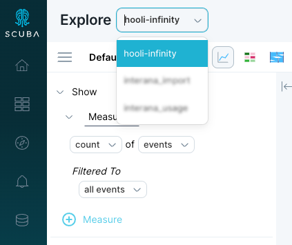
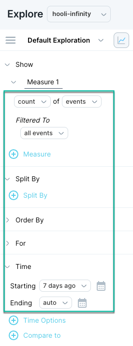
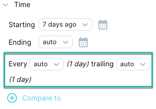
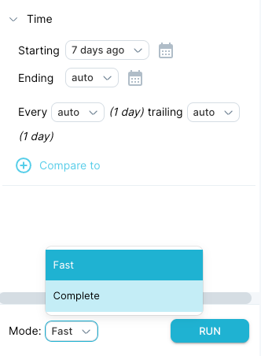
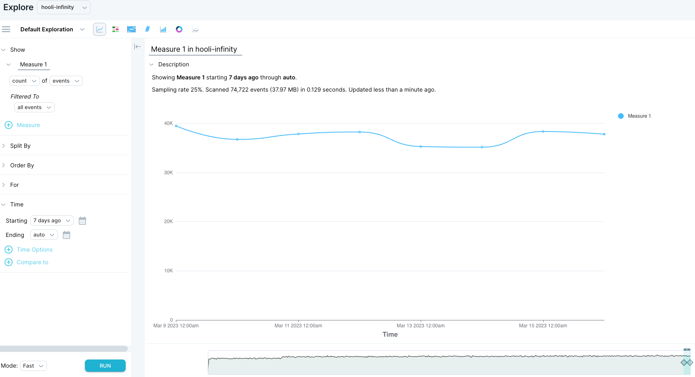
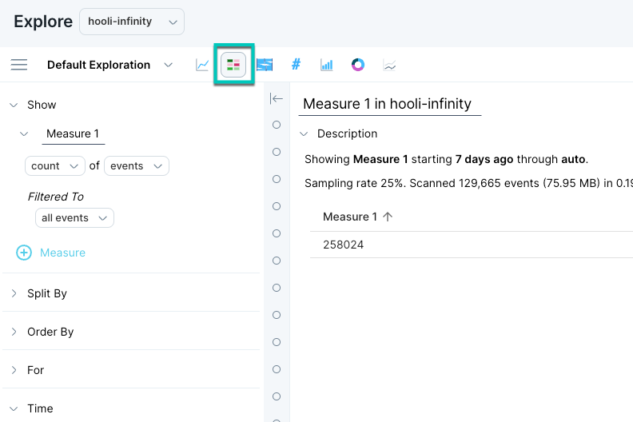
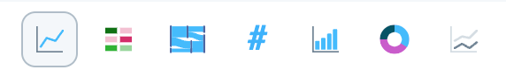
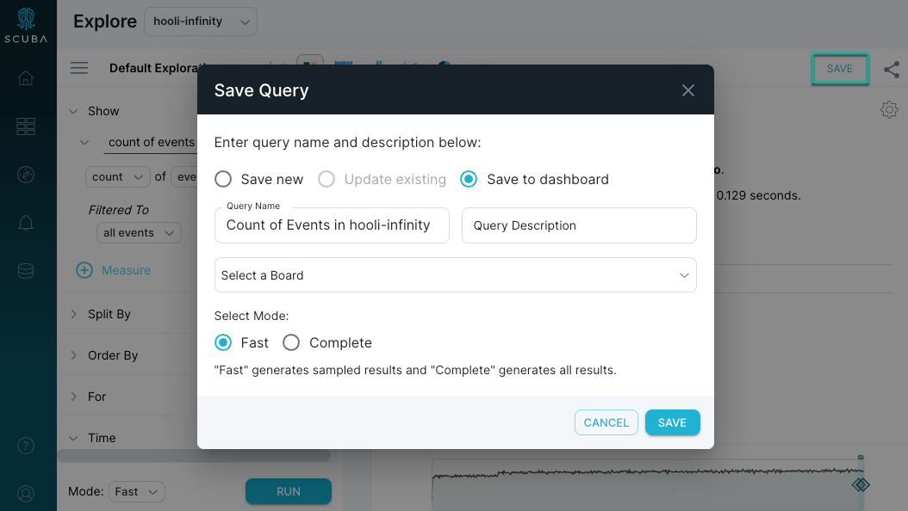

Once you're familiar with any Boards or queries in your workspace when you first log into Scuba, you'll want to create your own custom board. This article serves as a comprehensive guide to walk you through the process.

- [1\. Creating a new Board](#1-creating-a-new-board)
- [2\. Constructing a query](#2-constructing-a-query)
- [3\. Pinning the query to create a panel](#3-pinning-the-query-to-create-a-panel)
- [What's Next](#whats-next)

## 1\. Creating a new Board

This section shows you how to create a new Board that you can populate with your own query panels. New boards and panels are [private by default](../../scuba-guides/scuba-user-guides/manage-your-created-objects/share-an-object-with-other-users).

#### To create a new Board, complete the following steps:

1. From the Scuba UI, click the table icon to access Boards.

2\. Click **\+ ADD BOARD** at the top right of the page. Give the Board a unique name, ideally including your Scuba username, and click Save. The description field is optional, but can add deeper context to a Board when needed.

3\. The Board will initially be empty. To begin building the Board, click **Go to Explore to Add a Panel**.

## 2\. Constructing a query

Next, we will define a query and then use it to create a panel by pinning the results to our Board. This section provides a demonstration of creating a query that reveals the number of events that occurred in the past seven (7) days.

Think of a Scuba query as a mathematical equation made up of words, and the word segments as query building blocks. The building blocks we use to create the query in this example are:

- **Count** of **events**: The total number of events.
- Filtered to **all events**: We are not using any filters (or comparisons). We are querying all events.
- Split by **none**: We are not filtering the results by an actor, action, or property.
- Starting **7 days ago**: We start our count 7 days ago.
- Ending **now**: Ending the count right now.

To create a query that counts all events over the last seven days, complete the following steps:

1. Click **Explore** in the left navigation bar. The Scuba default query page will appear.

2\. Select a dataset from the dropdown list in the top left corner. Your available datasets will be for your company data. In our example, we chose a dataset called **hooli-infinity.**

3\. In the first line of the query, select count and events from the drop-down lists if they're not already selected. In the image below, you will see the query is:

- **Filtered To** all events.
- **Split By** is not set.
- **Starting** time will default to 7 days ago, and **Ending** to now.

4\. Click **\+ Time Options** to reveal trailing window options. For now, leave the default value of 1 day.

A [trailing window](/measure_iq/glossary/trailing-window) (the default is 1 day) specifies how far back from each data point's end time Scuba looks at when aggregating over events. It is common to set the time resolution equal to the trailing window. See [Specify Relative Time in a Query](../../scuba-guides/scuba-user-guides/build-queries-and-visualizations/specify-time-in-a-query) in the User's Guide.

5\. At the bottom of the query definition, select a **Mode** then click **RUN**. The query results appear on the right.

**Mode** options:

- **Fast** will return a query in less time, using population sampling.
- **Complete** will run query unsampled but takes longer.

Note that both modes do not impact whether adaptive sampling is used.

**Optional troubleshooting step:** If no query results appear, check the time scrubber at the bottom of the page. The time scrubber graphs the number of events across time in your dataset. Depending on your dataset, you might need to drag the start and end time markers to a time range that contains data.

In the next step, you will continue with [Pinning the query to create a panel](#pinning-query).

## 3\. Pinning the query to create a panel

In the previous task, you successfully completed [constructing a query](#construct-query).

This task demonstrates the ways you can view query results, then pin the query to the Board as a panel. Query results are displayed in **Time view** by default, as shown in the following example below.

#### To view query results in different formats and then pin the query, do the following:

1. In the default **Time view**, hover the cursor over points on the line to view detail data, as shown in the example below.

.gif)

To view query results in table format, click the **Table view** icon at the top of the window, as shown below.  

2\. To view the query results in various formats, click on the other icons for visualization format. Once you've tried out a few formats, click on your preferred visualization again.

3\. From left to right, the visualization formats (above) are:

- Time
- Table
- Sankey
- Number
- Bar
- Pie
- Line

Note: Visualization formats will be greyed out if they cannot be used to show the query definition as is.

4\. Name your query “Count of Events” by editing **measure 1** above the first line of the query and clicking **RUN** again. The title above the visualization updates to include the new name.

5\. Clicking **SAVE** will prompt a pop-up screen giving you the ability to save the query independently, or to a Board.

Note: The mode can be adjusted in this screen for the panel in the Board.

6\. Choose the Board you created in [Creating a New Board](#create-board). The panel displays dynamically updated results for the query. Navigate to the Board to see the panel in place.

## What's Next

Next, you'll want to [Modify a Query](../scuba-tutorials/modify-a-query).